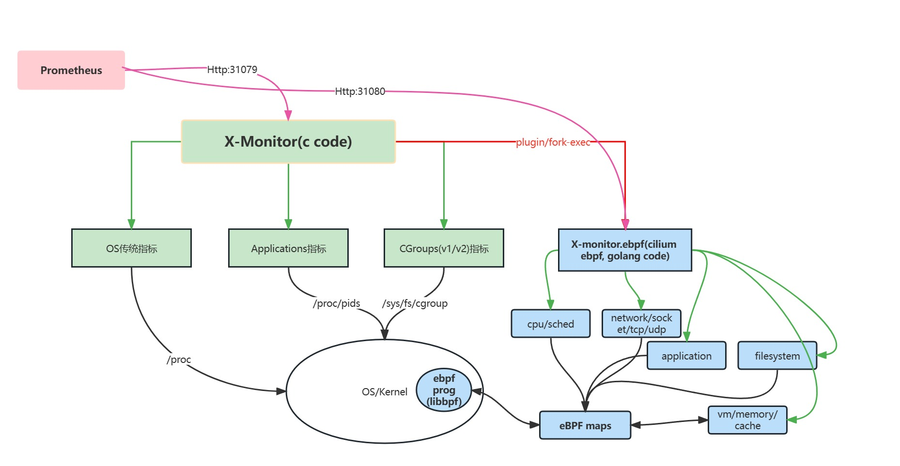

# x-monitor

观察系统、应用、内核的运行状态，从以下几个方面：

- 传统的系统运行指标

- 应用运行的指标

- CGroups状态指标

- eBPF内核状态指标

## 详情

1. [编译、运行](doc/编译、运行.md)

2. [对接Prometheus](doc/对接Prometheus.md)

3. [应用监控](doc/应用监控.md)

4. [系统监控](doc/系统监控.md)

5. [cgroup监控](doc/CGroup监控.md)

6. [eBPF内核观察](doc/eBPF内核观察.md)

7. [系统参数说明](doc/系统参数说明.md)

   

