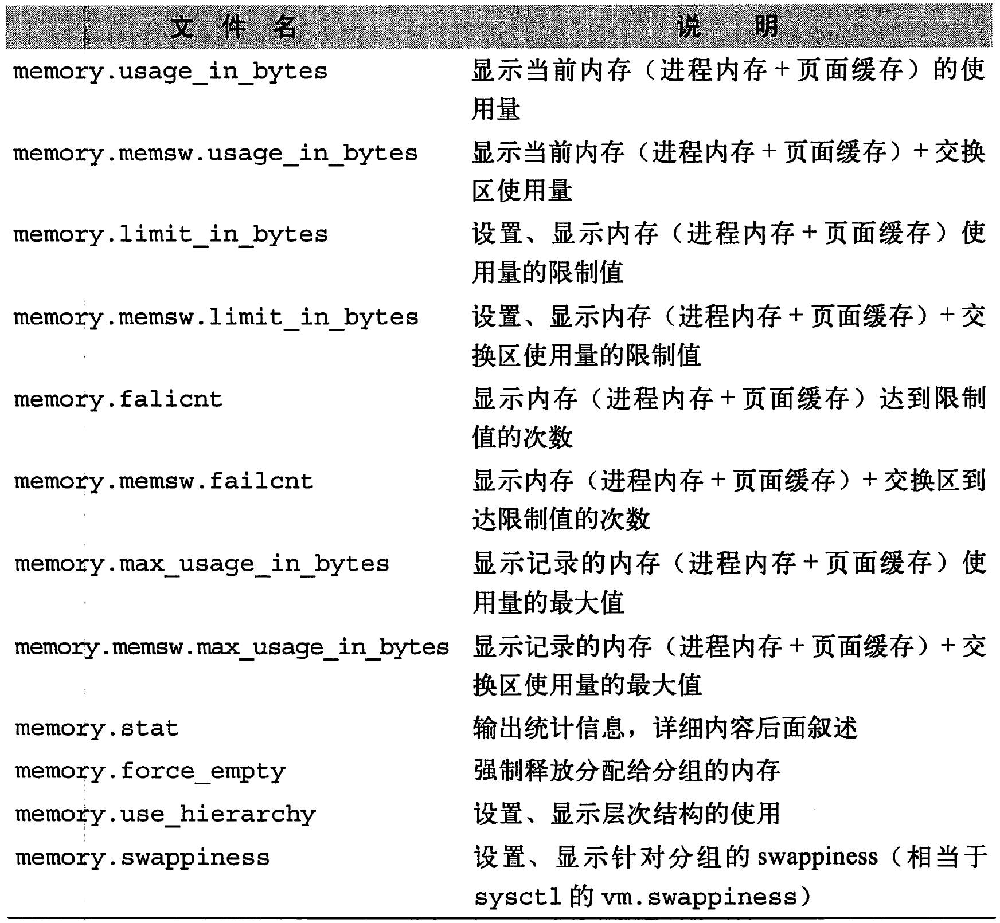
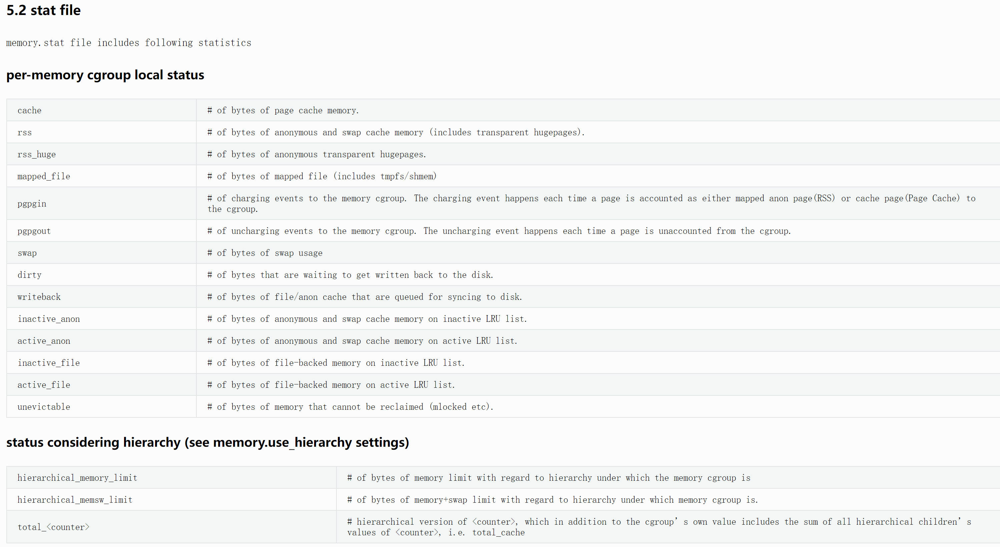
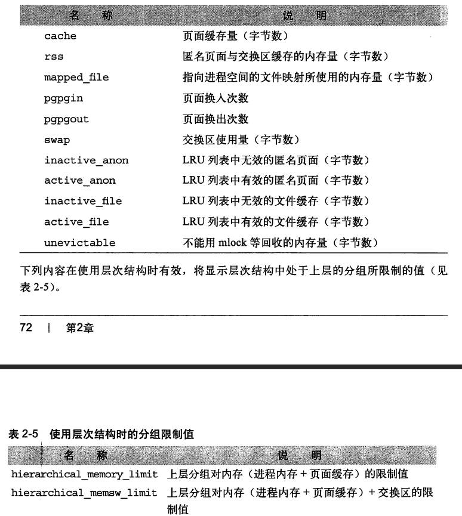
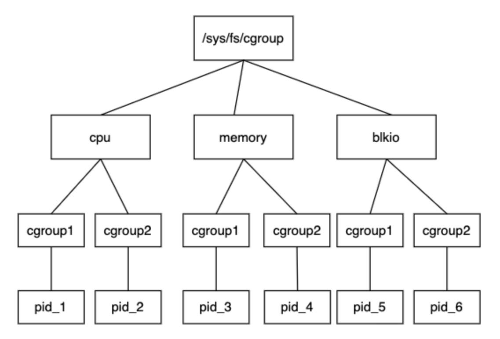

# CGroup监控

## CGroupV1

### CPU资源配额
#### CPUACCT控制器

自动生成控制组中任务对CPU资源使用情况的报告。

##### cpu.shares，按权重比例设定CPU的分配

shares用来设置CPU的相对值，必须大于等于2，最后除以权重综合，算出相对比例，按比例分配CPU时间。该指是针对**所有的CPU**。

cgroup A设置为100, cgroup B设置为300，那么cgroupA中的任务运行25%的CPU时间。对于一个**四核CPU**的系统来说，cgroup A中的任务可以100%占有某一个CPU，这个比例是相对整体的一个值。

shares值有如下特点：

1. 如果A不忙，没有使用25%的时间，那么剩余的CPU时间将会被系统分配给B，**即B的CPU使用率可以超过75%**。
2. 在闲的时候，shares基本上不起作用，只有在CPU忙的时候起作用。
3. 由于shares是一个绝对值，需要和其它cgroup的值进行比较才能得到自己的相对限额，如果在一个部署**很多容器的机器上**，cgroup的数量是变化的，所以这个限额也是变化的。

cpu.shares是几个控制组之间的CPU分配比例，而且一定要到整个节点中所有的CPU都跑满的时候，它才发挥作用。

##### CPU使用周期和使用上限

cpu调度策略有两种：

- 完全公平调度（Completely Fair Scheduler，CFS），按限额和比例分配两种方式进行资源限制。
- 实时调度（Real-TimeScheduler），针对实时任务按周期分配固定的运行时间。

cpu.cfs_period_us：用来配置时间周期长度，单位：**微秒**。取值范围1毫秒(1000ms)~1秒(1000000ms)。它是CFS算法的一个调度周期，一般是100000。

cpu.cfs_quota_us：配置当前cgroup在设置的周期长度内所能使用的cpu时间数，单位：微秒，取值大于1ms即可，如果值为-1（默认值），表示不受CPU时间的限制。它表示CFS算法中，在一个调度周期里这个控制组被允许的运行时间。

两个文件配合起来可以以**绝对比例限制cgroup的cpu的使用上限**。举例：

```
1.限制只能使用1个CPU（每250ms能使用250ms的CPU时间）
    # echo 250000 > cpu.cfs_quota_us /* quota = 250ms */
    # echo 250000 > cpu.cfs_period_us /* period = 250ms */

2.限制使用2个CPU（内核）（每500ms能使用1000ms的CPU时间，即使用两个内核）
    # echo 1000000 > cpu.cfs_quota_us /* quota = 1000ms */
    # echo 500000 > cpu.cfs_period_us /* period = 500ms */

3.限制使用1个CPU的20%（每50ms能使用10ms的CPU时间，即使用一个CPU核心的20%）
    # echo 10000 > cpu.cfs_quota_us /* quota = 10ms */
    # echo 50000 > cpu.cfs_period_us /* period = 50ms */
```

cpu.shares和cpu.cfs_quota_us、cpu.cfs_period_us一起使用

三者合起来一起来综合判断，决定了能获得CPU资源上限，上限分为两种情况：

1. 当主机上有很多cgroup，节点上CPU已经完全占满，这时控制器获得的CPU资源由shares来决定。
2. 当主机比较闲，控制器中的进程获得cpu资源上限有quota/period来决定。

**结合来看cpu.cfs_quota_us决定了CPU资源的上限，cpu.shares决定了在繁忙机器上能使用CPU的下限**。

举例，有两个相同的层级的cgroup，bar和baz，在一个只有1core的节点，cpu.cfs_period_us都设置为100ms，cpu.share都设置为1024.

1. 当bar和baz的cpu.cfs_quota_us都设置超过50ms，例如75ms，这意味两个cgroup的cpu使用率之和大于1core，这时两个cgroup会平均分配cpu资源，每个都是50ms，50%的core。

2. 如果cpu.cfs_quota_us都设置为25ms，小于50ms，这意味两个cgroup的cpu使用率之和小于1core，这时他们的也会1:1的分配cpu，不过确切是各占25%的core。

3. 如果bar的quota设置为25ms，而baz设置为75ms，两者还是有相同的shares值。这是bar的cpu上限是25ms，如果是period是100ms，baz还会按照shares的1:1分配到25ms吗？如果是，那么剩余的50ms放到哪里了？

   ```
   Because the CFS does not demand equal usage of CPU, it is hard to predict how much CPU time a cgroup will be allowed to utilize. When tasks in one cgroup are idle and are not using any CPU time, the leftover time is collected in a global pool of unused CPU cycles. Other cgroups are allowed to borrow CPU cycles from this pool.
   ```

   实际是baz可以消费75ms的CPU的。

总结这个场景，两者是一起工作的。

```
cpu.share and cpu.cfs_quota_us are working together.

Given a total cpu quota, we should firstly distribute the cpu.share of each cgroup. Then find the cgroups whose exact quota exceeds their cpu.cfs_quota_us, find all such cgroups and keep their quota as their cpu.cfs_quota_us, and collect the exceeded part as unused cpu pool. Distribute these unused cpu pool among other cgroups by cpu.share again, and iterate as above, until no cgroup is exceeding the upper limit.
```

##### cpu资源报告

提供了CPU资源用量的统计

- cpuacct.usage，报告一个`cgroup`中所有任务（包括其子孙层级中的所有任务）使用`CPU`的总时间（纳秒）,该文件时可以写入`0`值的，用来进行重置统计信息。
- cpuacct.usage_user，报告一个`cgroup`中所有任务（包括其子孙层级中的所有任务）使用用户态`CPU`的总时间（纳秒）。
- cpuacct.usage_sys，报告一个`cgroup`中所有任务（包括其子孙层级中的所有任务）使用内核态`CPU`的总时间（纳秒）。
- cpuacct.usage_percpu，报告一个`cgroup`中所有任务（包括其子孙层级中的所有任务）在每个`CPU`使用`CPU`的时间（纳秒）。
- cpuacct.usage_percpu_user，报告一个`cgroup`中所有任务（包括其子孙层级中的所有任务）在每个`CPU`上使用用户态`CPU`的时间（纳秒）。
- cpuacct.usage_percpu_sys，报告一个`cgroup`中所有任务（包括其子孙层级中的所有任务）在每个`CPU`上使用内核态`CPU`的时间（纳秒）。
- cpuacct.usage_all，详细输出文件`cpuacct.usage_percpu_user`和`cpuacct.usage_percpu_sys`的内容。
- cpuacct.stat，报告cgroup的所有任务（包括其子孙层级中的所有任务）使用的用户和系统CPU时间，单位是USER_HZ（100ms）
- cpu.stat
  - nr_periods：表示过去了多少个cpu.cfs_period_us里面配置的时间周期。
  - nr_throttled：在上面这些周期中，有多少次是受到了限制（即cgroup中的进程在指定的时间周期中用光了它的配额）。
  - throttled_time：cgroup中的进程被限制使用CPU持续了多长时间，单位是ns。

### 内存资源配额

当限制内存时，我们最好想清楚如果内存超限了发生什么？该如何处理？业务是否可以接受这样的状态？

#### 内存控制能限制什么

- 限制cgroup中所有进程所能使用的物理内存总量。
- 限制cgroup中所有能使用的物理内存+交换空间总量（CONFIG_MEMCG_SWAP），一般在server不开启swap空间。

#### 主要文件



memory.stat说明





#### 压力通知机制

当cgroup内的内存使用量达到某种压力状态的时候，内核可以通过eventfd的机制来通知用户程序，这个通知是通过cgroup.event_control和memory.pressure_level来实现的。使用步骤如下：

1. 使用eventfd()创建一个eventfd，假设叫做efd。
2. 然后open()打开memory.pressure_level的文件路径，产生一个fd，暂且称为pfd。
3. 然后将这两个fd和我们要关注的内存压力级别告诉内核，让内核帮我们关注条件是否成立。
4. 按这样的格式”<event_fd> <pressure_level_fd> <threshold>"写入cgroup.event_control。然后就等着efd是否可读。如果能读出信息，则代表内存使用已经触发了相关压力条件。

压力级别的level有三个：

1. low，表示内存使用已经达到触发内存回收的压力级别。
2. medium，表示内存使用压力更大了，已经开始触发swap以及将活跃的cache写回文件等操作了。
3. critical，意味内存已经达到上限，内核已经触发oom killer了。

从efd读取的消息内容就是这三个级别的关键字。**多个level可能要创建多个event_fd**。

#### 内存阈值通知

使用cgroup的事件通知机制来对内存阈值进行监控，当内存使用量穿过（高于或低于）设置的阈值时，就会收到通知，步骤如下。

1. 使用eventfd()创建一个eventfd，假设叫做efd。
2. 然后open()打开memory.usage_in_bytes，产生一个fd，暂且称为ufd。
3. 往cgroup.event_control中写入这么一串：`<event_fd> <usage_in_bytes_fd> <threshold>`。
4. 然后通过读取event_fd得到通知。

### blkio资源限制

子系统为了减少进程之间共同读写同一块磁盘时相互干扰的问题。blkio子系统可以限制进程读写的IOPS和吞吐量，但它只能对Direct I/O的文件读写进行限速，对Buffered I/O的文件读写无法限制。

#### 文件详情

1. blkio.io_service_bytes，被分组迁入或者移出磁盘的字节数量。它按操作类型（读或写，同步或异步）细分。头两个域定义了主次设备号，第三个域定义了操作类型，第四个域定义了字节数量。
2. blkio.io_serviced，被分组发给磁盘的IO(bio)数量。它按操作类型（读或写，同步或异步）细分。头两个域定义了主次设备号，第三个域定义了操作类型，第四个域定义了IO数量。
3. blkio.io_merged，cgroup内的bio请求总量。它按操作类型（读或写，同步或异步）细分。
4. blkio.io_queued，cgroup内任意给定时刻的排队请求总量。它按操作类型（读或写，同步或异步）细分。
5. blkio.throttle.io_service_bytes，被分组迁入或者移出磁盘的字节数量。它又按操作类型（读或写，同步或异步）细分。头两个域定义了主次设备号，第三个域定义了操作类型，第四个域定义了字节数量。
6. blkio.throttle.io_serviced，被分组迁入或者移出磁盘的字节数量。它又按操作类型（读或写，同步或异步）细分。头两个域定义了主次设备号，第三个域定义了操作类型，第四个域定义了字节数量。

#### V1的缺陷

cgroup v1是每个层级对应一个子系统，子系统需要mount挂载使用，每个子系统之间是独立的，很难协同，比如memory subsys和blkio subsys能分别控制某个进程的资源使用，但blkio subsys对进程资源限制的时候无法感知memory subsys中进程资源的使用量。导致Buffer I/O的限制一直没有实现。




## CGroupV2

### CPU资源

#### 资源配额

v2中简化了cpu配额的配置方法，就用一个文件cpu.max，文件中填写2个值，格式为：$MAX $PERIOD。max : period的结果决定了占用cpu的百分比。如下配置方式。

```
    # 限制cpu的使用为1core
    cgxset -2 -r cpu.max='100000 100000' x-monitor 
```

#### 资源统计

文件cpu.stat记录了当前cgroup的cpu消耗统计。

```
 ⚡ root@localhost  /sys/fs/cgroup/x-monitor  cat cpu.stat
usage_usec 2707351
user_usec 1129936
system_usec 1577414
nr_periods 782
nr_throttled 0
throttled_usec 0
nr_bursts 0
burst_usec 0
```

- usage_usec：占用cpu的总时间，单位微秒。
- user_usec：用户态占用时间。
- system_usec：内核态占用。
- nr_periods：周期计数。
- nr_throttled：周期内的限制计数。
- throttled_usec：限制执行的时间。
- nr_bursts：突发发生的周期数。
- burst_usec：任何CPU 在各个时期内使用的超过配额的累积挂起时间，内核代码中是纳秒，输出seqfile转换为微妙。

#### 资源压力

cpu.pressure。

### Memory资源

#### 资源配额

memory.max，内存资源的上限，超过就会oom，默认值为max，不限制。如果限制就写入需要限制的字节数

```
    # 限制memory上限，1G
    cgxset -2 -r memory.max=1073741824 x-monitor
    # 不使用swap
    cgxset -2 -r memory.swap.max=0 x-monitor
```

memory.swap.max，使用swap的上限。默认为max，如果不想使用swap，设置值为0。通常应该填写0，关闭swap。

memory.min，内存保护机制，如果当前cgroup的内存使用量在min值以内，则任何情况都不会对这部分内存进行回收。

memory.current，显示当前cgroup的内存使用总数，包括后代cgroup。The total amount of memory currently being used by the cgroup and its descendants.

memory.swap.current，显示当前cgroup的swap的使用量。

#### 资源统计

memory.stat，类似/proc/meminfo的详细的内存使用统计信息，单位都是字节。

#### 资源压力

memory.pressure，显示内存的压力失速信息。

## CGroup指标

### CPU

- cgroup_v1_cpu_shares

  说明：The relative share of CPU that this cgroup gets. This number is divided into the sum total of all cpu share values to determine the share any individual cgroup is entitled to.

- cgroup_v1_cpu_cfs_period_us

  说明：The period of time in microseconds for how regularly a cgroup's access to CPU resources should be reallocated. This value is used by the Completely Fair Scheduler to determine how to share CPU time between cgroups. 单位：微秒。

- cgroup_v1_cpu_cfs_quota_us

  说明：The total amount of time in microseconds for which all tasks in a cgroup can run during one period. The period is in the metric `cgroup.cpu_cfs_period_us`，单位：微秒

- cgroup_v1_cpuacct_stat_user_userhzs

  说明：The number of USER_HZ units of time that this cgroup's tasks have been scheduled in user mode. 用户态cpu使用时间，单位：USER_HZ(100ms)。

- cgroup_v1_cpuacct_stat_system_userhzs

  说明：The number of USER_HZ units of time that this cgroup's tasks have been scheduled in kernel mode. 内核态cpu使用时间，单位：USER_HZ(100ms)。

- cgroup_v1_cpu_stat_nr_periods

  说明：Number of period intervals that have elapsed (the period length is in the metric `cgroup.cpu_cfs_period_us`)

- cgroup_v1_cpu_stat_nr_throttled

  说明：Number of times tasks in this cgroup have been throttled (that is, not allowed to run as much as they want).

- cgroup_v1_cpu_stat_throttled_time_ns

  说明：The total time in nanoseconds for which tasks in a cgroup have been throttled.

- cgroup_v1_cpuacct_usage_ns

  说明：Total time in nanoseconds spent using any CPU by tasks in this cgroup.单位：纳秒。

- cgroup_v1_cpuacct_usage_ns_per_cpu

  说明：Total time in nanoseconds spent using a specific CPU (core) by tasks in this cgroup. This metric will have the `cpu` dimension that specifies the specific cpu/core.

- cgroup_v1_cpuacct_usage_user_ns

  说明：Total time in nanoseconds spent in user mode on any CPU by tasks in this cgroup.

- cgroup_v1_cpuacct_usage_user_ns_per_cpu

  说明：Total time in nanoseconds spent in user mode on a specific CPU (core) by tasks in this cgroup. This metric will have the `cpu` dimension that specifies the specific cpu/core.

- cgroup_v1_cpuacct_usage_system_ns

  说明：Total time in nanoseconds spent in system (kernel) mode on any CPU by tasks in this cgroup

- cgroup_v1_cpuacct_usage_system_ns_per_cpu

  说明：Total time in nanoseconds spent in system (kernel) mode on a specific CPU (core) by tasks in this cgroup. This metric will have the `cpu` dimension that specifies the specific cpu/core.

- sys_cgroup_v2_metric_cpu_max

  说明：The maximum CPU usage, cpu core的使用数量。

- sys_cgroup_v2_metric_cpu_stat_nr_periods

  说明：Number of enforcement intervals that have elapsed. cpu.max中period的数量。

- sys_cgroup_v2_metric_cpu_stat_nr_throttled

  说明：Number of times the group has been throttled/limited.

- sys_cgroup_v2_metric_cpu_stat_throttled_usec

  说明：The total time duration (in usecs) for which entities of the group have been throttled.单位：微秒

- sys_cgroup_v2_metric_cpu_stat_usage_usec

  说明：The total CPU time (in usecs).单位：微秒

- sys_cgroup_v2_metric_cpu_stat_user_usec

  说明：Total time in microseconds spent in user mode on any CPU by tasks in this cgroup.

- sys_cgroup_v2_metric_cpu_stat_system_usec

  说明：Total time in microseconds spent in system (kernel) mode on any CPU by tasks in this cgroup

### Memory

- cgroup_v1_memory_stat_cache

  说明：Page cache, including tmpfs (shmem), in bytes.

- cgroup_v1_memory_stat_rss_huge

  说明：Bytes of anonymous transparent hugepages

- cgroup_v1_memory_stat_shmem

  说明：Bytes of shared memory

- cgroup_v1_memory_stat_mapped_file

  说明：Bytes of mapped file (includes tmpfs/shmem)

- cgroup_v1_memory_stat_dirty

  说明：Bytes that are waiting to get written back to the disk

- cgroup_v1_memory_stat_writeback

  说明：Bytes of file/anon cache that are queued for syncing to disk

- cgroup_v1_memory_stat_pgpgin

  说明：Number of charging events to the memory cgroup. The charging event happens each time a page is accounted as either mapped anon page(RSS) or cache page(Page Cache) to the cgroup.

- cgroup_v1_memory_stat_pgpgout

  说明：Number of uncharging events to the memory cgroup. The uncharging event happens each time a page is unaccounted from the cgroup.

- cgroup_v1_memory_stat_pgfault

  说明：Total number of page faults incurred

- cgroup_v1_memory_stat_pgmajfault

  说明：Number of major page faults incurred

- cgroup_v1_memory_stat_inactive_anon

  说明：Bytes of anonymous and swap cache memory on inactive LRU list

- cgroup_v1_memory_stat_active_anon

  说明：Bytes of anonymous and swap cache memory on active LRU list

- cgroup_v1_memory_stat_inactive_file

  说明：Bytes of file-backed memory on inactive LRU list

- cgroup_v1_memory_stat_active_file

  说明：Bytes of file-backed memory on active LRU list

- cgroup_v1_memory_stat_unevictable

  说明：Bytes of memory that cannot be reclaimed (mlocked, etc).

- cgroup_v1_memory_stat_hierarchical_memory_limit

  说明：Bytes of memory limit with regard to hierarchy under which the memory cgroup is

- cgroup_v1_memory_stat_hierarchical_memsw_limit

  说明：The memory+swap limit in place by the hierarchy cgroup

- cgroup_v1_memory_stat_swap

  说明：Bytes of swap memory used by the cgroup

- cgroup_v1_memory_stat_total_cache

  说明：The equivalent of `cgroup.memory_stat_cache` that also includes the sum total of that metric for all descendant cgroups

- cgroup_v1_memory_stat_total_rss

  说明：The equivalent of `cgroup.memory_stat_rss` that also includes the sum total of that metric for all descendant cgroups

- cgroup_v1_memory_stat_total_rss_huge

  说明：The equivalent of `cgroup.memory_stat_rss_huge` that also includes the sum total of that metric for all descendant cgroups

- cgroup_v1_memory_stat_total_shmem

  说明：The equivalent of `cgroup.memory_stat_shmem` that also includes the sum total of that metric for all descendant cgroups

- cgroup_v1_memory_stat_total_swap

  说明：Total amount of swap memory available to this cgroup

- cgroup_v1_memory_stat_total_mapped_file

  说明：The equivalent of `cgroup.memory_stat_mapped_file` that also includes the sum total of that metric for all descendant cgroups

- cgroup_v1_memory_stat_total_dirty

  说明：The equivalent of `cgroup.memory_stat_dirty` that also includes the sum total of that metric for all descendant cgroups

- cgroup_v1_memory_stat_total_writeback

  说明：The equivalent of `cgroup.memory_stat_writeback` that also includes the sum total of that metric for all descendant cgroups

- cgroup_v1_memory_stat_total_pgpgin

  说明：The equivalent of `cgroup.memory_stat_pgpgin` that also includes the sum total of that metric for all descendant cgroups

- cgroup_v1_memory_stat_total_pgpgout

  说明：The equivalent of `cgroup.memory_stat_pgpgout` that also includes the sum total of that metric for all descendant cgroups

- cgroup_v1_memory_stat_total_pgfault

  说明：The equivalent of `cgroup.memory_stat_pgfault` that also includes the sum total of that metric for all descendant cgroups

- cgroup_v1_memory_stat_total_pgmajfault

  说明：The equivalent of `cgroup.memory_stat_pgmajfault` that also includes the sum total of that metric for all descendant cgroups

- cgroup_v1_memory_stat_total_inactive_anon

  说明：The equivalent of `cgroup.memory_stat_inactive_anon` that also includes the sum total of that metric for all descendant cgroups

- cgroup_v1_memory_stat_total_active_anon

  说明：The equivalent of `cgroup.memory_stat_active_anon` that also includes the sum total of that metric for all descendant cgroups

- cgroup_v1_memory_stat_total_inactive_file

  说明：The equivalent of `cgroup.memory_stat_inactive_file` that also includes the sum total of that metric for all descendant cgroups

- cgroup_v1_memory_stat_total_active_file

  说明：The equivalent of `cgroup.memory_stat_active_file` that also includes the sum total of that metric for all descendant cgroups

- cgroup_v1_memory_stat_total_unevictable

  说明：The equivalent of `cgroup.memory_stat_unevictable` that also includes the sum total of that metric for all descendant cgroups

- cgroup_v1_memory_usage_in_bytes

  说明：Bytes of memory used by the cgroup

- cgroup_v1_memory_limit_in_bytes

  说明：The maximum amount of user memory (including file cache). A value of `9223372036854771712` (the max 64-bit int aligned to the nearest memory page) indicates no limit and is the default.

- cgroup_v1_memory_failcnt

  说明：The number of times that the memory limit has reached the `limit_in_bytes` (reported in metric `cgroup.memory_limit_in_bytes`).

- cgroup_v1_memory_max_usage_in_bytes

  说明：The maximum memory used by processes in the cgroup (in bytes)

- cgroup_v1_memory_swappiness

  说明：The swappiness value for the cgroup

- cgroup_v1_memory_pressure_level

  说明：The memory pressure level for the cgroup

- cgroup_v2_memory_max_in_bytes

  说明："Memory usage hard limit. This is the final protection mechanism. If a cgroup’s memory usage reaches this limit and can’t be reduced, the OOM killer is invoked in the cgroup.

- cgroup_v2_metric_memory_current_in_bytes

  说明：The total amount of memory currently being used by the cgroup and its descendants.

- cgroup_v2_memory_stat_anon_bytes

  说明：Amount of memory used in anonymous mappings such as brk(), sbrk(), and mmap(MAP_ANONYMOUS)

- cgroup_v2_memory_stat_file_bytes

  说明：Amount of memory used to cache filesystem data, including tmpfs and shared memory.

- cgroup_v2_memory_stat_kernel_bytes

  说明：Amount of total kernel memory, including (kernel_stack, pagetables, percpu, vmalloc, slab) in addition to other kernel memory use cases.

- cgroup_v2_memory_stat_kernel_stack_bytes

  说明：Amount of memory allocated to kernel stacks.

- cgroup_v2_memory_stat_slab_bytes

  说明：Amount of memory used for storing in-kernel data structures.

- cgroup_v2_memory_stat_sock_bytes

  说明：Amount of memory used in network transmission buffers.

- cgroup_v2_memory_stat_anon_thp_bytes

  说明：Amount of memory used in anonymous mappings backed by transparent hugepages

- cgroup_v2_memory_stat_file_writeback_bytes

  说明：Amount of cached filesystem data that was modified and is currently being written back to disk

- cgroup_v2_memory_stat_file_dirty_bytes

  说明：Amount of cached filesystem data that was modified but not yet written back to disk

- cgroup_v2_memory_stat_pgfault

  说明：Total number of page faults incurred

- cgroup_v2_memory_stat_pgmajfault

  说明：Number of major page faults incurred

- cgroup_v2_memory_stat_inactive_anon_bytes

  说明：Bytes of anonymous and swap cache memory on inactive LRU list

- cgroup_v2_memory_stat_active_anon_bytes

  说明：Bytes of anonymous and swap cache memory on active LRU list

- cgroup_v2_memory_stat_inactive_file_bytes

  说明：Bytes of file-backed memory on inactive LRU list

- cgroup_v2_memory_stat_active_file_bytes

  说明：Bytes of file-backed memory on active LRU list

- cgroup_v2_memory_stat_unevictable_bytes

  说明：Bytes of memory that cannot be reclaimed (mlocked, etc).

## 资料

- [Linux Cgroup系列（05）：限制cgroup的CPU使用（subsystem之cpu） - SegmentFault 思否](https://segmentfault.com/a/1190000008323952?utm_source=sf-similar-article)
- [容器CPU（1）：怎么限制容器的CPU使用？_富士康质检员张全蛋的博客-CSDN博客_容器cpu限制](https://blog.csdn.net/qq_34556414/article/details/120654931)
- [3.2. cpu Red Hat Enterprise Linux 6 | Red Hat Customer Portal](https://access.redhat.com/documentation/en-us/red_hat_enterprise_linux/6/html/resource_management_guide/sec-cpu)
- [Index of /doc/Documentation/cgroup-v1/ (kernel.org)](https://www.kernel.org/doc/Documentation/cgroup-v1/)
- **[详解Cgroup V2 | Zorro’s Linux Book (zorrozou.github.io)](https://zorrozou.github.io/docs/详解Cgroup V2.html)**
- [Linux内存中的Cache真的能被回收么？ | Zorro’s Linux Book (zorrozou.github.io)](https://zorrozou.github.io/docs/books/linuxnei-cun-zhong-de-cache-zhen-de-neng-bei-hui-shou-yao-ff1f.html)
- [Cgroup - Linux内存资源管理 | Zorro’s Linux Book (zorrozou.github.io)](https://zorrozou.github.io/docs/books/cgroup_linux_memory_control_group.html)
- [Memory Resource Controller — The Linux Kernel documentation](https://docs.kernel.org/admin-guide/cgroup-v1/memory.html)
- [A.4. cpuset Red Hat Enterprise Linux 7 | Red Hat Customer Portal](https://access.redhat.com/documentation/zh-cn/red_hat_enterprise_linux/7/html/resource_management_guide/sec-cpuset)
- [Linux 系统调用 eventfd - Notes about linux and my work (laoqinren.net)](http://linux.laoqinren.net/linux/syscall-eventfd/)
- [Simple command-line tool use cgroup's memory.pressure_level (github.com)](https://gist.github.com/vi/46f921db3cc24430f8d4)
- [Linux错误码汇总 - CodeAntenna](https://codeantenna.com/a/VRNs4eUMHL)
- [blkio cgroup · 田飞雨 (tianfeiyu.com)](https://blog.tianfeiyu.com/source-code-reading-notes/cgroup/blkio_cgroup.html)
- [Linux Cgroup v1(中文翻译)(4)：Block IO Controller - 啊噗得网 (apude.com)](https://www.apude.com/blog/14886.html)
- [Cgroup内核文档翻译(2)——Documentation/cgroup-v1/blkio-controller.txt - Hello-World3 - 博客园 (cnblogs.com)](https://www.cnblogs.com/hellokitty2/p/14226290.html)
- [[译\] Control Group v2（cgroupv2 权威指南）（KernelDoc, 2021） (arthurchiao.art)](https://arthurchiao.art/blog/cgroupv2-zh/)
- [Control Group v2 — The Linux Kernel documentation](https://docs.kernel.org/admin-guide/cgroup-v2.html)


