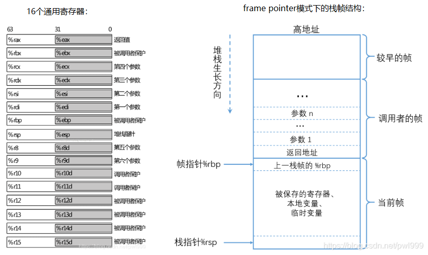
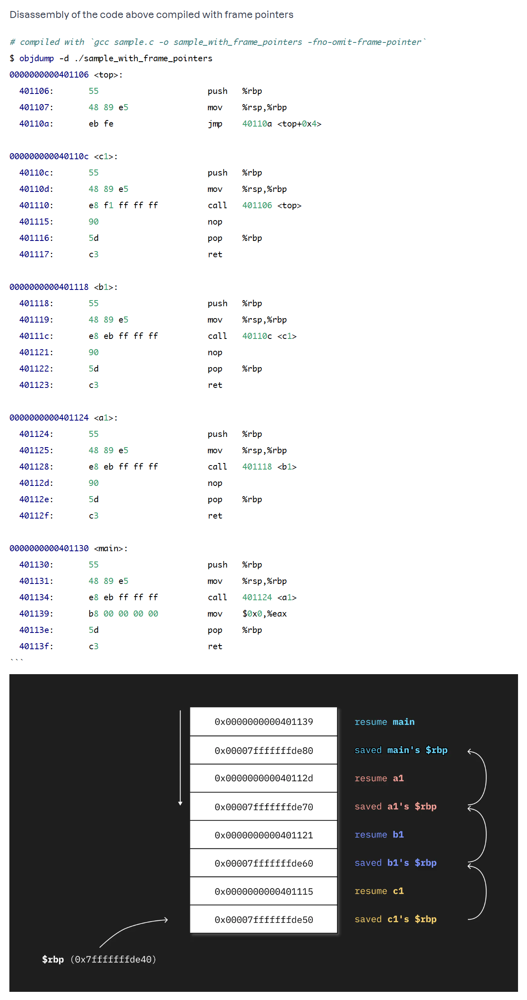
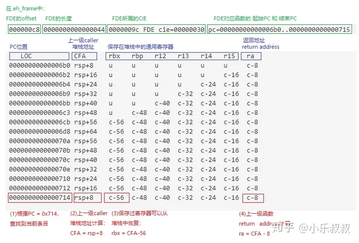

# Profile

## 搭建环境

1. 安装podman

   ```
   dnf -y install podman-docker
   ```

2. 创建网络namespace

   ```
   docker network create xm-calmwu
   ```

3. 安装Prometheus，chmod +777 /root/prometheus/datastore，以下是命令example，具体根据环境修改

   ```
   docker run -d --name prom -p 9090:9090 --network=xm-calmwu  -v /home/pingan/Program/prometheus-2.43.0-rc.1.linux-amd64/data:/prometheus -v /home/pingan/Program/prometheus-2.43.0-rc.1.linux-amd64/prometheus.yml:/etc/prometheus/prometheus.yml prom/prometheus --storage.tsdb.retention.time=3d --config.file=/etc/prometheus/prometheus.yml --storage.tsdb.path=/prometheus
   ```
   
4. 安装grafana

   ```
   docker pull grafana/grafana:main
   docker run --rm --name=grafana -d -p 3000:3000 -e "GF_FEATURE_TOGGLES_ENABLE=flameGraph" --network=xm-calmwu  grafana/grafana:main
   ```

5. 安装pyroscope

   ```
   docker pull grafana/pyroscope:1.0.0
   docker run --rm --name pyroscope -d --network=xm-calmwu -p 4040:4040 grafana/pyroscope:1.0.0
   ```

   验证

   ```
   curl localhost:4040/ready
   ```

6. 配置

   - 查看容器ip

     ```
     docker exec -it <container-id> ip addr
     ```

     

## 安装x-monitor.eBPF

1. 配置
2. 启动

## 测试

1. 配置grafana-agent-flow

   ```
   logging {
   	level = "debug"
   }
   
   pyroscope.ebpf "instance" {
   	forward_to = [pyroscope.write.endpoint.receiver]
   	default_target = {
   		"__name__"="host_cpu",
   		"service_name"="host_cpu", 
   	}
           targets = [
   		{"__container_id__"="4ec0624267de013f5b936c7bc37a6551d95a997fa659d41a9f840e7d32b84378", 
   		 "service_name"="grafana", 
   		 "__name__"="grafana_cpu"},
   	]
   	targets_only = false
   	collect_kernel_profile = true
   	collect_user_profile = true
   	collect_interval = "5s"
   	sample_rate = 100
   }
   
   pyroscope.write "endpoint" {
   	endpoint {
           url = "http://10.0.0.4:4040"
       }
   }
   
   ```

2. 启动grafana-agent-flow

   ```
   ./grafana-agent-flow run /home/pingan/Program/agent/build/grafana-agent-flow.river
   ```

3. profile

   

## 栈帧回溯

### frame pointer(fp)

1. 需要一个ebp寄存器来保存frame pointer，每次调用都会将ebp赋值给esp。
2. 保存ebp寄存器即保存回溯信息(unwind info)的动作会被编译成代码，有指令开销。
3. 在回溯堆栈时，除了恢复sp，不知道怎么恢复其他的寄存器。(例如gdb中的 frame n, info reg)。
4. 没有源语言信息。

这种栈帧结构，在x86_64中被抛弃。gcc 在64位编译器中默认不使用rbp保存栈帧地址，即不再保存上一个栈帧地址，因此在x86_64中也就无法使用这种栈回溯方式（不过可以使用**-fno-omit-frame-pointer**选项保存栈帧rbp）。

```
-fno-omit-frame-pointer
    push $rbp # 在进入下一个函数(callee)时，会保存调用函数（caller）的栈帧
    mov $rbp, $rsp # 进入下一个函数(callee)后，会将新的帧地址（rsp）赋值给rbp
```



```c
int top(void) {
    for(;;) { }
}

int c1(void) {
    top();
}

int b1(void) {
    c1();
}

int a1(void) {
    b1();
}

int main(void) {
  a1();
}
```



#### 地址计算

```
(gdb) p td_io_queue
$1 = {enum fio_q_status (struct thread_data *, struct io_u *)} 0x55555557dbc0 <td_io_queue>

➜  utils git:(master) ✗ cat /proc/684299/maps
555555554000-55555560c000 r-xp 00000000 08:02 3314393                    /usr/bin/fio
55555580c000-55555580e000 r--p 000b8000 08:02 3314393                    /usr/bin/fio
55555580e000-5555558ee000 rw-p 000ba000 08:02 3314393                    /usr/bin/fio

55555557dbc0 - 555555554000 = 29BC0

➜  bin git:(feature-xm-ebpf-collector) ✗ readelf -s /usr/bin/fio|grep td_io_queue
   611: 0000000000029bc0  1692 FUNC    GLOBAL DEFAULT   15 td_io_queue
```

#### DWARF

调试信息（Debugging with Attributed Record Formats）定义了一个.debug_frame section，该调试信息支持处理无基地址的方法，可以将ebp用作常规寄存器，但是当保存esp时，它必须在.debug_frame节中产生一个注释，告诉调试器什么指令将其保存在何处。

不足在于

1. 没有源语言信息
2. 不支持在程序加载是同时加载调试信息

DWARF’s Call Frame Information 是一种在EFL文件的.debug_frame section中保存unwind信息的规范。**通过解析这些信息，可以unwind stack**。

<u>在编译的二进制不支持 stack frame pointer（gcc 开启优化有就关闭 FP，故各大发行版提供的软件包一般都不支持 FP）时， gdb/perf 使用 debuginfo（DWARF 格式，一般使用 GNU libunwind 包，或 elfutils 提供的 libdw ）来进行 stack unwinding/单步调试/内存地址和源文件对应关系。</u>

每个.eh_frame section 包含一个或多个**CFI**(Call Frame Information)记录，记录的条目数量由.eh_frame 段大小决定。每条CFI记录包含一个**CIE**(Common Information Entry Record)记录，每个CIE包含一个或者多个**FDE**(Frame Description Entry)记录。

通常情况下，**CIE对应一个文件，FDE对应一个函数**。

**CFA (Canonical Frame Address, which is the address of %rsp in the caller frame)，CFA就是上一级调用者的堆栈指针**。

#### EH_FRAME

LSB(Linux Standard Base)标准中定义了一个.eh_frame section来解决上面的问题， [exception handler framework(.eh_frame)](https://refspecs.linuxfoundation.org/LSB_3.0.0/LSB-Core-generic/LSB-Core-generic/ehframechpt.html)用来解决各种语言的结构对 reliable unwinding 的需求。 `.eh_frame` 是 .debug_frame 的子集，遵从 DWARF CFI Extensions 规范， `是 unwinding stack 专用的特性`。

这个section和.debug_frame非常类似，但是它编码紧凑，可以随程序一起加载。

- <u>`.eh_frame 会被 gcc 默认生成` ，不会被 strip，会被加载到内存（而 .debug_frame 等是会被 strip，默认不会被加载到内存）。</u>
- 使用 readelf -Wwf XX 来查看 .eh_frame section 的内容；

这个段中存储着跟函数入栈相关的关键数据。当函数执行入栈指令后，在该段会保存跟入栈指令一一对应的编码数据，根据这些编码数据，就能计算出当前函数栈大小和cpu的那些寄存器入栈了，在栈中什么位置。

无论是否有-g选项，gcc都会默认生成.eh_frame和eh_frame_hdr这两个section。

1. 拥有源语言信息
2. 编码紧凑，并随程序一起加载。

### eh_frame进行unwind



这张表的结构设计如下：

1. 第一列。表示程序中包含代码的每个位置的地址。（在共享对象中，这是一个相对于对象的偏移量。）其余的列包含与指示的位置关联的虚拟展开规则。

利用eh_frame来进行栈回朔的过程：

1. 根据当前的PC在.eh_frame中找到对应的条目，根据条目提供的各种偏移计算其他信息。（这里能否通过ebpf来获取rip寄存器）
2. 首先根据CFA = rsp+4，把当前rsp+4得到CFA的值。再根据CFA的值计算出通用寄存器和返回地址在堆栈中的位置。
3. 通用寄存器栈位置计算。例如：rbx = CFA-56。
4. 返回地址ra的栈位置计算。ra = CFA-8。
5. 根据ra的值，重复步骤1到4，就形成了完整的栈回溯。

## eBPF获取用户堆栈

Linus [is not a great lover of DWARF](https://lkml.org/lkml/2012/2/10/356), so there is not and probably will not be in-kernel DWARF support. This is why [`bpf_get_stackid()`](https://github.com/torvalds/linux/blob/0d18c12b288a177906e31fecfab58ca2243ffc02/include/uapi/linux/bpf.h#L2064) and [`bpf_get_stack()`](https://github.com/torvalds/linux/blob/0d18c12b288a177906e31fecfab58ca2243ffc02/include/uapi/linux/bpf.h#L2932) will often return gibberish if frame pointers are not built into the userspace application. 

BFP 提供了 bpf_get_stackid()/bpf_get_stack() help func 来获取 userspace stack，但是它依赖于 userspace program 编译时开启了 frame pointer 的支持。


### 使用elfutils库

1. 安装、编译elfutils

   ```
   git clone git://sourceware.org/git/elfutils.git
   autoreconf -i -f &&\n./configure --enable-maintainer-mode --disable-libdebuginfod --disable-debuginfod
   ```

2. 使用stack来获取fio的运行堆栈，fio被取出了debuginfo

   ```
   ❯ sudo file /bin/fio   
   /bin/fio: ELF 64-bit LSB shared object, x86-64, version 1 (SYSV), dynamically linked, interpreter /lib64/ld-linux-x86-64.so.2, for GNU/Linux 3.2.0, BuildID[sha1]=0c8a9a6540d4d4a8247e07553d72cde921c4379b, stripped
   pingan in 🌐 Redhat8-01 in elfutils/src on  master [!?] via C v8.5.0-gcc 
   ❯ sudo ./nm -A /bin/fio
   ./nm: /bin/fio: no symbols
   ```

3. 获得堆栈

   ```
   pingan in 🌐 Redhat8-01 in elfutils/src on  master [!?] via C v8.5.0-gcc 
   ❯ sudo cat /proc/1007004/maps
   558c21f6a000-558c22022000 r-xp 00000000 08:02 585918                     /usr/bin/fio
   558c22222000-558c22224000 r--p 000b8000 08:02 585918                     /usr/bin/fio
   558c22224000-558c22304000 rw-p 000ba000 08:02 585918                     /usr/bin/fio
   
   ❯ sudo ./stack -i -m -s -p 1009871
   PID 1009871 - process
   TID 1009871:
   #0  0x00007f1c323f2d98 __nanosleep - /usr/lib64/libc-2.28.so
   #1  0x00007f1c3241eb28 usleep - /usr/lib64/libc-2.28.so
   #2  0x0000555bccb14010 do_usleep - /usr/bin/fio
       /usr/src/debug/fio-3.19-3.el8.x86_64/backend.c:2141:2
   #3  0x0000555bccb14010 run_threads - /usr/bin/fio
       /usr/src/debug/fio-3.19-3.el8.x86_64/backend.c:2460:3
   #4  0x0000555bccb14662 fio_backend - /usr/bin/fio
       /usr/src/debug/fio-3.19-3.el8.x86_64/backend.c:2513:2
   #5  0x0000555bccac3605 main - /usr/bin/fio
       /usr/src/debug/fio-3.19-3.el8.x86_64/fio.c:60:9
   #6  0x00007f1c3234d493 __libc_start_main - /usr/lib64/libc-2.28.so
   #7  0x0000555bccac365e _start - /usr/bin/fio
   TID 1009872:
   #0  0x00007f1c3241e29f __select - /usr/lib64/libc-2.28.so
   #1  0x0000555bccb1c074 helper_thread_main - /usr/bin/fio
       /usr/src/debug/fio-3.19-3.el8.x86_64/helper_thread.c:179:10
   #2  0x00007f1c32c7d17a start_thread - /usr/lib64/libpthread-2.28.so
   #3  0x00007f1c32426dc3 __clone - /usr/lib64/libc-2.28.so
   TID 1009873:
   #0  0x00007f1c3242152d syscall - /usr/lib64/libc-2.28.so
   #1  0x00007f1c330acc15 io_submit - /usr/lib64/libaio.so.1.0.1
   #2  0x0000555bccb1d8cf fio_libaio_commit - /usr/bin/fio
       engines/libaio.c:307:9
   #3  0x0000555bccad0a99 td_io_commit - /usr/bin/fio
       /usr/src/debug/fio-3.19-3.el8.x86_64/ioengines.c:442:9
   #4  0x0000555bccad0fb6 td_io_queue - /usr/bin/fio
       /usr/src/debug/fio-3.19-3.el8.x86_64/ioengines.c:390:4
   #5  0x0000555bccb104eb do_io - /usr/bin/fio
       /usr/src/debug/fio-3.19-3.el8.x86_64/backend.c:1066:10
   #6  0x0000555bccb12881 thread_main - /usr/bin/fio
       /usr/src/debug/fio-3.19-3.el8.x86_64/backend.c:1791:4
   #7  0x00007f1c32c7d17a start_thread - /usr/lib64/libpthread-2.28.so
   #8  0x00007f1c32426dc3 __clone - /usr/lib64/libc-2.28.so
   ```

4. 对比符号地址

   通过计算maps地址，得到堆栈fio_backend的pc等于6D662，通过nm查看fio_backend地址范围，说明地址是在函数范围内的。

   ```
   000000000006d805 t .annobin_fio_backend.end
   000000000006d56e t .annobin_fio_backend.start
   ```

### 使用bpftrace

1. 通过pc获得sym

   ```
   ➜  bin git:(feature-xm-ebpf-collector) ✗ bpftrace -e 'uprobe:/bin/fio:fio_libaio_commit {printf("%s\n", usym(reg("ip"))); }'
   Attaching 1 probe...
   fio_libaio_commit
   fio_libaio_commit
   fio_libaio_commit
   ```

2. bpftrace无法获得正确的堆栈，看来bpftrace是依赖frame-point

   ```
   ➜  bin git:(feature-xm-ebpf-collector) ✗ bpftrace -e 'uprobe:/bin/fio:td_io_commit {printf("%s\n", ustack(perf)); }'
           5597dbd19eb0 0x5597dbd19eb0 ([unknown])
           7f9961e3b000 0x7f9961e3b000 ([unknown])
           5597dbd19eb0 0x5597dbd19eb0 ([unknown])
           7f9961e3b000 0x7f9961e3b000 ([unknown])
   ```

   这些地址明显不对，超过了/proc/pid/maps范围

   ```
   5597db17b000-5597db233000 r-xp 00000000 08:02 585918                     /usr/bin/fio
   5597db433000-5597db435000 r--p 000b8000 08:02 585918                     /usr/bin/fio
   5597db435000-5597db515000 rw-p 000ba000 08:02 585918                     /usr/bin/fio
   ```


### eBPF Prog程序中怎么获取用户态的寄存器信息

1. 内核中是通过如下函数来获取的，X86

   ```
   static inline void *task_stack_page(const struct task_struct *task)
   {
   	return task->stack;
   }
   
   #define task_pt_regs(task) \
   ({									\
   	unsigned long __ptr = (unsigned long)task_stack_page(task);	\
   	__ptr += THREAD_SIZE - TOP_OF_KERNEL_STACK_PADDING;		\
   	((struct pt_regs *)__ptr) - 1;					\
   })
   
   static inline long get_user_reg(struct task_struct *task, int offset)
   {
   	return task_pt_regs(task)->uregs[offset];
   }
   ```

   查看那elfutils代码，找到uregs每个成员对应的具体寄存器，参与CFA计算的PC寄存器是16，rsp寄存器是7，rbp寄存器是6

   ```
   bool
   x86_64_set_initial_registers_tid (pid_t tid __attribute__ ((unused)),
   			  ebl_tid_registers_t *setfunc __attribute__ ((unused)),
   				  void *arg __attribute__ ((unused)))
   {
   #if !defined(__x86_64__) || !defined(__linux__)
     return false;
   #else /* __x86_64__ */
     struct user_regs_struct user_regs;
     if (ptrace (PTRACE_GETREGS, tid, NULL, &user_regs) != 0)
       return false;
     Dwarf_Word dwarf_regs[17];
     dwarf_regs[0] = user_regs.rax;
     dwarf_regs[1] = user_regs.rdx;
     dwarf_regs[2] = user_regs.rcx;
     dwarf_regs[3] = user_regs.rbx;
     dwarf_regs[4] = user_regs.rsi;
     dwarf_regs[5] = user_regs.rdi;
     dwarf_regs[6] = user_regs.rbp;
     dwarf_regs[7] = user_regs.rsp;
     dwarf_regs[8] = user_regs.r8;
     dwarf_regs[9] = user_regs.r9;
     dwarf_regs[10] = user_regs.r10;
     dwarf_regs[11] = user_regs.r11;
     dwarf_regs[12] = user_regs.r12;
     dwarf_regs[13] = user_regs.r13;
     dwarf_regs[14] = user_regs.r14;
     dwarf_regs[15] = user_regs.r15;
     dwarf_regs[16] = user_regs.rip;
     return setfunc (0, 17, dwarf_regs, arg);
   #endif /* __x86_64__ */
   }
   ```

   

2. struct task_struct.stack成员的含义

   struct task_struct结构中的stack成员是一个指针，它指向进程的内核栈的地址。内核栈是当进程从用户空间进入内核空间时，特权级发生变化，需要切换堆栈，那么内核空间中使用的就是这个内核栈。12 内核栈的大小是固定的，通常是8KB或16KB，它是由一个union thread_union结构体或一个struct thread_info结构体来表示的。32 stack成员可以通过宏task_stack_page(task)来访问，它返回一个void *类型的指针，指向内核栈的底部。

   当进程从用户态切换到内核态（例如，在执行系统调用时）或从内核态切换回用户态时，内核会使用这个内核栈来保存和恢复进程的上下文信息。这包括寄存器的值、栈指针等。

## 资料

1. [Get started with Pyroscope | Grafana Pyroscope documentation](https://grafana.com/docs/pyroscope/latest/get-started/)

1. [基于ebpf的parca-agent profiling方案探究_ebpf_jupiter_InfoQ写作社区](https://xie.infoq.cn/article/739629c2c64a16d99cf370f00)

1. **[Unwind 栈回溯详解 - pwl999 - 博客园 (cnblogs.com)](https://www.cnblogs.com/pwl999/p/15534946.html)**

1. [linux 栈回溯(x86_64 ) - 知乎 (zhihu.com)](https://zhuanlan.zhihu.com/p/302726082)

1. **[DWARF-based Stack Walking Using eBPF (polarsignals.com)](https://www.polarsignals.com/blog/posts/2022/11/29/dwarf-based-stack-walking-using-ebpf/)**

1. [linux 栈回溯(x86_64 ) - 知乎 (zhihu.com)](https://zhuanlan.zhihu.com/p/302726082)

1. [Function Stack Unwinding · Opsnull](https://blog.opsnull.com/posts/function-stack-unwinding/)

1. [Developing eBPF profilers for polyglot cloud-native applications (lpc.events)](https://lpc.events/event/16/contributions/1361/attachments/1043/2004/Developing eBPF profilers for polyglot cloud-native applications (1).pdf)

1. [ELF文件格式 - 知乎 (zhihu.com)](https://zhuanlan.zhihu.com/p/286088470)

   

