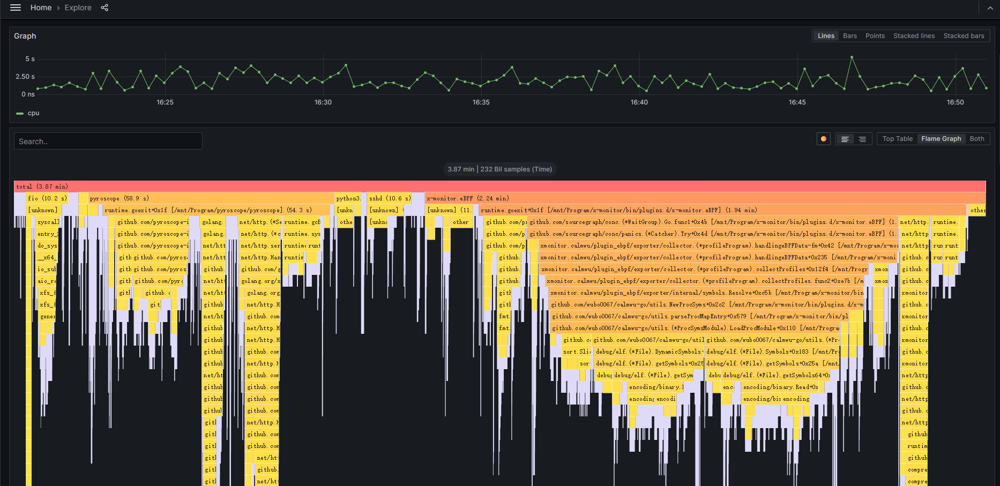

# Profile

## 搭建环境

1. 安装podman

   ```
   dnf -y install podman-docker
   ```

2. 创建网络namespace

   ```
   docker network create xm-pyroscope 
   ```

3. 安装grafana

   ```
   docker pull grafana/grafana:main
   docker run --rm --name=grafana -d -p 3000:3000 -e "GF_FEATURE_TOGGLES_ENABLE=flameGraph" --network=xm-pyroscope  grafana/grafana:main
   ```

4. 安装pyroscope

   ```
   docker pull grafana/pyroscope:1.0.0
   docker run --rm --name pyroscope -d --network=xm-pyroscope -p 4040:4040 --network=xm-pyroscope grafana/pyroscope:1.0.0
   ```

   二进制启动

5. 配置

   - 查看容器ip

     ```
     docker exec -it 7738b5e2ee19 ip addr
     ```

     

## 安装x-monitor.eBPF

1. 配置
2. 启动

## 测试

1. 配置grafana-agent-flow

   ```
   logging {
   	level = "debug"
   }
   
   pyroscope.ebpf "instance" {
   	forward_to = [pyroscope.write.endpoint.receiver]
   	default_target = {
   		"__name__"="host_cpu",
   		"service_name"="host_cpu", 
   	}
           targets = [
   		{"__container_id__"="4ec0624267de013f5b936c7bc37a6551d95a997fa659d41a9f840e7d32b84378", 
   		 "service_name"="grafana", 
   		 "__name__"="grafana_cpu"},
   	]
   	targets_only = false
   	collect_kernel_profile = true
   	collect_user_profile = true
   	collect_interval = "5s"
   	sample_rate = 100
   }
   
   pyroscope.write "endpoint" {
   	endpoint {
           url = "http://10.0.0.4:4040"
       }
   }
   
   ```

2. 启动grafana-agent-flow

   ```
   ./grafana-agent-flow run /home/pingan/Program/agent/build/grafana-agent-flow.river
   ```

3. profile

   

## 栈帧回溯

### frame pointer(fp)

#### 地址计算

```
(gdb) p td_io_queue
$1 = {enum fio_q_status (struct thread_data *, struct io_u *)} 0x55555557dbc0 <td_io_queue>

➜  utils git:(master) ✗ cat /proc/684299/maps
555555554000-55555560c000 r-xp 00000000 08:02 3314393                    /usr/bin/fio
55555580c000-55555580e000 r--p 000b8000 08:02 3314393                    /usr/bin/fio
55555580e000-5555558ee000 rw-p 000ba000 08:02 3314393                    /usr/bin/fio

55555557dbc0 - 555555554000 = 29BC0

➜  bin git:(feature-xm-ebpf-collector) ✗ readelf -s /usr/bin/fio|grep td_io_queue
   611: 0000000000029bc0  1692 FUNC    GLOBAL DEFAULT   15 td_io_queue
```

#### 编译依赖

```
-fno-omit-frame-pointer
    push $rbp # 在进入下一个函数(callee)时，会保存调用函数（caller）的栈帧
    mov $rbp, $rsp # 进入下一个函数(callee)后，会将新的帧地址（rsp）赋值给rbp
```

#### 乱码

Linus [is not a great lover of DWARF](https://lkml.org/lkml/2012/2/10/356), so there is not and probably will not be in-kernel DWARF support. This is why [`bpf_get_stackid()`](https://github.com/torvalds/linux/blob/0d18c12b288a177906e31fecfab58ca2243ffc02/include/uapi/linux/bpf.h#L2064) and [`bpf_get_stack()`](https://github.com/torvalds/linux/blob/0d18c12b288a177906e31fecfab58ca2243ffc02/include/uapi/linux/bpf.h#L2932) will often return gibberish if frame pointers are not built into the userspace application. 

### eh_frame进行unwind

## 资料

1. [Get started with Pyroscope | Grafana Pyroscope documentation](https://grafana.com/docs/pyroscope/latest/get-started/)
1. [基于ebpf的parca-agent profiling方案探究_ebpf_jupiter_InfoQ写作社区](https://xie.infoq.cn/article/739629c2c64a16d99cf370f00)
1. **[Unwind 栈回溯详解 - pwl999 - 博客园 (cnblogs.com)](https://www.cnblogs.com/pwl999/p/15534946.html)**
1. [linux 栈回溯(x86_64 ) - 知乎 (zhihu.com)](https://zhuanlan.zhihu.com/p/302726082)
1. **[DWARF-based Stack Walking Using eBPF (polarsignals.com)](https://www.polarsignals.com/blog/posts/2022/11/29/dwarf-based-stack-walking-using-ebpf/)**
1. [linux 栈回溯(x86_64 ) - 知乎 (zhihu.com)](https://zhuanlan.zhihu.com/p/302726082)

