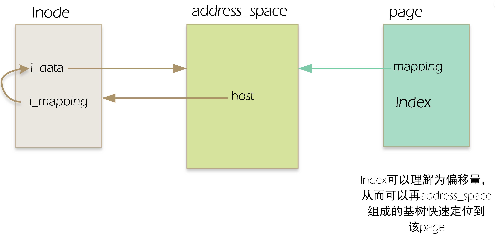
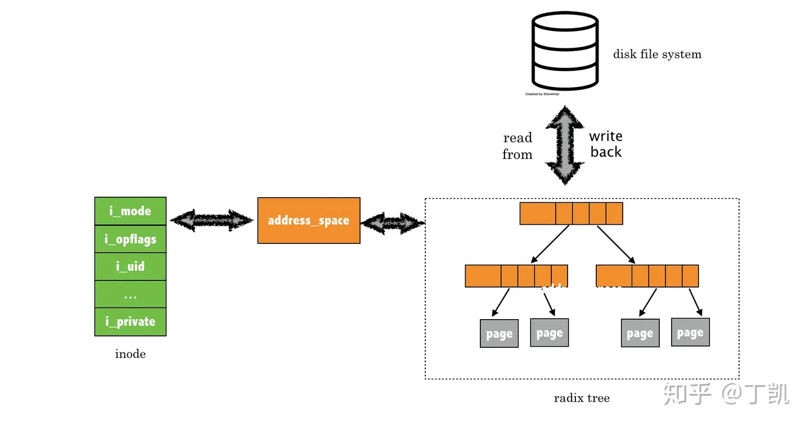
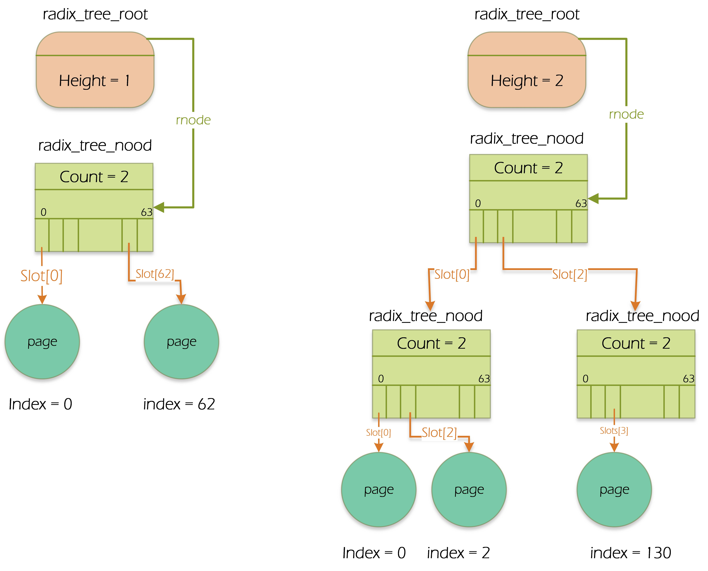
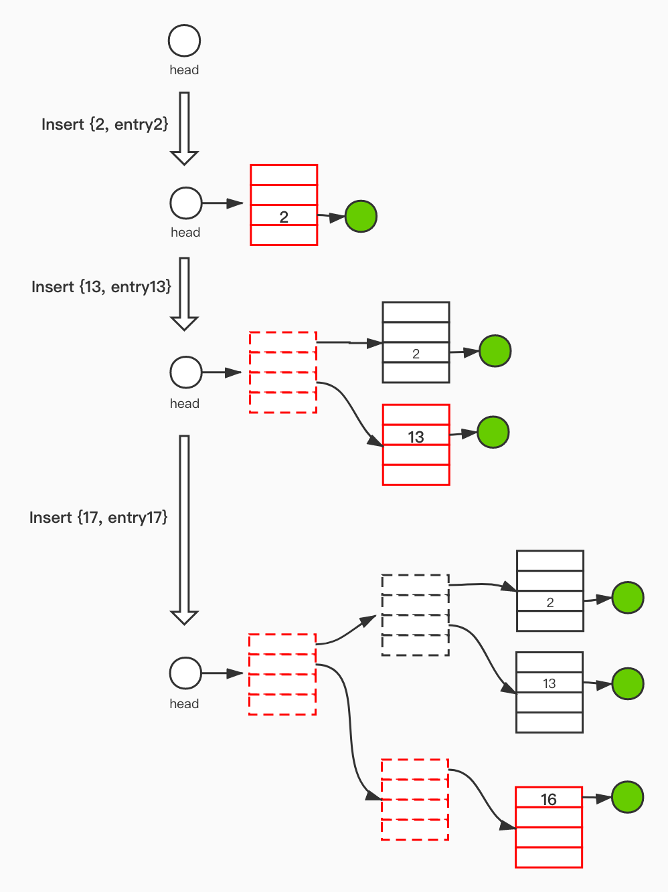

# PageCache

## inode、PageCache，page的关系



## PageCache

### 类型

内核代码并不直接读写磁盘，基本都是通过页高速缓存，PageCache的类型可能是以下几种

1. 含有普通文件数据的Page。
2. 含有目录的Page。
3. 含有直接从块设备（skip file system）读取的数据Page。
4. 含有用户态进程数据的页，但页中的数据已经被交换到磁盘。
5. 属于特殊文件系统文件的Page，例如shm。

所以，PageCache中每个Page包含的数据肯定属于某个文件。这个文件（更确切的说是inode）就是Page的所有者（owner）。

几乎所有的文件读、写都依赖于PageCache，只有使用O_DIRECT标志的进程打开文件的时候才会出现例外，从而绕过了PageCache，少数数据库采用自己的缓存算法。

### 目的

内核设计者实现PageCache主要是满足下面两个需求

1. 快速定位给定inode相关数据的特定页。为了尽可能充分发挥PageCache的优势，使用radix_tree。
2. 记录在读或写Page中的数据是应该如何处理高速缓存中的每个页。例如，从普通文件、块设备文件或者交换区读取一个数据页必须用不同的实现方式，因此内核必须根据页的所有者（inode的类型不同）选择适当的操作。

### Page识别

通过页的所有者和所有者数据中的索引（通常是一个索引节点和在相应文件中的偏移量）来识别PageCache中的Page。

## struct address_space

address_space是linux内核中的一个关键抽象，它是PageCache和外部设备中文件系统的桥梁，上层应用读、写数据会进入到该结构。

### 结构成员描述

| field           | type                                  | desc                                                         |
| --------------- | ------------------------------------- | ------------------------------------------------------------ |
| i_pages         | struct radix_tree_root                | 指向了这个地址空间对应的页缓存的基数树。这样就可以通过 inode --> address_space -->i_pages 找到文件对应缓存页，在最近的内核中改为xarray，在radix tree的基础上增加了一些功能。 |
| a_ops           | const struct address_space_operations | 定义了抽象的文件系统交互接口，由具体文件系统负责实现。例如如果文件是存储在ext4文件系统之上，那么该结构便被初始化为***ext4_aops\*** （见fs/ext4/inode.c） |
| host            | struct inode *                        | owner: inode, block_device                                   |
| nrpages         | unsigned long                         | address_space中缓存的总页面数                                |
| writeback_index | pgoff_t                               | 该address_space中回写（writeback）操作的起始偏移量，即将缓存中的脏页面写回到文件或设备中的位置。 |
| i_mmap_writable | atomic_t                              | 这个成员是一个原子变量，用于记录该address_space中有多少个共享映射（VM_SHARED），即多个进程共享同一段内存映射的情况 |
| gfp_mask        | gfp_t                                 | 这个成员是一个标志位，用于指定为该address_space分配内存时使用的内存分配器类型和参数，例如是否允许睡眠、是否允许交换等。 |
| flags           | unsigned long                         | 这个成员是一个位图，用于记录该address_space中发生的一些错误或异常情况，例如内存不足、读写错误等。 |



### address_space操作函数

| type                                                         | desc                                                         |
| ------------------------------------------------------------ | ------------------------------------------------------------ |
| int (*writepage)(struct page *page, struct writeback_control *wbc) | 函数指针，指向一个用于将一个脏页面（dirty page）写回到文件或设备中的函数。脏页面是指缓存在内存中的页面，但是与文件或设备中的内容不一致的页面。wbc参数是一个用于控制回写操作的结构体，包含了一些信息，例如回写的范围、模式、同步或异步等。 |
| int (*readpage)(struct file *, struct page *)                | 函数指针，指向一个用于从文件或设备中读取一个页面到内存中的函数。file参数是一个指向打开的文件或设备的结构体，page参数是一个指向要读取到的页面的结构体。 |
| int (*set_page_dirty)(struct page *page)                     | 函数指针，指向一个用于将一个页面标记为脏的函数。page参数是一个指向要标记的页面的结构体。这个函数通常在内存中修改了页面内容后调用，以便在适当的时候回写到文件或设备中。 |
| int (*write_begin)(struct file *, struct address_space *mapping, | 函数指针，指向一个用于开始写入操作前准备工作的函数。file参数与readpage相同，mapping参数与readpages相同，pos参数是要写入的位置偏移量，len参数是要写入的长度，flags参数是一些标志位，例如是否需要分配新页面等，pagep参数是一个指向要写入到的页面的指针的指针，fsdata参数是一个指向文件系统特定数据的指针的指针。这个函数通常会锁定要写入到的页面，并返回给调用者。 |
| int (*write_end)(struct file *, struct address_space *mapping, | 函数指针，指向一个用于结束写入操作后清理工作的函数。file参数与write_begin相同，mapping参数与write_begin相同，pos参数与write_begin相同，len参数与write_begin相同，copied参数是实际写入到页面中的字节数，page参数与write_begin相同，fsdata参数与write_begin相同。这个函数通常会解锁已经写入到的页面，并更新文件或设备中的内容。 |

### 在PageCache中查找一个Page

```
/**
 * pagecache_get_page - Find and get a reference to a page.
 * @mapping: The address_space to search.
 * @index: The page index.
 * @fgp_flags: %FGP flags modify how the page is returned.
 * @gfp_mask: Memory allocation flags to use if %FGP_CREAT is specified.
 *
 * Looks up the page cache entry at @mapping & @index.
 *
 * @fgp_flags can be zero or more of these flags:
 *
 * * %FGP_ACCESSED - The page will be marked accessed.
 * * %FGP_LOCK - The page is returned locked.
 * * %FGP_CREAT - If no page is present then a new page is allocated using
 *   @gfp_mask and added to the page cache and the VM's LRU list.
 *   The page is returned locked and with an increased refcount.
 * * %FGP_FOR_MMAP - The caller wants to do its own locking dance if the
 *   page is already in cache.  If the page was allocated, unlock it before
 *   returning so the caller can do the same dance.
 * * %FGP_WRITE - The page will be written
 * * %FGP_NOFS - __GFP_FS will get cleared in gfp mask
 * * %FGP_NOWAIT - Don't get blocked by page lock
 *
 * If %FGP_LOCK or %FGP_CREAT are specified then the function may sleep even
 * if the %GFP flags specified for %FGP_CREAT are atomic.
 *
 * If there is a page cache page, it is returned with an increased refcount.
 *
 * Return: The found page or %NULL otherwise.
 */
struct page *pagecache_get_page(struct address_space *mapping, pgoff_t index,
				int fgp_flags, gfp_t gfp_mask)
{
	struct page *page;

repeat:
	page = find_get_entry(mapping, index);
	if (xa_is_value(page))
		page = NULL;
	if (!page)
		goto no_page;

	if (fgp_flags & FGP_LOCK) {
		if (fgp_flags & FGP_NOWAIT) {
			if (!trylock_page(page)) {
				put_page(page);
				return NULL;
			}
		} else {
			lock_page(page);
		}

		/* Has the page been truncated? */
		if (unlikely(compound_head(page)->mapping != mapping)) {
			unlock_page(page);
			put_page(page);
			goto repeat;
		}
		VM_BUG_ON_PAGE(page->index != index, page);
	}

	if (page && (fgp_flags & FGP_ACCESSED))
		mark_page_accessed(page);
	else if (fgp_flags & FGP_WRITE) {
		/* Clear idle flag for buffer write */
		if (page_is_idle(page))
			clear_page_idle(page);
	}

no_page:
	if (!page && (fgp_flags & FGP_CREAT)) {
		int err;
		if ((fgp_flags & FGP_WRITE) && mapping_can_writeback(mapping))
			gfp_mask |= __GFP_WRITE;
		if (fgp_flags & FGP_NOFS)
			gfp_mask &= ~__GFP_FS;

		page = __page_cache_alloc(gfp_mask);
		if (!page)
			return NULL;

		if (WARN_ON_ONCE(!(fgp_flags & (FGP_LOCK | FGP_FOR_MMAP))))
			fgp_flags |= FGP_LOCK;

		/* Init accessed so avoid atomic mark_page_accessed later */
		if (fgp_flags & FGP_ACCESSED)
			__SetPageReferenced(page);

		err = add_to_page_cache_lru(page, mapping, index, gfp_mask);
		if (unlikely(err)) {
			put_page(page);
			page = NULL;
			if (err == -EEXIST)
				goto repeat;
		}

		/*
		 * add_to_page_cache_lru locks the page, and for mmap we expect
		 * an unlocked page.
		 */
		if (page && (fgp_flags & FGP_FOR_MMAP))
			unlock_page(page);
	}

	return page;
}
```

## 文件read到PageCache

```
struct file {
	......
	loff_t f_pos;
	struct address_space *f_mapping;
};
```

| field     | type                 | desc                 |
| --------- | -------------------- | -------------------- |
| f_pos     | loff_t               | 文件当前读写位置偏移 |
| f_mapping | struct address_space | 对应的地址空间       |

### 系统API

```
ssize_t ksys_read(unsigned int fd, char __user *buf, size_t count)
{
	struct fd f = fdget_pos(fd);
	ssize_t ret = -EBADF;

	if (f.file) {
		// 文件读写偏移
		loff_t pos = file_pos_read(f.file);
		ret = vfs_read(f.file, buf, count, &pos);
		if (ret >= 0)
			// 读取成功，修改f_pos
			file_pos_write(f.file, pos);
		fdput_pos(f);
	}
	return ret;
}

SYSCALL_DEFINE3(read, unsigned int, fd, char __user *, buf, size_t, count)
{
	return ksys_read(fd, buf, count);
}
```

### 通过vfs读取，文件系统是xfs，构造sync read

```
ssize_t __vfs_read(struct file *file, char __user *buf, size_t count,
		   loff_t *pos)
{
	if (file->f_op->read)
		return file->f_op->read(file, buf, count, pos);
	else if (file->f_op->read_iter)
		// 对于xfs，.read_iter	= xfs_file_read_iter,
		return new_sync_read(file, buf, count, pos);
	else
		return -EINVAL;
}
```

### 构造散列读

```
static ssize_t new_sync_read(struct file *filp, char __user *buf, size_t len,
			     loff_t *ppos)
{
	// 缓冲区和长度
	struct iovec iov = { .iov_base = buf, .iov_len = len };
	// kernel i/o control block缩写
	struct kiocb kiocb;
	struct iov_iter iter;
	ssize_t ret;

	init_sync_kiocb(&kiocb, filp);
	// 读写的位置
	kiocb.ki_pos = *ppos;
	iov_iter_init(&iter, READ, &iov, 1, len);
	// file->f_op->read_iter(kio, iter);
	ret = call_read_iter(filp, &kiocb, &iter);
	BUG_ON(ret == -EIOCBQUEUED);
	*ppos = kiocb.ki_pos;
	return ret;
}
```

### xfs文件系统的read，涉及到pageCache的读取

```
/**
 * generic_file_buffered_read - generic file read routine
 * @iocb:	the iocb to read
 * @iter:	data destination
 * @written:	already copied
 *
 * This is a generic file read routine, and uses the
 * mapping->a_ops->readpage() function for the actual low-level stuff.
 *
 * This is really ugly. But the goto's actually try to clarify some
 * of the logic when it comes to error handling etc.
 *
 * Return:
 * * total number of bytes copied, including those the were already @written
 * * negative error code if nothing was copied
 */
static ssize_t generic_file_buffered_read(struct kiocb *iocb,
					  struct iov_iter *iter,
					  ssize_t written)
{
	// 文件对象
	struct file *filp = iocb->ki_filp;
	// 地址空间
	struct address_space *mapping = filp->f_mapping;
	// 文件的所有者
	struct inode *inode = mapping->host;
	struct file_ra_state *ra = &filp->f_ra;
	// 文件的读写偏移
	loff_t *ppos = &iocb->ki_pos;
	pgoff_t index;
	pgoff_t last_index;
	pgoff_t prev_index;
	unsigned long offset; /* offset into pagecache page */
	unsigned int prev_offset;
	int error = 0;

	if (unlikely(*ppos >= inode->i_sb->s_maxbytes))
		return 0;
	iov_iter_truncate(iter, inode->i_sb->s_maxbytes);
	// 根据读取位置计算索引，index = 4k的倍数 #define PAGE_SHIFT		12
	index = *ppos >> PAGE_SHIFT;
	// 最后一次读取的索引
	prev_index = ra->prev_pos >> PAGE_SHIFT;
	// 在page中的偏移位置
	prev_offset = ra->prev_pos & (PAGE_SIZE - 1);
	// 读取位置 + 缓冲区大小 + PAGE-1 / PAGE_SIZE，这次读的最后page的索引
	last_index = (*ppos + iter->count + PAGE_SIZE - 1) >> PAGE_SHIFT;
	// 页开始的位置，去掉小于4k的部分，
	offset = *ppos & ~PAGE_MASK;

	for (;;) {
		struct page *page;
		pgoff_t end_index;
		loff_t isize;
		unsigned long nr, ret;

		cond_resched();
	find_page:
		if (fatal_signal_pending(current)) {
			error = -EINTR;
			goto out;
		}
		// 根据索引在pagecache中查找
		page = find_get_page(mapping, index);
		if (!page) {
			// 没有在pagecache中找到
			if (iocb->ki_flags & (IOCB_NOWAIT | IOCB_NOIO))
				goto would_block;
			// 如果pagecache miss了，会触发预读取，预读取的起始page是index，读取page数量是last_index-index
			page_cache_sync_readahead(mapping, ra, filp, index,
						  last_index - index);
			page = find_get_page(mapping, index);
			if (unlikely(page == NULL))
				goto no_cached_page;
		}	
        ......
		/*
		 * Ok, we have the page, and it's up-to-date, so
		 * now we can copy it to user space...
		 */
		// 这里将page的数据拷贝到缓冲中
		ret = copy_page_to_iter(page, offset, nr, iter);        
```

### PageCache miss

```
/**
 * page_cache_sync_readahead - generic file readahead
 * @mapping: address_space which holds the pagecache and I/O vectors
 * @ra: file_ra_state which holds the readahead state
 * @filp: passed on to ->readpage() and ->readpages()
 * @offset: start offset into @mapping, in pagecache page-sized units
 * @req_size: hint: total size of the read which the caller is performing in
 *            pagecache pages
 *
 * page_cache_sync_readahead() should be called when a cache miss happened:
 * it will submit the read.  The readahead logic may decide to piggyback more
 * pages onto the read request if access patterns suggest it will improve
 * performance.
 */
void page_cache_sync_readahead(struct address_space *mapping,
			       struct file_ra_state *ra, struct file *filp,
			       pgoff_t offset, unsigned long req_size)
```

### 预读取

在Linux内核中,PageReadAhead函数是用来提前发起页面(page)预读的。

该函数的主要作用是:

- 对指定的文件,提前发起异步(async)的页面读请求。
- 目的是将文件数据预先读取到页面缓存(page cache)中。
- 这样后续的文件读取请求就可以直接从缓存中获取数据,提高I/O性能。

PageReadAhead函数的典型用法:

- 当检测到对文件顺序读取时,调用PageReadAhead。
- 指定预读的起始页面(page offset)和长度。
- 内核会提交异步读请求到块层,将指定范围的数据提前读取到page cache。

PageReadAhead的实现机制:

- 通过调用generic file read函数submit_page_readahead发起读请求。
- 异步请求提交到blkdev_issue_flush后处理。
- 请求完成后通过page cache满足后续的文件读取。

使用PageReadahead可以减少文件实际读IO次数,是文件系统提高顺序读性能的重要手段之一。它利用了块层的预读能力,将随机IO转换为顺序IO,也称为顺序化(sequentialization)。

### Page的Update状态

在Linux内核中,PageUptodate函数用于检查一个页面(page)的Uptodate状态。

Uptodate表示页面内容是否与磁盘一致,是一个页面管理中的重要状态。

PageUptodate函数的主要作用是:

- 接收一个struct page指针作为参数。
- 检查页面的Uptodate位,一般存储在flags字段中。
- 如果Uptodate为1,表示页面数据与磁盘一致,则返回true。
- 如果Uptodate为0,表示页面数据可能过期,需要从磁盘重新读取,则返回false。

页面的Uptodate状态在不同场景下的意义:

- 文件读取时,如果页面Uptodate,可以直接使用,否则需要发起磁盘IO获取最新数据。
- 页面写入时,如果Uptodate,需要先写回磁盘,否则可以直接丢弃。
- mmap操作时,如果Uptodate,表示映射内存与文件数据一致。

PageUptodate封装了Uptodate状态的检查,提高代码复用性,是Linux内存管理中的基础函数之一。正确判断页面状态十分重要,它们决定了后续的页面处理流程。

### put_page

put_page函数的主要执行流程如下:

1. 减少页面page的引用计数。

2. 如果页面引用计数减为0,则调用__put_page函数释放页面。

3. __put_page根据页面状态进行处理:

   - 如果页面在swap cache中,则释放swap cache entry。

   - 如果页面在page cache中,进行解锁并回写到磁盘。

   - 如果是匿名页面,则直接释放物理内存页框。

4. 如果页面引用计数不为0,表示还有其他用户在使用,则直接返回。

所以put_page函数允许在对页面使用完成后释放引用,是页面生命周期管理的关键之一。

它与get_page配对使用,通常在获取页面后,在不需要时调用put_page释放。

这种开发模式可以防止内存泄露,保证内核内存页面的合理使用和回收。

### DAX模式

在Linux内核中,IS_DAX宏是用来判断一个地址空间(address space)是否支持DAX(Direct Access)的。它检查两个条件

- CONFIG_FS_DAX内核配置选项是否启用,也就是支持DAX的特性是否开启。
- dax_mapping()函数对指定inode是否返回true。dax_mapping()函数检查该inode对应的地址空间是否启用了DAX模式。

DAX模式允许进程直接对文件存储设备(如NVDIMM)进行内存映射,而不需要经过页面缓存。**通过DAX,可以 bypass 页面缓存**,降低读写延迟。

所以,IS_DAX宏判断一个inode的地址空间是否支持DAX模式。如果支持,在访问该文件的页时可以直接访问设备,而不需要缓存。

#### 判断内核是否支持或开启DAX模式

- 检查内核配置选项CONFIG_FS_DAX是否被启用。该配置需要在内核编译时被显式地开启。
- 检查/proc/filesystems文件,看是否包含"dax"。该文件列出了内核支持的文件系统类型。
- 检查mount命令的help信息,是否包含"dax"。如果内核支持DAX,mount命令会有相关的挂载选项。

## DropCache

执行dropcache操作后调用的函数

```
void delete_from_page_cache_batch(struct address_space *mapping,
				  struct pagevec *pvec)
{
	int i;
	unsigned long flags;

	if (!pagevec_count(pvec))
		return;

	xa_lock_irqsave(&mapping->i_pages, flags);
	for (i = 0; i < pagevec_count(pvec); i++) {
		trace_mm_filemap_delete_from_page_cache(pvec->pages[i]);

		unaccount_page_cache_page(mapping, pvec->pages[i]);
	}
	// 将page从xarray中删除
	page_cache_delete_batch(mapping, pvec);
	xa_unlock_irqrestore(&mapping->i_pages, flags);
	// 释放page管理的内存
	for (i = 0; i < pagevec_count(pvec); i++)
		page_cache_free_page(mapping, pvec->pages[i]);
}
```

## radix tree

linux支持给个T的文件。访问大文件时，PageCache中充满了太多的Page，如果顺序扫描这些页要消耗大量的时间。为了实现Page的高效查找，使用了radix tree。

每个address_space对象对应一个搜索树，成员i_pages是基树的根。



## IOCB标志位

IOCB全称是I/O Control Block, 中文可以翻译为I/O控制块

| IOCB_EVENTFD | 1 << 0 | 当I/O操作完成时应触发一个eventfd通知                         |
| ------------ | ------ | ------------------------------------------------------------ |
| IOCB_APPEND  | 1 << 1 | 数据应该附加到文件末尾，而不是覆盖原有数据                   |
| IOCB_DIRECT  | 1 << 2 | 进行直接I/O，绕过页面缓存，直接从存储设备读取/写入数据       |
| IOCB_HIPRI   | 1 << 3 | I/O操作应当具有高优先级                                      |
| IOCB_DSYNC   | 1 << 4 | 同步数据写入。表示数据将被同步到磁盘，但不需要同步元数据     |
| IOCB_SYNC    | 1 << 5 | 同步写入，意味着写入操作会一直阻塞，直到数据被物理写入存储设备 |
| IOCB_WRITE   | 1 << 6 | 写入操作                                                     |
| IOCB_NOWAIT  | 1 << 7 | 表示I/O操作应该是非阻塞的，即它会立即返回而不会等待完成      |
| IOCB_NOIO    | 1 << 9 | 这个标志用于表示不执行任何I/O操作。通常在preadv2/pwritev2系统调用中使用，其中I/O是单独处理的 |

## xarray

一个文件的缓存通过该数据结构进行管理，这里记录了文件数据与内存页之间的映射关系的数据结构就是xarray。当每次需要访问文件的数据时，都需要先查找这个缓存表，所以它最重要的需求就是查找速度快。如果把文件的偏移看做是虚拟地址，那么这个表其实做的事情就是“虚拟地址---->内存页”的映射。

xarray作为一个树形结构，树中每个节点的数据结构struct xa_node

```
struct xa_node {
	unsigned char shift; /* Bits remaining in each slot */
	unsigned char offset; /* Slot offset in parent */
	unsigned char count; /* Total entry count */
	unsigned char nr_values; /* Value entry count */
	struct xa_node __rcu *parent; /* NULL at top of tree */
	struct xarray *array; /* The array we belong to */
	union {
		struct list_head private_list; /* For tree user */
		struct rcu_head rcu_head; /* Used when freeing node */
	};
	void __rcu *slots[XA_CHUNK_SIZE];
	union {
		unsigned long tags[XA_MAX_MARKS][XA_MARK_LONGS];
		unsigned long marks[XA_MAX_MARKS][XA_MARK_LONGS];
	};
	/* RHEL kABI: this structure can be appended to by RH_KABI_EXTEND */
};

struct RH_KABI_RENAME(radix_tree_root, xarray) {
	spinlock_t xa_lock;
	/* private: The rest of the data structure is not to be used directly. */
	gfp_t RH_KABI_RENAME(gfp_mask, xa_flags);
	RH_KABI_RENAME(struct radix_tree_node __rcu *rnode,
		       void __rcu *xa_head);
	RH_KABI_AUX_EMBED(RH_KABI_RENAME(radix_tree_root, xarray));
};
```

### 一个插入过程



### xarray条目类型判断

- internal entry，内部条目用于表示节点指针。在 XArray 中，节点可以有多个子节点，因此内部条目包含指向子节点的指针，内部条目通常用于xarray自身的管理,而不会存放实际的数据

  ```
  /*
   * xa_is_internal() - Is the entry an internal entry?
   * @entry: XArray entry.
   *
   * Context: Any context.
   * Return: %true if the entry is an internal entry.
   */
  static inline bool xa_is_internal(const void *entry)
  {
  	// 这个逻辑判断入口指针的低两位的值是否为2。
  	return ((unsigned long)entry & 3) == 2;
  }
  ```

- entry flag的含义

  ```
  /*
   * The bottom two bits of the entry determine how the XArray interprets
   * the contents:
   *
   * 00: Pointer entry
   * 10: Internal entry
   * x1: Value entry or tagged pointer
   *
   * 0-62: Sibling entries
   * 256: Retry entry
   * 257: Zero entry
   *
   * Errors are also represented as internal entries, but use the negative
   * space (-4094 to -2).  They're never stored in the slots array; only
   * returned by the normal API.
   */
  ```

  

## 资料

1. [Linux内核页高速缓存 (feilengcui008.github.io)](https://feilengcui008.github.io/post/linux内核页高速缓存/)
1. [内核基础设施分析(一)：xarray - 知乎 (zhihu.com)](https://zhuanlan.zhihu.com/p/587184623)
1. [Linux lib 之 xarray | linkthinking (wushifublog.com)](https://wushifublog.com/2021/04/16/Linux-lib-之-xarray/)