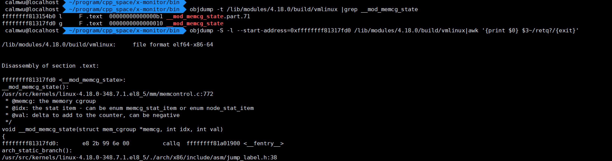

# objdump使用

## 基本功能

1. 显示文件头信息

   ```
    ⚡ root@localhost  /home/calmwu/program/cpp_space/x-monitor/bin  objdump -f ./x-monitor                                    
   
   ./x-monitor:     file format elf64-x86-64
   architecture: i386:x86-64, flags 0x00000112:
   EXEC_P, HAS_SYMS, D_PAGED
   start address 0x0000000000406000
   ```

2. 显示目标文件各个section的头部摘要信息

   ```
    ⚡ root@localhost  /home/calmwu/program/cpp_space/x-monitor/bin  objdump -h ./x-monitor 
   
   ./x-monitor:     file format elf64-x86-64
   
   Sections:
   Idx Name          Size      VMA               LMA               File off  Algn
     0 .interp       0000001c  0000000000400270  0000000000400270  00000270  2**0
                     CONTENTS, ALLOC, LOAD, READONLY, DATA
     1 .note.ABI-tag 00000020  000000000040028c  000000000040028c  0000028c  2**2
                     CONTENTS, ALLOC, LOAD, READONLY, DATA
     2 .note.gnu.build-id 00000024  00000000004002ac  00000000004002ac  000002ac  2**2
                     CONTENTS, ALLOC, LOAD, READONLY, DATA
     3 .gnu.hash     0000005c  00000000004002d0  00000000004002d0  000002d0  2**3
   ```

3. -x 显示所有可用的头信息，包括符号表、重定位入口。-x 等价于 -a -f -h -r -t 同时指定。

   ```
    ⚡ root@localhost  /home/calmwu/program/cpp_space/x-monitor/bin  oobjdump -x ./x-monitor                                                                          
   
   ./x-monitor:     file format elf64-x86-64
   ./x-monitor
   architecture: i386:x86-64, flags 0x00000112:
   EXEC_P, HAS_SYMS, D_PAGED
   start address 0x0000000000406000
   
   Program Header:
       PHDR off    0x0000000000000040 vaddr 0x0000000000400040 paddr 0x0000000000400040 align 2**3
            filesz 0x0000000000000230 memsz 0x0000000000000230 flags r--
     INTERP off    0x0000000000000270 vaddr 0x0000000000400270 paddr 0x0000000000400270 align 2**0
            filesz 0x000000000000001c memsz 0x000000000000001c flags r--
   ```

4. **反汇编**，我用-S -l的组合，在编译带有-g时，可以显示代码行对应的汇编指令。

   ```
   ⚡ root@localhost  /home/calmwu/program/cpp_space/x-monitor/bin  objdump -S -l --start-address=0x00000000004074d1 ./x-monitor | awk '{print $0} $3~/retq?/{exit}' 
   
   ./x-monitor:     file format elf64-x86-64
   
   
   Disassembly of section .text:
   
   00000000004074d1 <main+0xf69>:
   main():
   /home/calmwu/program/cpp_space/x-monitor/main.c:308
       // 解除信号阻塞
       signals_unblock();
       // 信号处理
       signals_handle(on_signal);
   
       return 0;
     4074d1:	41 bc 00 00 00 00    	mov    $0x0,%r12d
   /home/calmwu/program/cpp_space/x-monitor/main.c:167
   int32_t main(int32_t argc, char *argv[]) {
     4074d7:	48 8b 95 08 fb ff ff 	mov    -0x4f8(%rbp),%rdx
     4074de:	48 39 da             	cmp    %rbx,%rdx
     4074e1:	74 16                	je     4074f9 <main+0xf91>
     4074e3:	48 c7 03 0e 36 e0 45 	movq   $0x45e0360e,(%rbx)
     4074ea:	be 40 04 00 00       	mov    $0x440,%esi
     4074ef:	48 89 df             	mov    %rbx,%rdi
     4074f2:	e8 19 e7 ff ff       	callq  405c10 <__asan_stack_free_5@plt>
     4074f7:	eb 16                	jmp    40750f <main+0xfa7>
     4074f9:	41 c7 85 00 80 ff 7f 	movl   $0x0,0x7fff8000(%r13)
     407500:	00 00 00 00 
     407504:	41 c7 85 84 80 ff 7f 	movl   $0x0,0x7fff8084(%r13)
     40750b:	00 00 00 00 
     40750f:	48 8d 75 d0          	lea    -0x30(%rbp),%rsi
     407513:	48 89 e7             	mov    %rsp,%rdi
     407516:	e8 45 ea ff ff       	callq  405f60 <__asan_allocas_unpoison@plt>
   /home/calmwu/program/cpp_space/x-monitor/main.c:309
     40751b:	44 89 e0             	mov    %r12d,%eax
     40751e:	48 8d 65 d8          	lea    -0x28(%rbp),%rsp
     407522:	5b                   	pop    %rbx
     407523:	41 5c                	pop    %r12
     407525:	41 5d                	pop    %r13
     407527:	41 5e                	pop    %r14
     407529:	41 5f                	pop    %r15
     40752b:	5d                   	pop    %rbp
     40752c:	c3                   	retq   
   ```

   这里用到参数--start-address=vm_address

5. 查看函数的虚拟地址，使用-t显示符号表。

   ```
    ⚡ root@localhost  /home/calmwu/program/cpp_space/x-monitor/bin  objdump -t ./x-monitor|grep -w main
   0000000000000000 l    df *ABS*	0000000000000000              main.c
   0000000000406568 g     F .text	0000000000000fc5              main
   ```

   main的虚拟地址是0x0000000000406568，这个和gdb disassemble命令能对应起来0x0000000000406568。

   ```
   (gdb) disassemble main
   Dump of assembler code for function main:
      0x0000000000406568 <+0>:	push   %rbp
   ```

6. 查看某个函数的反汇编

   找到函数的入口地址

   ```
    ✘ calmwu@localhost  ~/program/cpp_space/x-monitor/bin  objdump -t ./x-monitor|grep -w main                      
   0000000000000000 l    df *ABS*	0000000000000000              main.c
   0000000000405c55 g     F .text	00000000000007e8              main
   ```

   执行命令

   ```
    calmwu@localhost  ~/program/cpp_space/x-monitor/bin  objdump -S -l --start-address=0x0000000000405c55 ./x-monitor| awk '{print $0} $3~/retq?/{exit}'
   
   ./x-monitor:     file format elf64-x86-64
   
   
   Disassembly of section .text:
   
   0000000000405c55 <main>:
   main():
   /home/calmwu/program/cpp_space/x-monitor/main.c:167
       } else if (E_SIGNAL_RELOADCONFIG == mode) {
           appconfig_reload();
       }
   }
   
   int32_t main(int32_t argc, char *argv[]) {
     405c55:	55                   	push   %rbp
     405c56:	48 89 e5             	mov    %rsp,%rbp
     405c59:	53                   	push   %rbx
     405c5a:	48 81 ec 78 04 00 00 	sub    $0x478,%rsp
     405c61:	89 bd 8c fb ff ff    	mov    %edi,-0x474(%rbp)
     405c67:	48 89 b5 80 fb ff ff 	mov    %rsi,-0x480(%rbp)
   ```

7. 看内核函数的反汇编

   

## 参考资料

- https://www.thegeekstuff.com/2012/07/elf-object-file-format/
- [Linux Objdump Command Examples (Disassemble a Binary File) (thegeekstuff.com)](https://www.thegeekstuff.com/2012/09/objdump-examples/)
- [14. objdump 二进制文件分析 — Linux Tools Quick Tutorial (linuxtools-rst.readthedocs.io)](https://linuxtools-rst.readthedocs.io/zh_CN/latest/tool/objdump.html)
- [What does each column of objdump's Symbol table mean? - Stack Overflow](https://stackoverflow.com/questions/6666805/what-does-each-column-of-objdumps-symbol-table-mean)


