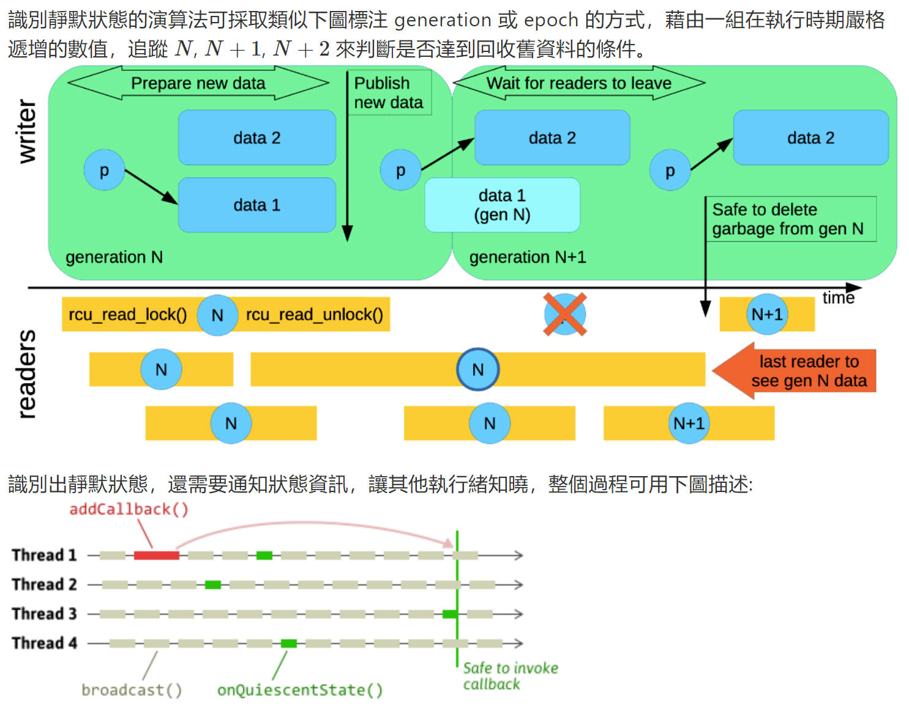

# 应用程序中使用RCU

## 背景、概念

​		读-复制-更新（RCU）是Linux内核中一种重要的同步机制，Linux内核中已经有了各种锁机制，为什么还要单独实现一种复杂的多的新同步机制呢？

​		更新分为两部分：Removal（移除）、Reclamation（回收）。

​		对于同步锁，基本的实现都是使用了原子操作指令，即原子的访问内存，多CPU争用共享的变量会让缓存一致性很糟糕，导致性能下降。而读写锁还有个缺点，就是只允许多个读同时存在，但是读和写不能同时存在。

​		RCU机制要实现的目标是希望读线程没有开销，或者同步开销变得很小，甚至可以忽略不计，不需要额外的锁，不需要使用原子操作指令和内存屏障，即可畅通无阻的访问。**而把需要同步的任务交给写线程，写线程等待所有读线程完成后才会把旧数据销毁**。

## 原理

​		RCU记录了所有指向共享数据的指针的使用者，当要修改共享数据时，首先创建副本，并在副本中修改。所有读访问线程都离开读临界区之后，使用者的指针指向新修改后的副本，并删除旧数据。

​		RCU对链表、hashTable都有使用场景。读取链表成员数据时通常只需要rcu_read_lock()，允许多个线程同时读取链表，并且允许同时修改链表，假设读线程遍历链表时，另一个线程删除一个节点，删除线程会把这个节点从链表中移出，但不会直接销毁。RCU会等到所有读线程读取完之后才销毁这个节点。

## Memory Barriers

有4种memory barriers：

- LoadLoad
- LoadStore
- StoreLoad
- StoreStore

## RCU

### 内核接口

- rcu_read_lock/rcu_read_unlock：组成一个RCU读临界区。

- rcu_dereference：用于获取被RCU保护的指针。读线程为了访问RCU保护的共享数据，需要使用该接口函数创建一个新指针，并且指向RCU被保护的指针。

  

- rcu_assign_pointer：通常用于写线程。在写线程完成新数据的修改后，调用该接口函数可以让被RCU保护的指针指向新建的数据，用RCU术语就是发布了更新后的数据。

  

- synchronize_rcu：同步等待所有现存的读访问完成。

- rcu_call：注册一个回调函数，当所有现存的读反问完成后，调用这个回调函数来销毁旧数据。**需要结构成员struct rcu_head**。

rcu_dereference/rcu_assign_pointer是防止指令执行乱序的方法。

### 基础

​		**Update是整体覆盖，*不要试图修改rcu保护的struct某一个field，而应该用一个新的struct pointer去替换old struct pointer，使用rcu_assign_pointer方法**。

### 使用场景

**QSBR算法**

​		qsbr的核心是判断线程的不活动状态。如何识别呢，该状态和CS（critical section）相对，线程一旦离开CS就归类于静默状态。每个reader在离开CS时记录一下自身状态，writer检查这个状态，当所有线程都离开CS时，就可释放节点所在的记忆体。

## USERSPACE-RCU

## 资料

- [Linux 核心設計: RCU 同步機制 - HackMD](https://hackmd.io/@sysprog/linux-rcu)，**非常值得学习**
- [Userspace RCU (liburcu.org)](https://liburcu.org/)
- [urcu/userspace-rcu: This repo is a mirror of the official userspace-rcu git found at git://git.lttng.org/userspace-rcu.git. liburcu is a LGPLv2.1 userspace RCU (read-copy-update) library. This data synchronization library provides read-side access which scales linearly with the number of cores. (github.com)](https://github.com/urcu/userspace-rcu)
- [Linux RCU机制详解 - kk Blog —— 通用基础 (abcdxyzk.github.io)](https://abcdxyzk.github.io/blog/2015/07/31/kernel-sched-rcu/)
- [【原创】Linux RCU原理剖析（一）-初窥门径 - LoyenWang - 博客园 (cnblogs.com)](https://www.cnblogs.com/LoyenWang/p/12681494.html)
- [理解 Memory barrier（内存屏障）_NearXDU的博客-CSDN博客](https://blog.csdn.net/zhangxiao93/article/details/42966279)

