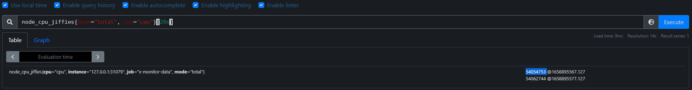
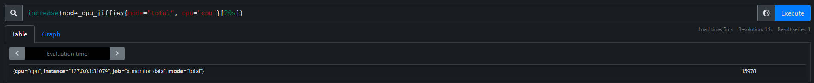
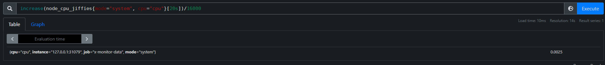
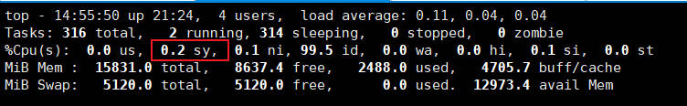
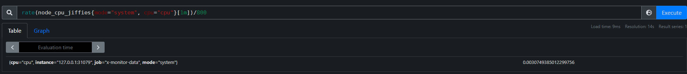
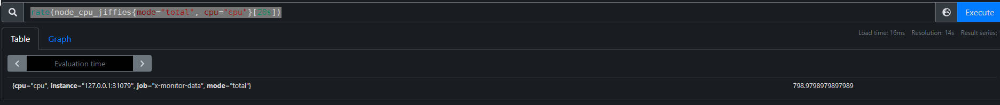

# 对接Prometheus

## Prometheus配置

在 prometheus.yml 文件加入

```
job_name: 'x-monitor-data'
scrape_interval: 1s
static_configs:
  - targets: ['127.0.0.1:31079']
```

启动Prometheus

```
./prometheus --log.level=debug
```

查询指标

```
curl 0.0.0.0:31079/metrics
```

会看到如下输出

```
 ⚡ root@localhost  ~  curl 0.0.0.0:31079/metrics
# HELP node_load1 System 1m Load Average
# TYPE node_load1 gauge
node_load1{loadavg="load"} 0.01

# HELP node_load15 System 15m Load Average
# TYPE node_load15 gauge
node_load15{loadavg="load"} 0.070000000000000007

# HELP node_load5 System 5m Load Average
# TYPE node_load5 gauge
node_load5{loadavg="load"} 0.040000000000000001
```

## Prometheus查询

- 聚合操作符：PromQL提供的聚合操作符用于聚合单个**即时向量**的所有时间序列列表，把聚合的结果存入到新生成的一条时间序列向量中。

  - sum：在维度上求和

  - max：在维度上求最大值

  - min：在维度上求最小值

  - avg：在维度上求平均值

  - count：统计向量元素的个数

  这些操作符被用于聚合所有标签维度，或者通过**without或者by**子句保留不同的维度。

- Prometheus数据类型

  - 标量：在PromQL中，标量是一个浮点型的数值，没有时序。
  - 区间向量：一组时间序列，每个时间序列包含一段时间范围内的样本数据。
  - 瞬时向量（instant vector）： 一组时间序列，每个时间序列包含单个样本，它们共享相同的时间戳。也就是说，表达式的返回值中只会包含该时间序列中的最新的一个样本值。而相应的这样的表达式称之为**瞬时向量表达式**。
  - 字符串。

- 按内存标签查询，{meminfo!=""}

- 按vmstat标签查询：{vmstat="page"}

- 按应用名查询：{dbapp="mysqld"}

- 查询cpu的jiffies，1分钟之内的数据：node_cpu_jiffies{cpu="cpu"}[1m]，如果Prometheus的采集时间间隔是3s，那么就会有20个数值。以当前时间为准，查询1分钟之前的数据：node_cpu_jiffies{cpu="cpu"} offset 1m。

- 计算所有数据的和，例如计算所有cpu时间：sum(node_cpu_jiffies{cpu="cpu", mode!="total"})。将jiffies转换为秒，除以100即可：node_cpu_jiffies{cpu="cpu", mode="total"}/100。

- 查询主机cpu 20秒内的jiffies值，机器配置是8core，采集的时间间隔是10s，两次的值分别是54054753、54062744，**差值≈8000（jiffies）**，这样是符合理论计算的，机器的HZ是100，8core、10s的**jiffies = 8 * 10 * 100 = 8000(jiffies)**。

  ```
   ✘ ⚡ root@localhost  ~  getconf CLK_TCK
  100
  ```

  

- increase函数，它的返回值的单位是 per-provided-time-window，计算结构就是单位时间内增长的数量。

  计算20秒的cpu总共增长了多少jiffies，expr：increase(node_cpu_jiffies{mode="total", cpu="cpu"}[20s])，查询结果15978≈16000（jiffies），**这也符合理论值：20 * 8 * 100 = 16000**。

  

- 计算**cpu system**的占用率，计算结果是0.2%，公式：increase(node_cpu_jiffies{mode="system", cpu="cpu"}[20s])/16000。

  

  这个是符合top的统计输出。

  

- rate函数，计算每一秒增长率(per-second)，是所提供tw内的平均值。

  expr：rate(node_cpu_jiffies{mode="system", cpu="cpu"}[1m])/800，除以**800**是因为cpu有8个core，1s等于100jiffies，除以的结构就是相对于一个core的占有率百分比。

  

- irate函数，它也是per-second增长率，是瞬时增长率。它只使用所提供tw内的最后两个采样，忽略掉前面的所有采样。

  现在配置的Prometheus的采样频率是10s一次，那么20s两次，这样用irate计算的都是瞬时的结果。

  expr：irate(node_cpu_jiffies{mode="system", cpu="cpu"}[20s])/800

- 查看主机cpu每秒的jiffies数量，expr：rate(node_cpu_jiffies{mode="total", cpu="cpu"}[20s]) ≈ 800

  
