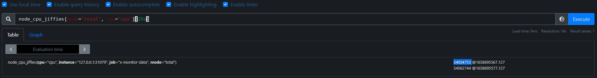
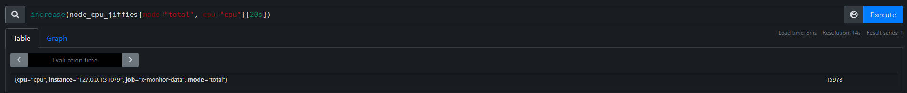
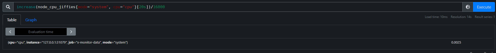
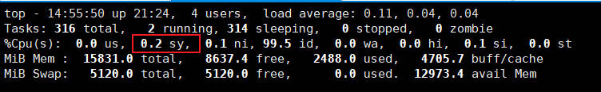

# 指标查询

## Prometheus配置、查询

在 prometheus.yml 文件加入

```
job_name: 'x-monitor-data'
scrape_interval: 1s
static_configs:
  - targets: ['127.0.0.1:31079']
```

启动Prometheus

```
./prometheus --log.level=debug
```

查询指标

```
curl 0.0.0.0:31079/metrics
```

会看到如下输出

```
 ⚡ root@localhost  ~  curl 0.0.0.0:31079/metrics
# HELP node_load1 System 1m Load Average
# TYPE node_load1 gauge
node_load1{loadavg="load"} 0.01

# HELP node_load15 System 15m Load Average
# TYPE node_load15 gauge
node_load15{loadavg="load"} 0.070000000000000007

# HELP node_load5 System 5m Load Average
# TYPE node_load5 gauge
node_load5{loadavg="load"} 0.040000000000000001
```

## Prometheus的查询

- 按内存标签查询，{meminfo!=""}

- 按vmstat标签查询：{vmstat="page"}

- 按应用名查询：{dbapp="mysqld"}

- 查询cpu的jiffies，1分钟之内的数据：node_cpu_jiffies{cpu="cpu"}[1m]，如果Prometheus的采集时间间隔是3s，那么就会有20个数值。

- 以当前时间为准，查询1分钟之前的数据：node_cpu_jiffies{cpu="cpu"} offset 1m。

- 计算所有数据的和，例如计算所有cpu时间：sum(node_cpu_jiffies{cpu="cpu", mode!="total"})。将jiffies转换为秒，除以100即可：node_cpu_jiffies{cpu="cpu", mode="total"}/100。

- 查询主机cpu 20秒内的jiffies值，机器配置是8core，采集的时间间隔是10s，两次的值分别是54054753、54062744，**差值≈8000（jiffies）**，这样是符合理论计算的，机器的HZ是100，8core、10s的**jiffies = 8 * 10 * 100 = 8000(jiffies)**。

  ```
   ✘ ⚡ root@localhost  ~  getconf CLK_TCK
  100
  ```

  

- increase，20s的cpu增量。increase(node_cpu_jiffies{mode="total", cpu="cpu"}[20s])，查询结果15978≈16000（jiffies），**这也符合理论值：20 * 8 * 100 = 16000**。

  

- 计算cpu system的占用率，计算结果是0.2%，分母是16000

  

  这个是符合top显示的

  

## 系统配置PSI

使用的 load average 有几个缺点

- load average 的计算包含了 TASK_RUNNING 和 TASK_UNINTERRUPTIBLE 两种状态的进程，TASK_RUNNING 是进程处于运行，或等待分配 CPU 的准备运行状态，TASK_UNINTERRUPTIBLE 是进程处于不可中断的等待，一般是等待磁盘的输入输出。因此 load average 的飙高可能是因为 CPU 资源不够，让很多 TASK_RUNNING 状态的进程等待 CPU，也可能是由于磁盘 IO 资源紧张，造成很多进程因为等待 IO 而处于 TASK_UNINTERRUPTIBLE 状态。可以通过 load average 发现系统很忙，但是无法区分是因为争夺 CPU 还是 IO 引起的。
- load average 最短的时间窗口是 1 分钟。
- load average 报告的是活跃进程的原始数据，还需要知道可用 CPU 核数，这样 load average 的值才有意义。

当 CPU、内存或 IO 设备争夺激烈的时候，系统会出现负载的延迟峰值、吞吐量下降，并可能触发内核的 `OOM Killer`。PSI 字面意思就是由于资源（CPU、内存和 IO）压力造成的任务执行停顿。**PSI** 量化了由于硬件资源紧张造成的任务执行中断，统计了系统中任务等待硬件资源的时间。我们可以用 **PSI** 作为指标，来衡量硬件资源的压力情况。停顿的时间越长，说明资源面临的压力越大。PSI 已经包含在 4.20 及以上版本内核中。https://xie.infoq.cn/article/931eee27dabb0de906869ba05。

开启 psi：

- 查看所有内核启动，grubby --info=ALL

- 增加内核启动参数：grubby --update-kernel=/boot/vmlinuz-4.18.0 **--args=psi=1**，重启系统。

- 查看 PSI 结果：

  ```
  tail /proc/pressure/*
  ==> /proc/pressure/cpu <==
  some avg10=0.00 avg60=0.55 avg300=0.27 total=1192936
  ==> /proc/pressure/io <==
  some avg10=0.00 avg60=0.13 avg300=0.06 total=325847
  full avg10=0.00 avg60=0.03 avg300=0.01 total=134192
  ==> /proc/pressure/memory <==
  some avg10=0.00 avg60=0.00 avg300=0.00 total=0
  full avg10=0.00 avg60=0.00 avg300=0.00 total=0
  ```

  


