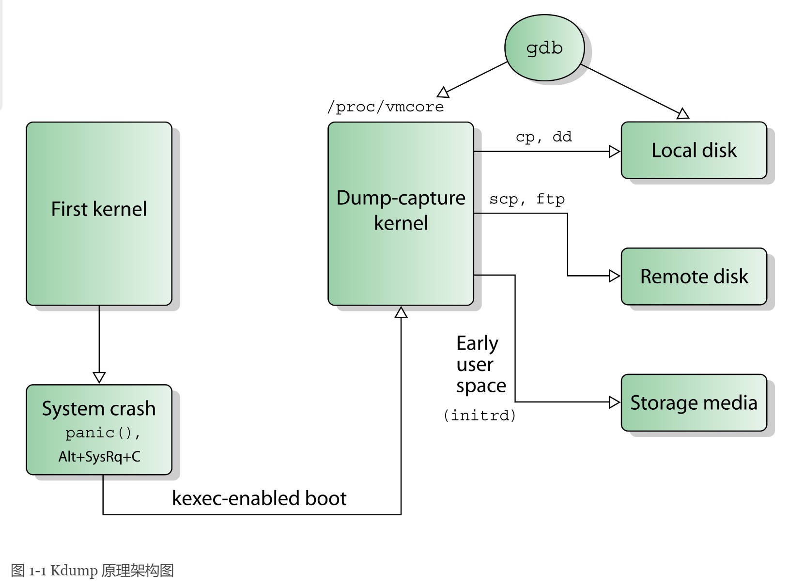
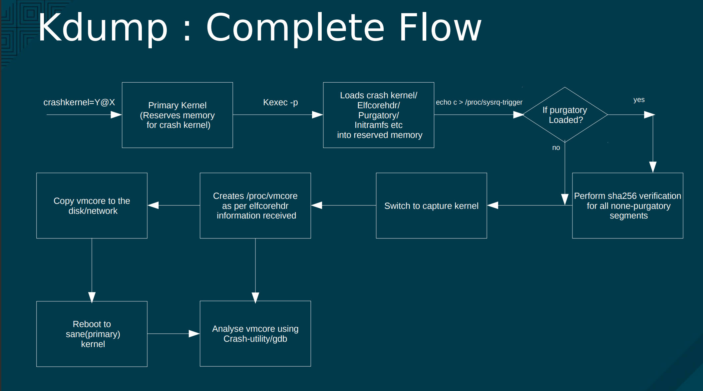

# 调试内核crash

## 准备CentoOS8环境

### 查看可用的系统内核

```
yum --enablerepo="baseos" list --showduplicates | sort -r | grep kernel
```

### 安装debug版本内核

```
dnf -y install kernel-debug
```

执行这个命令会安装以下三个包

- kernel-debug
- kernel-debug-core
- kernel-debug-modules

在boot目录下会安装+debug版本的内核，vmlinuz-4.18.0-348.7.1.el8_5.x86_64+debug。

### 安装debuginfo内核

如果是centos8版本，修改文件/etc/yum.repos.d/CentOS-Debuginfo.repo，设置enable=1，然后运行**yum install kernel-debuginfo**。

```
=======================================================================================================================================================================================================================
 Package                                                          Architecture                             Version                                                   Repository                                   Size
=======================================================================================================================================================================================================================
Installing:
 kernel-debuginfo                                                 x86_64                                   4.18.0-348.7.1.el8_5                                      debuginfo                                   596 M
Installing dependencies:
 kernel-debuginfo-common-x86_64                                   x86_64                                   4.18.0-348.7.1.el8_5                                      debuginfo                                    88 M

Transaction Summary
=======================================================================================================================================================================================================================
Install  2 Packages
```

安装完毕后，非压缩的+debuginfo的内核就存在了/usr/lib/debug/usr/lib/modules/4.18.0-348.7.1.el8_5.x86_64/vmlinux，可以用于crash调试。

```
[root@localhost /]# file /usr/lib/debug/usr/lib/modules/4.18.0-348.7.1.el8_5.x86_64/vmlinux
/usr/lib/debug/usr/lib/modules/4.18.0-348.7.1.el8_5.x86_64/vmlinux: ELF 64-bit LSB executable, x86-64, version 1 (SYSV), statically linked, BuildID[sha1]=209f9b66ebe4f81279616bbf61396c29028bf7f8, with debug_info, not stripped
```

通过file命令可以看到：with debug_info, not stripped。

## Kdump

kdump是内核崩溃的时候，用来转存运行内存的一个工具。系统一旦崩溃，内核就没法工作了，这个时候将由kdump提供一个用于捕获当前运行信息的内核，该内核会将此时内存中的所有运行状态和数据信息收集到一个dump core文件中以便之后分析崩溃原因。一旦内存信息收集完成，可以让系统自动重启。

### 工作原理

当内核发生panic时，内核依靠kexec机制在预先保留的内存区域快速重启一个新的内核实例，预留内存区域大小可以通过内核启动参数crashkernel指定。

为了实现双内核布局，kdump在内核崩溃后立即使用**kexec引导转储捕获内核（capture kernel）**，使用kexec引导“覆盖”当前运行的内核。kexec（kernel execution）是linux内核的一种机制，其允许从当前运行的内核启动新内核。kexec会跳过由系统固件执行的引导加载程序阶段和硬件初始化阶段，直接将新内核加载到主内存并立即开始执行。





Kdump在内核学习时非常有用，如果我们需要了解内核运行状态或结构详情也可以使用kdump进行转储，后续使用Crash工具对照源码进行分析总结。

### 安装、配置

#### 安装kdump

检查kdump是否已经安装

```
rpm -q kexec-tools
```

如果没有安装，执行

```
yum install kexec-tools
```

评估需要多大的磁盘空间保存crash dump file，这感觉和物理内存大小一致。

```
[root@VM-0-8-centos crash]# makedumpfile --mem-usage /proc/kcore

TYPE		PAGES			EXCLUDABLE	DESCRIPTION
----------------------------------------------------------------------

ZERO		122466          	yes		Pages filled with zero
NON_PRI_CACHE	77566           	yes		Cache pages without private flag
PRI_CACHE	44617           	yes		Cache pages with private flag
USER		50293           	yes		User process pages
FREE		32981           	yes		Free pages
KERN_DATA	176823          	no		Dumpable kernel data 
```

#### 配置内核启动参数crashkernel

```
[root@VM-0-8-centos bpf-examples]# grubby --update-kernel=/boot/vmlinuz-5.14.0-86.el9.x86_64+debug --args=crashkernel=1G-2G:192M,2G-4G:320M,4G-32G:512M,32G-64G:1024M,64G-128G:2048M,128G-:4096M
```

系统重启后，可以在dmesg中查看相关信息：

```
[root@VM-0-8-centos ~]# dmesg -T | grep -i crash
[Mon Jun 27 15:10:44 2022] Command line: BOOT_IMAGE=(hd0,msdos1)/boot/vmlinuz-5.14.0-86.el9.x86_64+debug root=UUID=ceba5bd8-a35a-4599-9dee-6f3120630969 ro console=ttyS0,115200 console=tty0 panic=5 net.ifnames=0 biosdevname=0 intel_idle.max_cstate=1 intel_pstate=disable crashkernel=1G-2G:256M,2G-4G:320M,4G-32G:512M,32G-64G:1024M,64G-128G:2048M,128G-:4096M
[Mon Jun 27 15:10:44 2022] Reserving 256MB of memory at 1776MB for crashkernel (System RAM: 2047MB)
[Mon Jun 27 15:10:44 2022] Kernel command line: BOOT_IMAGE=(hd0,msdos1)/boot/vmlinuz-5.14.0-86.el9.x86_64+debug root=UUID=ceba5bd8-a35a-4599-9dee-6f3120630969 ro console=ttyS0,115200 console=tty0 panic=5 net.ifnames=0 biosdevname=0 intel_idle.max_cstate=1 intel_pstate=disable crashkernel=1G-2G:256M,2G-4G:320M,4G-32G:512M,32G-64G:1024M,64G-128G:2048M,128G-:4096M
```

#### Kdump的状态和配置

```
[root@VM-0-8-centos ~]# kdumpctl showmem
kdump: Reserved 256MB memory for crash kernel
[root@VM-0-8-centos ~]# kdumpctl start
kdump: Kdump already running: [WARNING]
[root@VM-0-8-centos ~]# kdumpctl status
kdump: Kdump is operational
[root@VM-0-8-centos crash]# systemctl is-active kdump
active
```

kdump输出vmcore保存路径：/etc/sysconfig/kdump。

```
KDUMP_SAVEDIR=”file:///var/crash”
```

查看内核的启动命令：

```
[root@VM-0-8-centos ~]# cat /proc/cmdline 
BOOT_IMAGE=(hd0,msdos1)/boot/vmlinuz-5.14.0-86.el9.x86_64+debug root=UUID=ceba5bd8-a35a-4599-9dee-6f3120630969 ro console=ttyS0,115200 console=tty0 panic=5 net.ifnames=0 biosdevname=0 intel_idle.max_cstate=1 intel_pstate=disable crashkernel=1G-2G:256M,2G-4G:320M,4G-32G:512M,32G-64G:1024M,64G-128G:2048M,128G-:4096M
```

查看crashkernel内存分配的地址空间

```
[root@VM-0-8-centos ~]# cat /proc/iomem | grep -i crash
  6f000000-7effffff : Crash kernel
```

### 测试验证

使用Magic SysRq来触发system crash。在测试之前先介绍下Magic SysRq其它一些很有用的值，其都输出在/var/log/messages

- `m` - dump information about memory allocation，导出内存分配的信息 （可以用/var/log/message 查看
- `t` - dump thread state information，导出线程状态信息
- `p` - dump current CPU registers and flags，导出当前CPU寄存器信息和标志位的信息
- `c` - intentionally crash the system (useful for forcing a disk or netdump)，故意让系统崩溃
- `s` - immediately sync all mounted filesystems
- `u` - immediately remount all filesystems read-only
- `b` - immediately reboot the machine
- `o` - immediately power off the machine (if configured and supported)
- `f` - start the Out Of Memory Killer (OOM)

执行一次system crash，然后系统重启了。

```
[root@VM-0-8-centos ~]# echo 1 > /proc/sys/kernel/sysrq
[root@VM-0-8-centos ~]# echo c > /proc/sysrq-trigger
Socket error Event: 32 Error: 10053.
Connection closing...Socket close.
```

个人感觉t, p还是挺有用的。

## Kexec

Kexec是一种可以从当前运行的内核引导另一内核的工具。可以准备好系统，以便在系统崩溃的情况下引导进入另一个内核。

该工具非常有用，例如：**保存崩溃内核的转储**。Kexec可以保留物理内存的内容，在生产内核发生故障后，捕获内核（在预留内存范围内运行的附加内核）会保留故障内核的状态。保存的映象可帮助后续分析。

### 组件介绍

最主要的就是/usr/sbin/kexec这个命令，可以通过两种方式使用Kexec装在内核：

- 将内核装载到某个生产内核的地址空间，已进行常规引导：

  ```
  kexec -l KERNEL_IMAGE
  ```

  可以稍后使用kexec -e引导到此内核。

- 将内核装载到预留的内存区域

  ```
  kexec -p KERNEL_IMAGE
  ```

  当系统崩溃时，会自动引导此内核。

所以前面配置的crashkerne指定的内存就是专门给捕获内核使用的，生产内核永远不会装载到此区域，这个参数必须追加到生产内核引导命令行。

## Crash分析

crash是一个用于分析内核转储文件的工具，一般配合kdump使用。

CentOS（RedHat）：crash /usr/lib/debug/lib/modules/<kernel>/vmlinux vmcore

在我的机器上执行命令：

```
crash /usr/lib/debug/usr/lib/modules/4.18.0-348.7.1.el8_5.x86_64/vmlinux /var/crash/127.0.0.1-2022-06-29-19:21:07/vmcore
```

在读取symbols之后会输出

```
      KERNEL: /usr/lib/debug/usr/lib/modules/4.18.0-348.7.1.el8_5.x86_64/vmlinux
    DUMPFILE: /var/crash/127.0.0.1-2022-06-29-19:21:07/vmcore  [PARTIAL DUMP]
        CPUS: 8
        DATE: Wed Jun 29 19:20:55 PDT 2022
      UPTIME: 00:01:38
LOAD AVERAGE: 0.56, 0.25, 0.10
       TASKS: 689
    NODENAME: localhost.localdomain
     RELEASE: 4.18.0-348.7.1.el8_5.x86_64
     VERSION: #1 SMP Wed Dec 22 13:25:12 UTC 2021
     MACHINE: x86_64  (4200 Mhz)
      MEMORY: 16 GB
       PANIC: "sysrq: SysRq : Trigger a crash"
         PID: 3370
     COMMAND: "zsh"
        TASK: ffff8d03f6c717c0  [THREAD_INFO: ffff8d03f6c717c0]
         CPU: 3
       STATE: TASK_RUNNING (SYSRQ)
```

输出说明：

TASKS：内核崩溃时，内存中有多少个任务在运行，Task是已经将指令加载到内存中。

PANIC：那种类型的crash发生在机器上。

PID：是哪个进程导致的crash。

COMMAND：进程名。

### 命令

#### bt - backtrace

显示内核堆栈，如果没有具体参数指定，堆栈对应的是当前上下文的。

bt <pid>：列出相应进程的堆栈。

bt -f：列出当前堆栈每一帧中的数据。

bt -p：只打印panic的线程的内核栈。

堆栈每一行最右边是调用的地址。**可用sym或dis -s来查看具体代码**。

```
crash> bt
PID: 3370   TASK: ffff8d03f6c717c0  CPU: 3   COMMAND: "zsh"
 #0 [ffff9a6fc487fb98] machine_kexec at ffffffffb9e641ce
 #1 [ffff9a6fc487fbf0] __crash_kexec at ffffffffb9f9e67d
 #2 [ffff9a6fc487fcb8] crash_kexec at ffffffffb9f9f56d
 #3 [ffff9a6fc487fcd0] oops_end at ffffffffb9e2613d
 #4 [ffff9a6fc487fcf0] no_context at ffffffffb9e7562f
 #5 [ffff9a6fc487fd48] __bad_area_nosemaphore at ffffffffb9e7598c
 #6 [ffff9a6fc487fd90] do_page_fault at ffffffffb9e76267
 #7 [ffff9a6fc487fdc0] page_fault at ffffffffba80111e
    [exception RIP: sysrq_handle_crash+18]
    RIP: ffffffffba3affd2  RSP: ffff9a6fc487fe78  RFLAGS: 00010246
    RAX: ffffffffba3affc0  RBX: 0000000000000063  RCX: 0000000000000000
    RDX: 0000000000000000  RSI: ffff8d06eded6858  RDI: 0000000000000063
    RBP: 0000000000000004   R8: 00000000000006d6   R9: 000000000000002d
    R10: 0000000000000000  R11: ffff9a6fc487fd30  R12: 0000000000000000
    R13: 0000000000000000  R14: ffffffffbacaf240  R15: 0000000000000000
    ORIG_RAX: ffffffffffffffff  CS: 0010  SS: 0018
 #8 [ffff9a6fc487fe78] __handle_sysrq.cold.11 at ffffffffba3b0b68
 #9 [ffff9a6fc487fea8] write_sysrq_trigger at ffffffffba3b0a2b
#10 [ffff9a6fc487feb8] proc_reg_write at ffffffffba1b4359
#11 [ffff9a6fc487fed0] vfs_write at ffffffffba131915
#12 [ffff9a6fc487ff00] ksys_write at ffffffffba131b8f
#13 [ffff9a6fc487ff38] do_syscall_64 at ffffffffb9e042bb
#14 [ffff9a6fc487ff50] entry_SYSCALL_64_after_hwframe at ffffffffba8000ad
    RIP: 00007fc8a4c39648  RSP: 00007fffbd08cc98  RFLAGS: 00000246
    RAX: ffffffffffffffda  RBX: 0000000000000002  RCX: 00007fc8a4c39648
    RDX: 0000000000000002  RSI: 0000563d357b80c0  RDI: 0000000000000001
    RBP: 0000563d357b80c0   R8: 00007fc8a4f0d860   R9: 00007fc8a61a4b80
    R10: 000000000000000a  R11: 0000000000000246  R12: 00007fc8a4f0c6e0
    R13: 0000000000000002  R14: 00007fc8a4f07880  R15: 0000000000000002
    ORIG_RAX: 0000000000000001  CS: 0033  SS: 002b
```

##### 输出说明

- 指令指针Instruction pointer

  可以在bt输出中看到[exception RIP: sysrq_handle_crash+18]，首先明白RIP是什么，RIP指令指针，在32位机器上被称为EIP。它指向内存地址，sysrq_handle_crash+18这就是引发crash内核函数的位置。

- CS 代码段寄存器 - CPL/DPL/RPL

  CS: 0033，Seemingly, we crashed the kernel in user mode。这里有4个数字组合，为了解释需要先了解下特权级别。特权级别有4种：0~3，0是最高级别，就是kernel mode。3就是最低级别，是User mode。大多数系统忽略中间两个级别，包括linux在内只有0和3。读取寄存器最低两位是CPU当前的**特权等级**（CPL），这里是33。通过3可以判断是用户态bug导致内核崩溃的。

#### dmesg - log

显示内核log_buf中的内容，也就是崩溃时的log。

#### ps 

显示内核崩溃时，当时系统中所有进程的状态，可以看到进程的内存资源使用情况，VSZ、RSS

```
crash> ps
   PID    PPID  CPU       TASK        ST  %MEM     VSZ    RSS  COMM
  >3370   3366   3  ffff8d03f6c717c0  RU   0.0   65432   6704  zsh
```

#### dis - 反汇编

反汇编，参数可以使用地址、符号（函数名、变量名），对齐反汇编得到改地址对应的源码。

```
crash> dis -s ffffffffba3affd2
FILE: drivers/tty/sysrq.c
LINE: 147

  142            * complaint from the kernel before the panic.
  143            */
  144           rcu_read_unlock();
  145           panic_on_oops = 1;      /* force panic */
  146           wmb();
* 147           *killer = 1;
  148   }
```

dis -l 显示行号

```
crash> dis -l ffffffffba3affd2
/usr/src/debug/kernel-4.18.0-348.7.1.el8_5/linux-4.18.0-348.7.1.el8_5.x86_64/drivers/tty/sysrq.c: 147
0xffffffffba3affd2 <sysrq_handle_crash+18>:     movb   $0x1,0x0
```

#### rd - 读取相应的内存

#### mod - 查看显示、加载模块符号

crash使用的调试内核vmlinux是不包含ko的，所以调试内核模块需要加载-g编译后的ko里的符号信息。

mod不带参数会显示当前系统安装的模块，以及加载符号

```
crash> mod
     MODULE       NAME                                     BASE           SIZE  OBJECT FILE
ffffffffc0090b00  fuse                               ffffffffc0070000   155648  (not loaded)  [CONFIG_KALLSYMS]
```

mod -S加载所有安装模块的符号调试信息

```
crash> mod -S
     MODULE       NAME                                     BASE           SIZE  OBJECT FILE
ffffffffc0090b00  fuse                               ffffffffc0070000   155648  /usr/lib/debug/usr/lib/modules/4.18.0-348.7.1.el8_5.x86_64/kernel/fs/fuse/fuse.ko.debug 
ffffffffc00c4240  serio_raw                          ffffffffc00c2000    16384  /usr/lib/debug/usr/lib/modules/4.18.0-348.7.1.el8_5.x86_64/kernel/drivers/input/serio/serio_raw.ko.debug 
ffffffffc00c9040  libcrc32c                          ffffffffc00c7000    16384  /usr/lib/debug/usr/lib/modules/4.18.0-348.7.1.el8_5.x86_64/kernel/lib/libcrc32c.ko.debug
```

mod -s 加载指定的模块和调试符号，在我一篇用bpftrace调试nftables的文章，需要加载nft_chain_nat模块，这里可以这样。

```
crash> mod -s nft_chain_nat
     MODULE       NAME                                     BASE           SIZE  OBJECT FILE
ffffffffc087f000  nft_chain_nat                      ffffffffc087d000    16384  /usr/lib/debug/usr/lib/modules/4.18.0-348.7.1.el8_5.x86_64/kernel/net/netfilter/nft_chain_nat.ko.debug 
```

然后用dis去看函数地址和代码

```
crash> dis -s nft_do_chain
FILE: net/netfilter/nf_tables_core.c
LINE: 152

  147           expr->ops->eval(expr, regs, pkt);
  148   }
  149   
  150   unsigned int
  151   nft_do_chain(struct nft_pktinfo *pkt, void *priv)
* 152   {
  153           const struct nft_chain *chain = priv, *basechain = chain;

```

```
crash> dis nft_do_chain
0xffffffffc07e5080 <nft_do_chain>:      nopl   0x0(%rax,%rax,1) [FTRACE NOP]
0xffffffffc07e5085 <nft_do_chain+5>:    push   %rbp
0xffffffffc07e5086 <nft_do_chain+6>:    mov    %rsp,%rbp
```

#### x/FMT - 按格式查看内存数据。

| x/nfu                                                        |
| ------------------------------------------------------------ |
| n表示要显示的内存单元的个数                                  |
| f表示显示方式, 可取如下值 x 按十六进制格式显示变量。 d 按十进制格式显示变量。 u 按十进制格式显示无符号整型。 o 按八进制格式显示变量。 t 按二进制格式显示变量。 a 按十六进制格式显示变量。 i 指令地址格式 c 按字符格式显示变量。 f 按浮点数格式显示变量。 |
| u表示一个地址单元的长度 b表示单字节， h表示双字节， w表示四字节， g表示八字节 |

#### files - 查看某个进程打开的文件。

```
crash> files 3370
PID: 3370   TASK: ffff8d03f6c717c0  CPU: 3   COMMAND: "zsh"
ROOT: /    CWD: /home/calmwu
 FD       FILE            DENTRY           INODE       TYPE PATH
  0 ffff8d03f249bc00 ffff8d0439bb7e40 ffff8d0439a947b0 CHR  /dev/pts/1
  1 ffff8d03ea16c800 ffff8d03e1241240 ffff8d03e1270e80 REG  /proc/sysrq-trigger
  2 ffff8d03f249bc00 ffff8d0439bb7e40 ffff8d0439a947b0 CHR  /dev/pts/1
 10 ffff8d03fe59e300 ffff8d0439bb7e40 ffff8d0439a947b0 CHR  /dev/pts/1
 11 ffff8d045ddae500 ffff8d03d488e840 ffff8d03d4862bb0 REG  /var/lib/sss/mc/passwd
 12 ffff8d045ddaf500 ffff8d04398e00c0 ffff8d0439bcec30 SOCK UNIX
 13 ffff8d03f249bc00 ffff8d0439bb7e40 ffff8d0439a947b0 CHR  /dev/pts/1
```

#### vm - 查看进程的虚拟地址空间

```
crash> vm 3370
PID: 3370   TASK: ffff8d03f6c717c0  CPU: 3   COMMAND: "zsh"
       MM               PGD          RSS    TOTAL_VM
ffff8d03c8de1200  ffff8d046aaf8000  6704k    65432k 
      VMA           START       END     FLAGS FILE
ffff8d0405324658 563d354e2000 563d355ab000 8000875 /usr/bin/zsh
ffff8d0405325de8 563d357aa000 563d357ac000 8100871 /usr/bin/zsh
ffff8d045dcbc488 563d357ac000 563d357b2000 8100873 /usr/bin/zsh
ffff8d0405324ae0 563d357b2000 563d357c6000 8100073 
ffff8d045dcbd308 563d372b4000 563d3743f000 8100073 
ffff8d045695d6a8 7fc8a22ff000 7fc8a2310000 8000075 /usr/lib64/zsh/5.5.1/zsh/computil.so
ffff8d045695cae0 7fc8a2310000 7fc8a250f000 8000070 /usr/lib64/zsh/5.5.1/zsh/computil.so
ffff8d045695ce80 7fc8a250f000 7fc8a2510000 8100071 /usr/lib64/zsh/5.5.1/zsh/computil.so

```

#### task [pid] - 进程的task_struct和thread_info

```
crash> task 3370
PID: 3370   TASK: ffff8d03f6c717c0  CPU: 3   COMMAND: "zsh"
struct task_struct {
  thread_info = {
    flags = 2147483776, 
    status = 0
  }, 
  state = 0, 
  stack = 0xffff9a6fc487c000, 
  {
    usage = {
      refs = {
        counter = 1
      }
    }, 
    rh_kabi_hidden_630 = {
      usage = {
        counter = 1
      }
    }, 
    {<No data fields>}
  }, 
  flags = 4210944, 
  ptrace = 0, 
  wake_entry = {

```

#### kmem - 查看当时的内存使用情况

```
crash> kmem -i
                 PAGES        TOTAL      PERCENTAGE
    TOTAL MEM  3964370      15.1 GB         ----
         FREE  3264661      12.5 GB   82% of TOTAL MEM
         USED   699709       2.7 GB   17% of TOTAL MEM
       SHARED   150276       587 MB    3% of TOTAL MEM
      BUFFERS      540       2.1 MB    0% of TOTAL MEM
       CACHED   340217       1.3 GB    8% of TOTAL MEM
         SLAB    21131      82.5 MB    0% of TOTAL MEM

   TOTAL HUGE        0            0         ----
    HUGE FREE        0            0    0% of TOTAL HUGE

   TOTAL SWAP        0            0         ----
    SWAP USED        0            0    0% of TOTAL SWAP
    SWAP FREE        0            0    0% of TOTAL SWAP

 COMMIT LIMIT  1982185       7.6 GB         ----
    COMMITTED  1101977       4.2 GB   55% of TOTAL LIMIT
```

## 举例

### kernel panic

编写一个给空指针赋值导致kernel panic的module。

```
/*
 * @Author: calmwu
 * @Date: 2022-06-30 17:17:01
 * @Last Modified by: calmwu
 * @Last Modified time: 2022-06-30 17:18:35
 */

#include <linux/module.h> /* Needed by all modules */
#include <linux/kernel.h> /* Needed for KERN_INFO */
#include <linux/init.h>   /* Needed for the macros */

#define AUTHOR "calm.wu <wubo0067@hotmail.com>"
#define DESC "Cause kernel crash"

char *p = NULL;

static int __init hello_init(void) {
    printk(KERN_ALERT "Hello, world 1.\n");
    *p = 1;
    return 0;
}

static void __exit hello_exit(void) {
    printk(KERN_ALERT "Goodbye, world 1.\n");
}

module_init(hello_init);
module_exit(hello_exit);

/*
 * Get rid of taint message by declaring code as GPL.
 */
MODULE_LICENSE("GPL");

/*
 * Or with defines, like this:
 */
MODULE_AUTHOR(AUTHOR);    /* Who wrote this module? */
MODULE_DESCRIPTION(DESC); /* What does this module do */
```

编译、安装mod，系统重启

```
 calmwu@localhost  ~/Program/x-monitor/tools/km/hellocrash   main ±  make
make -C /lib/modules/4.18.0-348.7.1.el8_5.x86_64/build M=/home/calmwu/Program/x-monitor/tools/km/hellocrash modules
make[1]: Entering directory '/usr/src/kernels/4.18.0-348.7.1.el8_5.x86_64'
  CC [M]  /home/calmwu/Program/x-monitor/tools/km/hellocrash/hello-crash.o
  Building modules, stage 2.
  MODPOST 1 modules
  CC      /home/calmwu/Program/x-monitor/tools/km/hellocrash/hello-crash.mod.o
  LD [M]  /home/calmwu/Program/x-monitor/tools/km/hellocrash/hello-crash.ko
make[1]: Leaving directory '/usr/src/kernels/4.18.0-348.7.1.el8_5.x86_64'
 calmwu@localhost  ~/Program/x-monitor/tools/km/hellocrash   main ±  insmod hello-crash.ko
```

查看module的debug信息

```
 calmwu@localhost  ~/Program/x-monitor/tools/km/hellocrash   main ±  readelf -S hello-crash.ko|grep debug
  [19] .debug_info       PROGBITS         0000000000000000  00000640
  [20] .rela.debug_info  RELA             0000000000000000  0001f658
  [21] .debug_abbrev     PROGBITS         0000000000000000  000115b9
  [22] .debug_aranges    PROGBITS         0000000000000000  000121e0
  [23] .rela.debug_arang RELA             0000000000000000  00037130
  [24] .debug_ranges     PROGBITS         0000000000000000  00012240
  [25] .rela.debug_range RELA             0000000000000000  00037190
  [26] .debug_line       PROGBITS         0000000000000000  00012270
  [27] .rela.debug_line  RELA             0000000000000000  000371f0
  [28] .debug_str        PROGBITS         0000000000000000  0001320b
  [31] .debug_frame      PROGBITS         0000000000000000  0001efb0
  [32] .rela.debug_frame RELA             0000000000000000  00037220
```

### 分析

#### 查看crash报告

```
      KERNEL: /usr/lib/debug/usr/lib/modules/4.18.0-348.7.1.el8_5.x86_64/vmlinux
    DUMPFILE: /var/crash/127.0.0.1-2022-06-30-19:16:25/vmcore  [PARTIAL DUMP]
        CPUS: 8
        DATE: Thu Jun 30 19:16:16 PDT 2022
      UPTIME: 12:53:43
LOAD AVERAGE: 0.39, 0.46, 0.51
       TASKS: 799
    NODENAME: localhost.localdomain
     RELEASE: 4.18.0-348.7.1.el8_5.x86_64
     VERSION: #1 SMP Wed Dec 22 13:25:12 UTC 2021
     MACHINE: x86_64  (4200 Mhz)
      MEMORY: 16 GB
       PANIC: "BUG: unable to handle kernel NULL pointer dereference at 0000000000000000"
         PID: 24600
     COMMAND: "insmod"
        TASK: ffff9feae3b14740  [THREAD_INFO: ffff9feae3b14740]
         CPU: 2
       STATE: TASK_RUNNING (PANIC)
```

PANIC显示很清晰，引用了空地址导致的内核crash。COMMAND显示是由insmod命令导致的。

#### bt输出

```
crash>               bt
PID: 24600  TASK: ffff9feae3b14740  CPU: 2   COMMAND: "insmod"
 #0 [ffffb08b06c739d8] machine_kexec at ffffffffa88641ce
 #1 [ffffb08b06c73a30] __crash_kexec at ffffffffa899e67d
 #2 [ffffb08b06c73af8] crash_kexec at ffffffffa899f56d
 #3 [ffffb08b06c73b10] oops_end at ffffffffa882613d
 #4 [ffffb08b06c73b30] no_context at ffffffffa887562f
 #5 [ffffb08b06c73b88] __bad_area_nosemaphore at ffffffffa887598c
 #6 [ffffb08b06c73bd0] do_page_fault at ffffffffa8876267
 #7 [ffffb08b06c73c00] page_fault at ffffffffa920111e
    [exception RIP: _MODULE_INIT_START_hello_crash+24]
    RIP: ffffffffc0888018  RSP: ffffb08b06c73cb8  RFLAGS: 00010246
    RAX: 0000000000000000  RBX: 0000000000000000  RCX: 0000000000000000
    RDX: 0000000000000000  RSI: ffff9fed3de96858  RDI: ffff9fed3de96858
    RBP: ffffffffc0888000   R8: 00000000000006bd   R9: 000000000000001e
    R10: 0000000000000000  R11: ffffb08b06c73b68  R12: ffffffffc0885000
    R13: ffffffffc0885018  R14: ffffffffc08851d0  R15: 0000000000000000
    ORIG_RAX: ffffffffffffffff  CS: 0010  SS: 0018
 #8 [ffffb08b06c73cb0] _MODULE_INIT_START_hello_crash at ffffffffc0888011 [hello_crash]
 #9 [ffffb08b06c73cb8] do_one_initcall at ffffffffa88027f6
#10 [ffffb08b06c73d28] do_init_module at ffffffffa8998fda
#11 [ffffb08b06c73d48] load_module at ffffffffa899b415
#12 [ffffb08b06c73e80] __do_sys_finit_module at ffffffffa899b9a8
#13 [ffffb08b06c73f38] do_syscall_64 at ffffffffa88042bb
#14 [ffffb08b06c73f50] entry_SYSCALL_64_after_hwframe at ffffffffa92000ad
    RIP: 00007f8ed1c6052d  RSP: 00007ffe04c8dc98  RFLAGS: 00000246
    RAX: ffffffffffffffda  RBX: 000055b5768817c0  RCX: 00007f8ed1c6052d
    RDX: 0000000000000000  RSI: 000055b574b687d6  RDI: 0000000000000003
    RBP: 000055b574b687d6   R8: 0000000000000000   R9: 00007f8ed1f2b5c0
    R10: 0000000000000003  R11: 0000000000000246  R12: 0000000000000000
    R13: 000055b576881770  R14: 0000000000000000  R15: 0000000000000000
    ORIG_RAX: 0000000000000139  CS: 0033  SS: 002b
```

这里看到RIP的地址ffffffffc0888018，执行到_MODULE_INIT_START_hello_crash+24导致的crash。用mod -s命令加载模块符号。

```
crash> mod -s hello_crash /home/calmwu/Program/x-monitor/tools/km/hellocrash/hello-crash.ko
     MODULE       NAME                                     BASE           SIZE  OBJECT FILE
ffffffffc0885000  hello_crash                        ffffffffc0883000    16384  /home/calmwu/Program/x-monitor/tools/km/hellocrash/hello-crash.o
```

#### dis命令

```
crash> dis ffffffffc0888018
0xffffffffc0888018 <_MODULE_INIT_START_hello_crash+24>: movb   $0x1,(%rax)
crash> sym ffffffffc0888018
ffffffffc0888018 (m) _MODULE_INIT_START_hello_crash+24 [hello_crash]
```

很明显，将1赋值给寄存器rax，可是rax指向的是RAX: 0000000000000000，这就踩了空指针了。

#### 和代码对应

使用dis -s，发现无法显示代码，可是前面加载了module symbols

```
crash> dis -s ffffffffc0888018
dis: ffffffffc0888018: not a kernel text address
```

使用objdump命令

```
calmwu@localhost  ~/Program/x-monitor/tools/km/hellocrash   main ±  objdump -d -S ./hello-crash.ko 

./hello-crash.ko:     file format elf64-x86-64


Disassembly of section .init.text:

0000000000000000 <init_module>:
#define AUTHOR "calm.wu <wubo0067@hotmail.com>"
#define DESC "Cause kernel crash"

char *p = NULL;

static int __init hello_init(void) {
   0:	e8 00 00 00 00       	callq  5 <init_module+0x5>
    printk(KERN_ALERT "Hello, world 1.\n");
   5:	48 c7 c7 00 00 00 00 	mov    $0x0,%rdi
   c:	e8 00 00 00 00       	callq  11 <init_module+0x11>
    *p = 1;
  11:	48 8b 05 00 00 00 00 	mov    0x0(%rip),%rax        # 18 <init_module+0x18>
  18:	c6 00 01             	movb   $0x1,(%rax)
    return 0;
}
  1b:	31 c0                	xor    %eax,%eax
  1d:	c3                   	retq   

Disassembly of section .exit.text:

0000000000000000 <cleanup_module>:

static void __exit hello_exit(void) {
    printk(KERN_ALERT "Goodbye, world 1.\n");
   0:	48 c7 c7 00 00 00 00 	mov    $0x0,%rdi
   7:	e9 00 00 00 00       	jmpq   c <cleanup_module+0xc>
```

_MODULE_INIT_START_hello_crash+24的24对应0x18，可以看到就是

```
18:	c6 00 01             	movb   $0x1,(%rax)
```

这样就很明确具体是那一行导致的crash了。

## Crash命令列表

|  命令   |                功能                |
| :-----: | :--------------------------------: |
|    *    |             指针快捷健             |
|  alias  |             命令快捷键             |
|  ascii  |         ASCII码转换和码表          |
|   bpf   |  eBPF - extended Berkeley Filter   |
|   bt    |              堆栈查看              |
|  btop   |            地址页表转换            |
|   dev   |            设备数据查询            |
|   dis   |               返汇编               |
|  eval   |               计算器               |
|  exit   |                退出                |
| extend  |              命令扩展              |
|  files  |           打开的文件查看           |
| foreach |              循环查看              |
|  fuser  |           文件使用者查看           |
|   gdb   |          调用gdb执行命令           |
|  help   |                帮助                |
|  ipcs   |        查看system V IPC工具        |
|   irq   |            查看irq数据             |
|  kmem   |           查看Kernel内存           |
|  list   |              查看链表              |
|   log   |          查看系统消息缓存          |
|  mach   |            查看平台信息            |
|   mod   |             加载符号表             |
|  mount  |         Mount文件系统数据          |
|   net   |              网络命令              |
|    p    |            查看数据结构            |
|   ps    |          查看进程状态信息          |
|   pte   |              查看页表              |
|  ptob   |            页表地址转换            |
|  ptov   |        物理地址虚拟地址转换        |
|   rd    |              查看内存              |
| repeat  |              重复执行              |
|  runq   |       查看run queue上的线程        |
| search  |              搜索内存              |
|   set   |    设置线程环境和Crash内部变量     |
|   sig   |            查询线程消息            |
| struct  |             查询结构体             |
|  swap   |            查看swap信息            |
|   sym   |         符号和虚拟地址转换         |
|   sys   |            查看系统信息            |
|  task   | 查看task_struct和thread_thread信息 |
|  timer  |           查看timer队列            |
|  tree   |         查看radix树和rb树          |
|  union  |          查看union结构体           |
|   vm    |            查看虚拟内存            |
|  vtop   |        虚拟地址物理地址转换        |
|  waitq  |       查看wait queue上的进程       |
| whatis  |             符号表查询             |
|   wr    |              改写内存              |
|    q    |                退出                |

## 资料

- [Chapter 48. Installing and configuring kdump Red Hat Enterprise Linux 8 | Red Hat Customer Portal](https://access.redhat.com/documentation/en-us/red_hat_enterprise_linux/8/html/system_design_guide/installing-and-configuring-kdump_system-design-guide)
- [kdump_usage_and_internals.pdf (linuxfound.org)](https://events.static.linuxfound.org/sites/events/files/slides/kdump_usage_and_internals.pdf)
- [Kexec 和 Kdump | 系统分析和微调指南 | SUSE Linux Enterprise Desktop 15 SP3](https://documentation.suse.com/zh-cn/sled/15-SP3/html/SLED-all/cha-tuning-kexec.html)
- [linux - centos 8: debuginfo-install can't find kernel-debuginfo package - Server Fault](https://serverfault.com/questions/1044899/centos-8-debuginfo-install-cant-find-kernel-debuginfo-package)
- [系统崩溃 - crash工具介绍 - 简书 (jianshu.com)](https://www.jianshu.com/p/ad03152a0a53)
- [Centos8 dnf命令 - chillax1314 - 博客园 (cnblogs.com)](https://www.cnblogs.com/chillax1314/articles/14627854.html)

