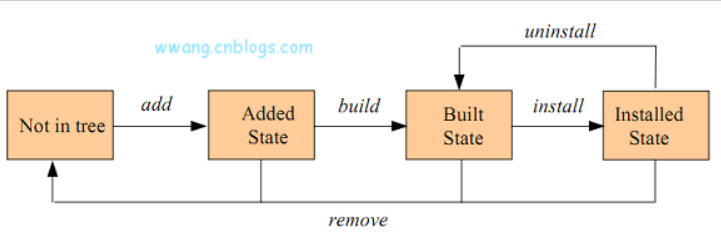

1. 编译

   make noisy

2. 安装模块，拷贝到内核对应目录

   ```
   make modules_install
   
    ⚡ root@localhost  ~  ls /lib/modules/4.18.0-425.19.2.el8_7.x86_64/extra/calmwu_modules/cw_dev_ioctl_test 
   cw_dev_ioctl_test.ko
   ```

3. 更新initramfs

   ```
   sodu make install
   
    calmwu@localhost  ~  sudo lsinitrd 
   [sudo] password for calmwu: 
   Image: /boot/initramfs-4.18.0-425.19.2.el8_7.x86_64.img: 31M
   ========================================================================
   drwxr-xr-x   3 root     root            0 Jan 13  2023 usr/lib/modules/4.18.0-425.19.2.el8_7.x86_64/extra
   drwxr-xr-x   3 root     root            0 Jan 13  2023 usr/lib/modules/4.18.0-425.19.2.el8_7.x86_64/extra/calmwu_modules
   drwxr-xr-x   2 root     root            0 Jan 13  2023 usr/lib/modules/4.18.0-425.19.2.el8_7.x86_64/extra/calmwu_modules/cw_dev_ioctl_test
   -rw-r--r--   1 root     root        18648 Jan 13  2023 usr/lib/modules/4.18.0-425.19.2.el8_7.x86_64/extra/calmwu_modules/cw_dev_ioctl_test/cw_dev_ioctl_test.ko
   ```

4. 配置模块参数，添加配置文件

   ```
    ⚡ root@localhost  ~  ccat /etc/modprobe.d/cw_dev_ioctl_test.conf 
   options cw_dev_ioctl_test __cw_ioctl_nr_devs=1
   ```

5. 启动自动加载ko，添加配置文件

   ```
    ⚡ root@localhost  ~  ccat /etc/modules-load.d/cw_dev_ioctl_test.conf 
   cw_dev_ioctl_test
   ```

6. 内核升级钩子，该目录下的脚本在内核升级后会自动执行

   ```
    ✘ ⚡ root@localhost  /etc/kernel  cd postinst.d 
    ⚡ root@localhost  /etc/kernel/postinst.d  ls -trl
   total 4
   -rwxr-xr-x. 1 root root 1566 Jan 13  2023 51-dracut-rescue-postinst.sh
   ```

7. DKMS

   DKMS全称是Dynamic Kernel Module Support，在内核版本变动之后可以自动重新生成新的模块。

   [DKMS简介 - kk Blog —— 通用基础 (abcdxyzk.github.io)](https://abcdxyzk.github.io/blog/2020/09/21/kernel-dkms/)

   

8. 资料

   [使用 DKMS 添加内核模块 — Documentation for Clear Linux* project](https://www.clearlinux.org/clear-linux-documentation/zh_CN/guides/kernel/kernel-modules-dkms.html#build-install-and-load-an-out-of-tree-module)

   [DKMS的使用详解-CSDN博客](https://blog.csdn.net/ldswfun/article/details/131554905)

   [DKMS简介 - wwang - 博客园 (cnblogs.com)](https://www.cnblogs.com/wwang/archive/2011/06/21/2085571.html)

   [Is DKMS provided in Red Hat Enterprise Linux? - Red Hat Customer Portal](https://access.redhat.com/solutions/1132653)

   

   

