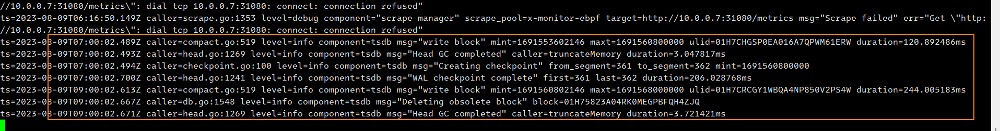
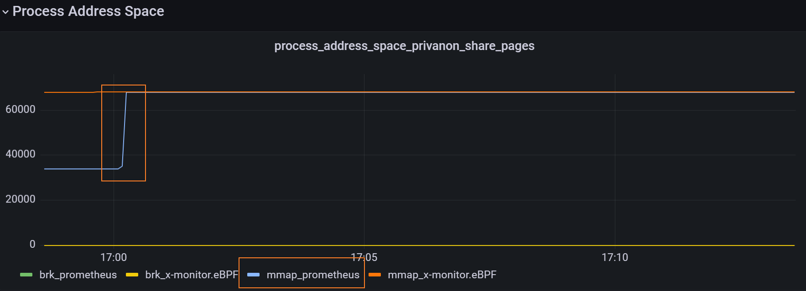
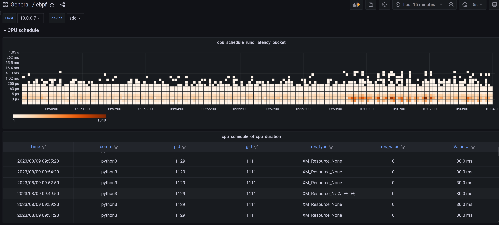
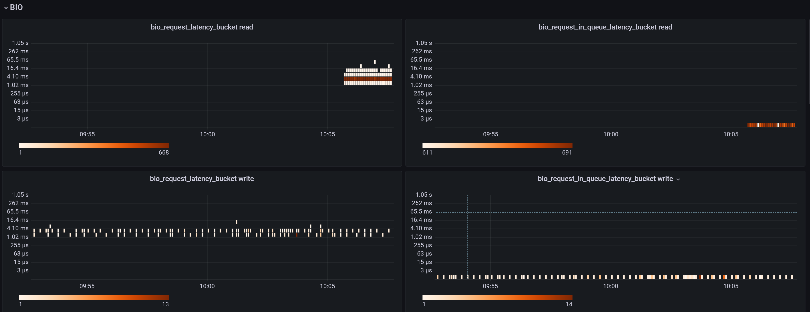
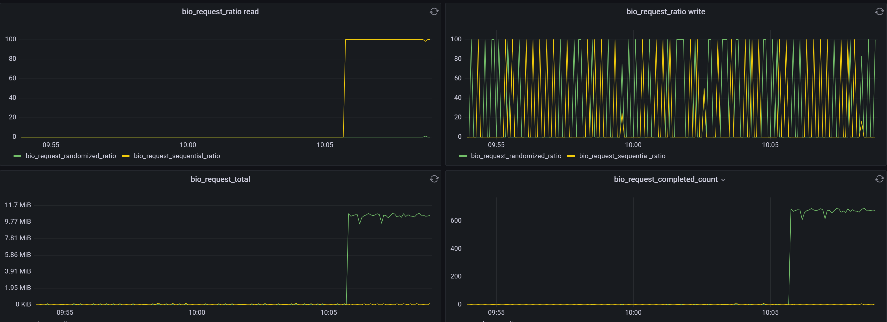
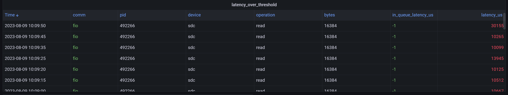
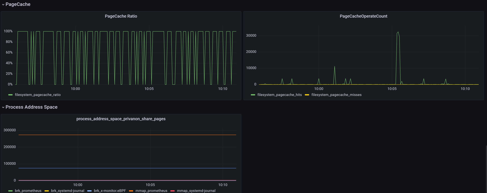
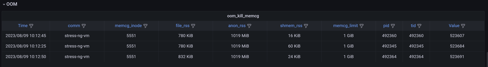

# x-monitor.eBPF

## 简介

本文通过表格的形式将x-montior.eBPF服务划分为各个子模块，细分出详细的功能能点，当前状态以及未来的目标

## 计划进度

| 子模块                    | 描述                                                         | 状态                                             |
| ------------------------- | ------------------------------------------------------------ | ------------------------------------------------ |
| x-monitor.eBPF服务框架    | 1：golang实现的web服务，服务框实现各个eBPF-Program的注册，注销，退出。 2：提供/metrics接口供Prometheus采集数据，服务导出Prometheus支持类型的指标。 3：配置管理，yaml格式，每个独立ebpf功能都有独立的配置项。 4：公共功能，事件中心，日志，信号，进程的pprof，内核/proc/kallsyms的读取。 | 完成。根据后续业务需求持续补充，增强、优化、改进 |
| x-monitor.eBPF-Base       | 1：cilium-ebpf库的封装，支持kprobe，kretprobe，tracepoint，rawtracepoint，btf-rawtracepoint类型的eBPF program自动加载。 2：eBPF kernel Part通用编译。使用go generate自动化编译c代码 3：eBPF kernel Part公共代码，log、kernel struct/field read、helper_map、helper_net、helper_math、kernel struct/field CO-RE support。 | 完成。根据后续业务需求持续补充，增强、优化、改进 |
| x-monitor.eBPF-CacheStat  | 1：watch kprobe的add_to_page_cache_lru、mark_page_accessed、account_page_dirtied、mark_buffer_dirty记录进程在这三个函数的调用计数 2：使用BPF_HASH_MAP。 3：用户态代码读取HashMap数据，计算出pagecache.hits、pagecache.misses、pagecache.ratio，对外导出Prometheus Counter类型指标。 | 完成。                                           |
| x-monitor.eBPF-CPUSched   | 1：支持按os、namespace、cgroup、pid、pgid进行进程过滤 2：使用btf_rawtracepoint提升内核数据访问效率 3：记录task_struct插入运行队列的时间、调度上cpu的时间、离开cpu的时间。 4：使用ringbuf与用户态交互。 5：使用hash直方图来统计task_struct在cpu运行队列中等待时间的分布。 6：用户态代码输出CPU运行队列延时Prometheus直方图、 7：用户态代码输出超过阈值Off-cpu状态的进程， 8：用户态代码输出输出ProcessHand状态的进程。 | 完成。                                           |
| x-monitor.eBPF-ProcessVM  | 1：观察进程的private-anon和share地址空间的分配。 2：统计进程brk堆地址空间的分配。 3：进程私有地址空间、堆空间的释放 4：用户态代码到处Prometheus指标，显示过滤进程的private-anon+share地址空间大小，brk堆分配空间。 | 完成。                                           |
| x-monitor.eBPF-OOMKill    | 1：收集系统触发的oomkill的进程信息，包括comm，pid，tid 2：区分进程是否在memory-cgroup限制环境中，如果是，获取memcg的inode ，获取memcg的memory-limit。如果不是获取系统物理内存大小 3：获取内核badness函数计算出的points。 4：获取oomkill进程的file-rss,anon-rss,shmem-rss的信息 5：获取系统ommkill的msg 6：Prometheus输出展示 | 完成                                             |
| x-monitor.eBPF.BioLatency | 1：按设备号进行分类统计 2：设备的随机读取的比例 3：设备顺序读取的比例 4：设备读取的次数 5：设备读取的字节kB数 6：request在request->blk_mq_ctx->rq_lists[type]等待耗时分布，2的指数分布 7：request执行的耗时分布，2的指数分布 8：超过阈值的request | 完成                                             |
| x-monitor.eBPF.NAPI       | 1：NAPI机制在高速网络环境下的状态                            | 待实现                                           |

## Tools

| 名称           | 描述                                                         | 状态 |
| -------------- | ------------------------------------------------------------ | ---- |
| tools.parseelf | 1：解析elf文件，读取btf、section信息 2：方便对ob文件的解析 | 完成 |
| tools.trace    | 1：在用户态实现eBPF指令，可复用kprobe逻辑 2：抓取指定系统调用参数的返回值，内核堆栈、用户态堆栈。 3：栈帧到代码的转换。 | 完成 |

## Metrics

### process_vm

一次Prometheus的GC。

## Test examples

外网地址：[Prometheus Time Series Collection and Processing Server](http://159.27.191.120:9090/graph?g0.expr=process_address_space_privanon_share_pages&g0.tab=0&g0.stacked=0&g0.show_exemplars=0&g0.range_input=12h&g1.expr=cpu_schedule_runq_latency_bucket&g1.tab=0&g1.stacked=0&g1.show_exemplars=0&g1.range_input=1h&g2.expr=filesystem_pagecache_ratio&g2.tab=0&g2.stacked=0&g2.show_exemplars=0&g2.range_input=1h)

1. **bio_latency测试**
   1. 顺序读:

      fio -filename=fio_test -direct=1 -iodepth 1 -thread -rw=read -ioengine=libaio -bs=16k -size=1G -numjobs=1 -runtime=300 -group_reporting -name=mytest

   2. 顺序写:

      fio -filename=fio_test -direct=1 -iodepth 1 -thread -rw=write -ioengine=libaio -bs=16k -size=1G -numjobs=1 -runtime=300 -group_reporting -name=mytest

   3. 随机写:

      fio -filename=fio_test -direct=1 -iodepth 1 -thread -rw=randwrite -ioengine=libaio -bs=16k -size=1G -numjobs=1 -runtime=300 -group_reporting -name=mytest

   4. 随机读:

      fio -filename=fio_test -direct=1 -iodepth 1 -thread -rw=randread -ioengine=libaio -bs=16k -size=1G -numjobs=1 -runtime=300 -group_reporting -name=mytest

2. **cpu_runqlatency测试**

   1. stress-ng -c 8 --cpu-method all -t 10m

3. **oom测试**

   tools/bin/cg_pressure.sh

4. **Pagecache命中率测试**

   fio -filename=fio_test -direct=0 -iodepth 1 -thread -rw=randread -ioengine=libaio -bs=16k -size=1G -numjobs=1 -runtime=300 -group_reporting -name=mytest，随机读会导致pagecache命中率降低

## Dashboard

grafana环境：[ebpf - Dashboards - Grafana](http://159.27.191.120:3000/d/bd5cbc8d-760f-4cf3-b38a-a77808412920/ebpf?orgId=1)

用户名/账号：test/test1234

## 资料

1. process延迟太久，[tools/dslower: add dslower to trace process block time by curu · Pull Request #4392 · iovisor/bcc (github.com)](https://github.com/iovisor/bcc/pull/4392?notification_referrer_id=NT_kwDOAMWMprM1MDUzMzcwODE4OjEyOTQ2NTk4)。