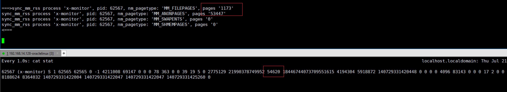

# Process memory rss  vs  Process CGroup memory rss

## CG目的

- 隔离一个或一组应用
- 限制内存的使用量。

## CG特性

- 统计匿名页、file cache、swap cache使用情况并加以限制。
- 统计memory+swap使用情况并加以限制。
- 使用量阈值通知。
- 内存压力通知。

## CG设计

内存控制器的核心就是page_counter，它追踪添加到控制器里的进程当前内存使用情况以及使用限制，每个cgroup都有一个独立的内存控制器数据结构mem_cgroup。memcontrol.h

```
struct mem_cgroup {
	struct cgroup_subsys_state css;

	/* Private memcg ID. Used to ID objects that outlive the cgroup */
	struct mem_cgroup_id id;

	/* Accounted resources */
	struct page_counter memory;		/* Both v1 & v2 */
```

## 页交换扩展（CONFIG_MEMCG_SWAP）

```
[root@VM-0-8-centos /]# cat /boot/config-5.14.0-86.el9.x86_64|grep CONFIG_MEMCG_SWAP
CONFIG_MEMCG_SWAP=y
```

页交换扩展使得cgroup能记录交换的页。交换页被记录统计时，会增加如下文件

- memory.memsw.usage_in_bytes
- memory.memsw.limit_in_bytes

memsw是memory+swap的意思。cgroup限制进程所使用的内存总量实际是memsw，一般在服务器上，不会使用swap空间，文章[Linux交换空间 - Notes about linux and my work (laoqinren.net)](http://linux.laoqinren.net/linux/linux-swap/)介绍了该如何配置swap。

这个选项给memory resource controller添加了swap的管理功能，这样就可以针对每个cgroup限定其使用的mem+swap总量，如果关闭此选项，**cgroup memory controller只限制物理内存的使用量**，而无法对swap进行控制，开启此功能会对性能有不利影响，并且追踪swap的使用也会消耗更多内存。

关闭方式：grubby --update-kernel=ALL --args=swapaccount=0，默认开启也可以通过内核引导参数"swapaccount=0"禁止此特性。**设置重启后memory.memsw.*文件就没有了**。

## 统计

### 进程角度和CGroup角度对rss的统计差异

#### CGroup memory.usage_in_bytes和stat

通用的解释是显示当前已用的内存，如果cgroup中只有一个进程，那么是该进程的内存使用量，但是和进程角度的内存使用是不同的（pidstat）。可以看到usage_in_bytes接近等于**rss + pagecache**，可以认为memory resource controller主要限制的是RSS和Page Cache。

```
 ⚡ root@localhost  /sys/fs/cgroup/memory/x-monitor  cat memory.usage_in_bytes 
53755904
 ⚡ root@localhost  /sys/fs/cgroup/memory/x-monitor  cat memory.stat 
cache 24195072
rss 28147712
```

#### process的rss

用pidstat或top看进程的rss才115736，/proc/<pid>/stat.rss的24列。

```
# Time        UID      TGID       TID    %usr %system  %guest   %wait    %CPU   CPU  minflt/s  majflt/s     VSZ     RSS   %MEM   kB_rd/s   kB_wr/s kB_ccwr/s iodelay   cswch/s nvcswch/s  Command
03:23:49 PM     0     10505         -    0.00    0.00    0.00    0.00    0.00     4    105.00      0.00 21474979248  115736   0.71      0.00     32.00      0.00       0      0.00      0.00  x-monitor
```

### 进程rss的统计

#### 内核相关代码

从struct task_struct视角来统计进程的物理内存使用量，使用mm_struct结构对象。

```
enum {
	MM_FILEPAGES,	/* Resident file mapping pages */
	MM_ANONPAGES,	/* Resident anonymous pages */
	MM_SWAPENTS,	/* Anonymous swap entries */
	MM_SHMEMPAGES,	/* Resident shared memory pages */
	NR_MM_COUNTERS
};

static inline unsigned long get_mm_rss(struct mm_struct *mm)
{
	return get_mm_counter(mm, MM_FILEPAGES) +     // 私有文件映射，例如加载动态库 
		get_mm_counter(mm, MM_ANONPAGES) +
		get_mm_counter(mm, MM_SHMEMPAGES);        // 共享内存 
}
```

外部使用add_mm_counter来增加计数，下面编写bpftrace脚本来验证下内核对进程rss的统计。

```
static inline void add_mm_counter(struct mm_struct *mm, int member, long value)
{
	atomic_long_add(value, &mm->rss_stat.count[member]);
}
```

#### bpftrace脚本验证

脚本：[ktrace_memory.bt](./ktrace_memory.bt)

我使用bpftrace脚本来跟踪下进程匿名内存分配，并输出堆栈

```
process 'x-monitor', pid: 60426, nm_pagetype: 'MM_ANONPAGES', current page count '25' will add '1' pages
call stack>>>	
        add_mm_counter_fast+1
        do_anonymous_page+351
        __handle_mm_fault+2022
        handle_mm_fault+190
        __do_page_fault+493
        do_page_fault+55
        page_fault+30
```

脚本统计和/proc/<pid>/stat.rss的完全吻合



### cgroup memory.stat中rss的统计

可见cgroup的rss是统计的NR_ANON_MAPPED

```
static const unsigned int memcg1_stats[] = {
	NR_FILE_PAGES,
	NR_ANON_MAPPED,
#ifdef CONFIG_TRANSPARENT_HUGEPAGE
	NR_ANON_THPS,
#endif
	NR_SHMEM,
	NR_FILE_MAPPED,
	NR_FILE_DIRTY,
	NR_WRITEBACK,
	MEMCG_SWAP,
};

static const char *const memcg1_stat_names[] = {
	"cache",
	"rss",
#ifdef CONFIG_TRANSPARENT_HUGEPAGE
	"rss_huge",
#endif
	"shmem",
	"mapped_file",
	"dirty",
	"writeback",
	"swap",
};

static int memcg_stat_show(struct seq_file *m, void *v)
{
	struct mem_cgroup *memcg = mem_cgroup_from_seq(m);
	unsigned long memory, memsw;
	struct mem_cgroup *mi;
	unsigned int i;

	BUILD_BUG_ON(ARRAY_SIZE(memcg1_stat_names) != ARRAY_SIZE(memcg1_stats));

	for (i = 0; i < ARRAY_SIZE(memcg1_stats); i++) {
		unsigned long nr;

		if (memcg1_stats[i] == MEMCG_SWAP && !do_memsw_account())
			continue;
		nr = memcg_page_state_local(memcg, memcg1_stats[i]);
		seq_printf(m, "%s %lu\n", memcg1_stat_names[i], nr * PAGE_SIZE);
	}
```

实际的统计函数memcg_page_state_local

```
/*
 * idx can be of type enum memcg_stat_item or node_stat_item.
 * Keep in sync with memcg_exact_page_state().
 */
static inline unsigned long memcg_page_state_local(struct mem_cgroup *memcg,
						   int idx)
{
	long x = 0;
	int cpu;

	for_each_possible_cpu(cpu)
		x += per_cpu(memcg->vmstats_local->stat[idx], cpu);
#ifdef CONFIG_SMP
	if (x < 0)
		x = 0;
#endif
	return x;
}
```

### cgroup的memory stat文件内容解释

```
# per-memory cgroup local status
cache		- # of bytes of page cache memory.
rss		- # of bytes of anonymous and swap cache memory (includes
		transparent hugepages).
rss_huge	- # of bytes of anonymous transparent hugepages.
mapped_file	- # of bytes of mapped file (includes tmpfs/shmem)
pgpgin		- # of charging events to the memory cgroup. The charging
		event happens each time a page is accounted as either mapped
		anon page(RSS) or cache page(Page Cache) to the cgroup.
pgpgout		- # of uncharging events to the memory cgroup. The uncharging
		event happens each time a page is unaccounted from the cgroup.
swap		- # of bytes of swap usage
dirty		- # of bytes that are waiting to get written back to the disk.
writeback	- # of bytes of file/anon cache that are queued for syncing to
		disk.
inactive_anon	- # of bytes of anonymous and swap cache memory on inactive
		LRU list.
active_anon	- # of bytes of anonymous and swap cache memory on active
		LRU list.
inactive_file	- # of bytes of file-backed memory on inactive LRU list.
active_file	- # of bytes of file-backed memory on active LRU list.
unevictable	- # of bytes of memory that cannot be reclaimed (mlocked etc).
```

docker的文档也有详细说明：[运行时指标| Docker文档 (xy2401.com)](https://docs.docker.com.zh.xy2401.com/config/containers/runmetrics/#metrics-from-cgroups-memory-cpu-block-io)

差异的说明：

- [Linux processes in memory and memory cgroup statistics - linux - newfreesoft.com](http://www.newfreesoft.com/linux/linux_processes_in_memory_and_memory_cgroup_statistics_747/)

### 判断

判断memory cgroup的真实内存使用量，不能看memory.usage_in_bytes，而需要用memory.stat.rss字段，这类似于free命令看到的，要看除去Page Cache之后的available字段。

