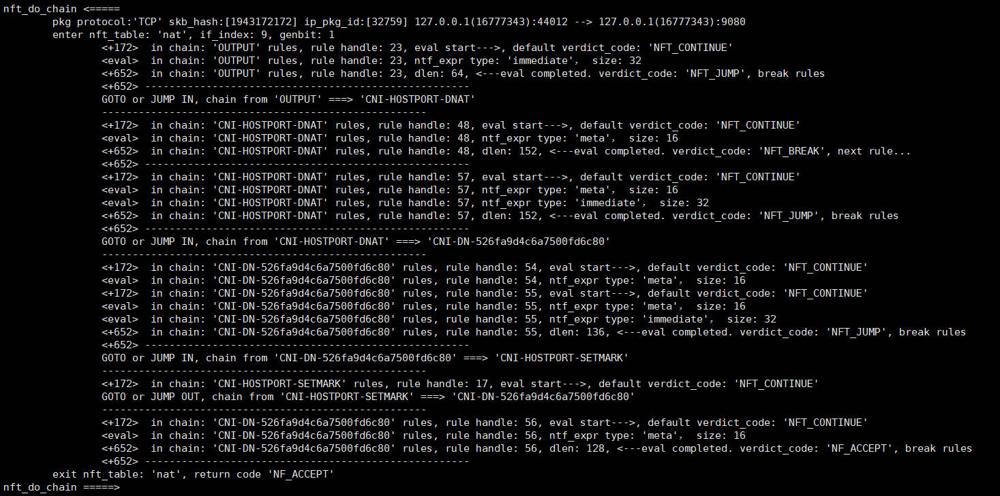
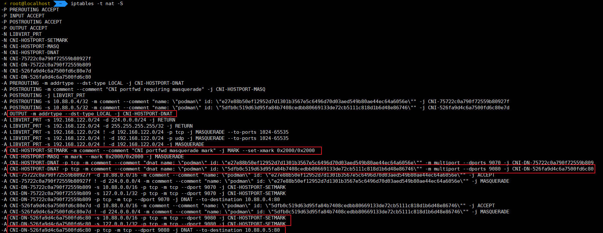

# 使用bpftrace跟踪网络包在ntf_tables的旅行


### IPtables和NFtables

Nftables由netfilter/IPTables开发，是一个包过滤框架。它的目标是用来取代老的IPtables，因为IPTables在扩展性和性能方面存在一些问题。

NFtables在2014年合入linux kernel，从3.13版本就是内核的一部分了。

### 通过内核堆栈来找到定位函数

使用bfptrace脚本来获取内核堆栈，以nat表为例，观察nft_nat_do_chain函数。

```
bpftrace -e 'kprobe:nft_nat_do_chain { @[kstack] = count(); }'
```

堆栈输出信息：

```
@[
    nft_nat_do_chain+1
    nf_nat_inet_fn+318
    nf_nat_ipv4_pre_routing+68
    nf_hook_slow+63
    ip_rcv+145
    __netif_receive_skb_core.constprop.0+1671
    __netif_receive_skb_list_core+310
    netif_receive_skb_list_internal+454
    napi_complete_done+111
    virtnet_poll+478
    __napi_poll+42
    net_rx_action+559
    __softirqentry_text_start+202
    __irq_exit_rcu+173
    common_interrupt+131
    asm_common_interrupt+30
    default_idle+16
    default_idle_call+47
    cpuidle_idle_call+345
    do_idle+123
    cpu_startup_entry+25
    start_kernel+1166
    secondary_startup_64_no_verify+194
]: 8

@[
    nft_nat_do_chain+1
    nf_nat_inet_fn+318
    nf_nat_ipv4_out+77
    nf_hook_slow+63
    ip_output+220
    __ip_queue_xmit+354
    __tcp_transmit_skb+2192
    tcp_connect+957
    tcp_v4_connect+946
    __inet_stream_connect+202
    inet_stream_connect+55
    __sys_connect+159
    __x64_sys_connect+20
    do_syscall_64+59
    entry_SYSCALL_64_after_hwframe+68
]: 18
```

### 通过栈帧查询对应的内核代码

这里想知道nf_hook_slow+63具体是内核的代码那一行。这里要获取该版本带有的debuginfo的vmlinux。使用如下命令：

```
wget http://linuxsoft.cern.ch/cern/centos/s9/BaseOS/x86_64/debug/tree/Packages/kernel-debug-debuginfo-5.14.0-55.el9.x86_64.rpm
wget http://linuxsoft.cern.ch/cern/centos/s9/BaseOS/x86_64/debug/tree/Packages/kernel-debug-debuginfo-common-5.14.0-55.el9.x86_64.rpm
```

安装的vmlinux位于：/usr/lib/debug/lib/modules/5.14.0-55.el9.x86_64+debug/vmlinux

执行下面命令都可以获取函数nf_hook_slow的基地址，ffffffff82bbe0c0

- nm命令
  
  ```
  [root@VM-0-8-centos Program]# nm -A /usr/lib/debug/lib/modules/5.14.0-55.el9.x86_64+debug/vmlinux|grep -w nf_hook_slow
  /usr/lib/debug/lib/modules/5.14.0-55.el9.x86_64+debug/vmlinux:ffffffff82bbe0c0 T nf_hook_slow
  ```

- readelf
  
  ```
  [root@VM-0-8-centos Program]# readelf -sW /usr/lib/debug/lib/modules/5.14.0-55.el9.x86_64+debug/vmlinux|grep -w nf_hook_slow
  115025: ffffffff82bbe0c0   396 FUNC    GLOBAL DEFAULT    1 nf_hook_slow
  ```
  
  使用运行时基地址ffffffff82bbe0c0+0x3F(63)偏移 = FFFFFFFF82BBE0FF

- 使用addr2line定位到对应代码

  ```
  [root@VM-0-8-centos Program]# addr2line -e /usr/lib/debug/lib/modules/5.14.0-55.el9.x86_64+debug/vmlinux FFFFFFFF82BBE0FF
  /usr/src/debug/kernel-5.14.0-55.el9/linux-5.14.0-55.el9.x86_64/net/netfilter/core.c:589
  ```

- 使用gdb更快获取对应代码

  ```
  [root@VM-0-8-centos Program]# gdb /usr/lib/debug/lib/modules/5.14.0-55.el9.x86_64+debug/vmlinux
  
  (gdb) list *(nf_hook_slow+0x3f)
  0xffffffff82bbe0ff is in nf_hook_slow (net/netfilter/core.c:589).
  584             const struct nf_hook_entries *e, unsigned int s)
  585    {
  586        unsigned int verdict;
  587        int ret;
  588
  589        for (; s < e->num_hook_entries; s++) {
  590            verdict = nf_hook_entry_hookfn(&e->hooks[s], skb, state);
  591            switch (verdict & NF_VERDICT_MASK) {
  592            case NF_ACCEPT:
  593
  ```

### 内核Module函数定位

上面nf_hook_slow函数使内核代码，而nf_nat_ipv4_out、nf_nat_inet_fn、nft_nat_do_chain这些都在ko中，vmlinux是没有其符号信息的，这样需要加载kernel module。

1. 在系统中找到模块文件，将其解压
   
   ```
   [root@VM-0-8-centos Program]# modinfo nft_chain_nat
   filename:       /lib/modules/5.14.0-55.el9.x86_64/kernel/net/netfilter/nft_chain_nat.ko.xz
   [root@VM-0-8-centos Program]# xz -d nft_chain_nat.ko.xz
   ```

2. 找到module的.text地址，在目录/sys/module/<module_name>/sections
   
   ```
   [root@VM-0-8-centos sections]# cat .text
   0xffffffffc07e8000
   ```

3. gdb加载模块符号
   
   ```
   (gdb) add-symbol-file /root/Program/nft_chain_nat.ko 0xffffffffc07e8000
   add symbol table from file "/root/Program/nft_chain_nat.ko" at
       .text_addr = 0xffffffffc07e8000
   (y or n) y
   Reading symbols from /root/Program/nft_chain_nat.ko...
   Downloading separate debug info for /root/Program/nft_chain_nat.ko...
   Reading symbols from /root/.cache/debuginfod_client/5acdf22341f7178739c6b3c3cf804e739dd7cf44/debuginfo...
   ```

4. 确定函数的代码位置，有完整代码输出。
   
   ```
   (gdb) p nft_nat_do_chain
   $3 = {unsigned int (void *, struct sk_buff *, const struct nf_hook_state *)} 0xffffffffc07e8020 <nft_nat_do_chain>
   (gdb) list *(nft_nat_do_chain)
   0xffffffffc07e8020 is in nft_nat_do_chain (net/netfilter/nft_chain_nat.c:12).
   7    #include <net/netfilter/nf_tables_ipv4.h>
   8    #include <net/netfilter/nf_tables_ipv6.h>
   9
   10    static unsigned int nft_nat_do_chain(void *priv, struct sk_buff *skb,
   11                         const struct nf_hook_state *state)
   12    {
   13        struct nft_pktinfo pkt;
   14
   15        nft_set_pktinfo(&pkt, skb, state);
   ```

5. 源码编译的vmlinux安装路径
   
   ```
   /lib/modules/4.18.0/build/vmlinux
   ```
   
   使用gdb读取
   
   ```
   [root@localhost build]# gdb /lib/modules/4.18.0/build/vmlinux
   GNU gdb (GDB) Red Hat Enterprise Linux 8.2-18.0.1.el8
   Copyright (C) 2018 Free Software Foundation, Inc.
   License GPLv3+: GNU GPL version 3 or later <http://gnu.org/licenses/gpl.html>
   This is free software: you are free to change and redistribute it.
   There is NO WARRANTY, to the extent permitted by law.
   Type "show copying" and "show warranty" for details.
   This GDB was configured as "x86_64-redhat-linux-gnu".
   Type "show configuration" for configuration details.
   For bug reporting instructions, please see:
   <http://www.gnu.org/software/gdb/bugs/>.
   Find the GDB manual and other documentation resources online at:
       <http://www.gnu.org/software/gdb/documentation/>.
   
   For help, type "help".
   Type "apropos word" to search for commands related to "word"...
   Reading symbols from /lib/modules/4.18.0/build/vmlinux...done.
   ```

### 使用bpftrace观察nft_do_chain

nft_do_chain才是包在nft_table、ntf_chain、nft_rule、nft_expr中执行的核心函数。我们编写的bpftrace脚本主要用来观察该函数的执行。

1. 加载nft_do_chain函数对应的模块，读取符号表

   ```
   add-symbol-file /lib/modules/4.18.0/kernel/net/netfilter/nf_tables.ko 0xffffffffc0a24000
   ```

   现在看看各个地址之间的关系：

   0xffffffffc0a24000：这个地址是模块运行后的基地址。使用如下命令，可以看到函数nft_do_chain运行的地址：

   ```
   (gdb) p nft_do_chain
   $1 = {unsigned int (struct nft_pktinfo *, void *)} 0xffffffffc0a24080 <nft_do_chain>
   ```

   0xffffffffc0a24080 - 0xffffffffc0a24000 = 0x80怎么来的呢，其实0x80就是编译器设定的elf文件中的偏移地址。如下最后一行可以看到80的偏移。

   ```
   [root@localhost iptables_dump]# readelf -sW /lib/modules/4.18.0/kernel/net/netfilter/nf_tables.ko |grep nft_do_chain
       43: 00000000000000c0    16 OBJECT  LOCAL  DEFAULT   11 __ksymtab_nft_do_chain
       44: 0000000000000000    13 OBJECT  LOCAL  DEFAULT   20 __kstrtab_nft_do_chain
      302: 0000000000010860    87 FUNC    LOCAL  DEFAULT    2 nft_do_chain_arp
      303: 00000000000108c0   128 FUNC    LOCAL  DEFAULT    2 nft_do_chain_ipv4
      305: 0000000000010a50   242 FUNC    LOCAL  DEFAULT    2 nft_do_chain_inet
      306: 0000000000010b50   394 FUNC    LOCAL  DEFAULT    2 nft_do_chain_bridge
      307: 0000000000010ce0   379 FUNC    LOCAL  DEFAULT    2 nft_do_chain_netdev
      308: 0000000000010e60   171 FUNC    LOCAL  DEFAULT    2 nft_do_chain_ipv6
      595: 000000000f887883     0 NOTYPE  GLOBAL DEFAULT  ABS __crc_nft_do_chain
      731: 0000000000000080  1221 FUNC    GLOBAL DEFAULT    2 nft_do_chain
   ```

2. 使用disassemble /m(/s) nft_do_chain查看汇编与代码的对应，后者更详细，但对应关系很难看。

   [nft_do_chain_kernel-4.18.disa_s](./nft_do_chain_kernel-4.18.disa_s)

   [nft_do_chain_kernel-4.18.disa_m](nft_do_chain_kernel-4.18.disa_m)

3. 运行脚本，使用kprobe偏移来观察nft_do_chain，脚本参数来指定要观察的sport、dport两个端口号

   ```
   BPFTRACE_VMLINUX=/lib/modules/4.18.0/kernel/net/netfilter/nf_tables.ko bpftrace -v ./ktrace_nftables-4.18.bt 9080 80
   ```

   脚本源码：[ktrace_nftables-4.18.bt](ktrace_nftables-4.18.bt)

   为什么需要函数的汇编代码：

   1. kprobe+offset可以观察到函数内部流程。
   2. 代码的局部变量只有通过寄存器才能获取，通过代码对应到汇编指令，才能读取到局部变量。这样能更好的观察函数流程。

4. 代码说明

   1. 指令

      JE：ZF=1则跳转。CMP判断相等ZF=1。

      JNE：ZF=0则跳转。CMP判断不想等，ZF=0。

5. 测试

   - podman启动nginx容器。本地nat映射端口不同。

     ```
     [root@localhost calmwu]# podman --runtime /usr/bin/crun run -d -p 9070:80 nginx
     63185f11e26b8a1075b8e2403b1819a40288780acca1ab9453fa8c1417ff572b
     [root@localhost calmwu]# podman --runtime /usr/bin/crun run -d -p 9080:80 nginx
     bf5636ceef9bf16a655e47b40e3f5d7cb5044da6caea2650b288d927f31ef046
     ```

   - 普通访问测试

     ```
     [root@localhost ~]# curl 127.0.0.1:9080
     ```

     可以看到nat表的输出，正确的匹配出chain的跳转、rule的顺序和判断verdict code。

     
     
     对比iptables nat表、链、规则的内容。
     
     
     
   - iptables drop测试
   
     ```
     iptables -t filter -I OUTPUT 1 -m tcp --proto tcp --dst 127.0.0.1/32 --dport 9080 -j DROP
     ```
   
6. 从kprobe观察nft_do_chain函数看出表、链、rule的运转规则，对应函数逻辑。

   1. 如果规则返回的是break和continue，就会继续执行同链的后续rule。
   2. 如果rule返回的是accept、drop、queue、stolen，链、表都停止，函数return。不会恢复入栈链和rule。
   3. 如果rule是jump、goto，则将当前的下一条rule和当前chain入栈，跳转到目标链继续执行1、2。
   4. 对于jump in的chain，执行到3之后会恢复堆栈执行jump out到入栈保存的chain和rule。

### 相关

1. ​	使用debugfs文件系统查看当前系统安装的kprobe。

   ```
   cat /sys/kernel/debug/kprobes/list
   ```

2. 支持probe offset。

   If you need to insert a probe in the middle of a function, you may find it useful to “Compile the kernel with debug info” (CONFIG_DEBUG_INFO), so you can use “objdump -d -l vmlinux” to see the source-to-object code mapping.

3. sp和bp寄存器。

   bp指向栈的开始，sp指向栈顶。栈的扩展方向是从高地址向低地址，所以sp的地址会小于等于bp。一般函数开始会将bp先push		栈，再将sp赋值给bp。

   函数中的局部变量都是存放在堆栈中的，要想访问一般都是通过sp+offset来访问的。


### 资料

- [The Kernel Newbie Corner: Kernel and Module Debugging with gdb - Linux.com](https://www.linux.com/training-tutorials/kernel-newbie-corner-kernel-and-module-debugging-gdb/)

- https://gist.github.com/jarun/ea47cc31f1b482d5586138472139d090

- [bpftrace/reference_guide.md at master · iovisor/bpftrace (github.com)](https://github.com/iovisor/bpftrace/blob/master/docs/reference_guide.md#1-kprobekretprobe-dynamic-tracing-kernel-level)

- [Kernel analysis with bpftrace [LWN.net\]](https://lwn.net/Articles/793749/)

- bpftrace观察的寄存器名：[bpftrace/x86_64.cpp at master · ajor/bpftrace (github.com)](https://github.com/ajor/bpftrace/blob/master/src/arch/x86_64.cpp)

- [How The Tables Have Turned: An analysis of two new Linux vulnerabilities in nf_tables · David's Blog (dbouman.nl)](https://blog.dbouman.nl/2022/04/02/How-The-Tables-Have-Turned-CVE-2022-1015-1016/)

- kprobe不能探测说明：[Kernel Probes (Kprobes) — The Linux Kernel documentation](https://docs.kernel.org/trace/kprobes.html#kprobes-blacklist)

- [ungleich blog - IPtables vs. nftables](https://ungleich.ch/en-us/cms/blog/2018/08/18/iptables-vs-nftables/)

- [深入理解计算机系统寄存器寻址讲解_ciqingloveless的博客-CSDN博客_rdx寄存器](https://blog.csdn.net/ciqingloveless/article/details/84136002)
