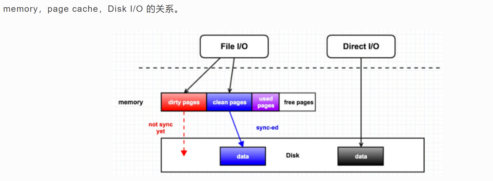
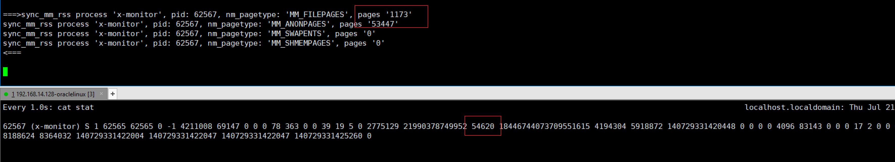

# Process memory 和 Process CGroup memory

进程角度：process实际使用的物理内存

CGroup角度：CGroup本身是一个容量概念，容量就会有范围了。

## CGroup介绍

- 隔离一个或一组应用
- 限制内存的使用量。

### 特性

- 统计匿名页、file cache、swap cache使用情况并加以限制。swap cache：用来加速交换的缓冲区，应为swap设备都是磁盘。
- 统计memory+swap使用情况并加以限制。
- 使用量阈值通知。
- 内存压力通知。

### CGroup设计

内存控制器的核心就是page_counter，它追踪添加到控制器里的进程当前内存使用情况以及使用限制，每个cgroup都有一个独立的内存控制器数据结构mem_cgroup。memcontrol.h

```
struct mem_cgroup {
	struct cgroup_subsys_state css;

	/* Private memcg ID. Used to ID objects that outlive the cgroup */
	struct mem_cgroup_id id;

	/* Accounted resources */
	struct page_counter memory;		/* Both v1 & v2 */
```

### 页交换扩展（CONFIG_MEMCG_SWAP）

```
[root@VM-0-8-centos /]# cat /boot/config-5.14.0-86.el9.x86_64|grep CONFIG_MEMCG_SWAP
CONFIG_MEMCG_SWAP=y
```

页交换扩展使得cgroup**能记录交换的页**。交换页被记录统计时，会增加如下文件

- memory.memsw.usage_in_bytes
- memory.memsw.limit_in_bytes

memsw是memory+swap的意思。cgroup限制进程所使用的内存总量实际是memsw，一般在服务器上，不会使用swap空间，文章[Linux交换空间 - Notes about linux and my work (laoqinren.net)](http://linux.laoqinren.net/linux/linux-swap/)介绍了该如何配置swap。

这个选项给memory resource controller添加了swap的管理功能，这样就可以针对每个cgroup限定其使用的mem+swap总量，如果关闭此选项，**cgroup memory controller只限制物理内存的使用量**，而无法对swap进行控制，开启此功能会对性能有不利影响，并且追踪swap的使用也会消耗更多内存。

关闭方式：grubby --update-kernel=ALL --args=swapaccount=0，默认开启也可以通过内核引导参数"swapaccount=0"禁止此特性。**设置重启后memory.memsw.*文件就没有了**。

## Memory统计方式

### 进程角度和CGroup角度对rss的统计差异

#### CGroup memory.usage_in_bytes和stat

通用的解释是显示当前已用的内存，如果cgroup中只有一个进程，那么是该进程的内存使用量，但是和进程角度的内存使用是不同的（pidstat）。可以看到usage_in_bytes接近等于**rss + pagecache**，可以认为memory resource controller主要限制的是RSS和Page Cache。

```
 ⚡ root@localhost  /sys/fs/cgroup/memory/x-monitor  cat memory.usage_in_bytes 
53755904
 ⚡ root@localhost  /sys/fs/cgroup/memory/x-monitor  cat memory.stat 
cache 24195072
rss 28147712
```

#### Process的RSS

用pidstat或top看进程的rss才115736，/proc/<pid>/stat.rss的24列。

```
# Time        UID      TGID       TID    %usr %system  %guest   %wait    %CPU   CPU  minflt/s  majflt/s     VSZ     RSS   %MEM   kB_rd/s   kB_wr/s kB_ccwr/s iodelay   cswch/s nvcswch/s  Command
03:23:49 PM     0     10505         -    0.00    0.00    0.00    0.00    0.00     4    105.00      0.00 21474979248  115736   0.71      0.00     32.00      0.00       0      0.00      0.00  x-monitor
```

### 进程RSS的计算

#### 进程内存的分类

通常，进程使用的内存分为下面四种

- anonymous user space map pages (Anonymous pages in User Mode address spaces), like calling malloc allocation of memory, and the use of MAP_ANONYMOUS mmap; when the system memory is not enough, this part of the kernel can be swapped out of memory。这段话说明就是程序中的malloc，calloc这种调用分配的内存。

- user space file mapping page (**Mapped pages in User Mode address spaces**), contains the map file and map tmpfs; former such as mmap specified file, the latter such as IPC shared memory; when the system is not enough memory, the kernel can reclaim these pages, but you may need to synchronize data files before recovery。**这段话最关键的地方是用户地址空间，说明是由用户调用mmap、shmget创建的共享内存或文件映射。根据资料10，mmap(MAP_SHARED)，shmget创建的共享内存都是基于tmpfs，而tmpfs也是使用的page cache，所以这块看到的还是cache的增长**。

  简而言之，进程使用的共享内存时基于tmpfs，而tmpfs使用的page cache。这块物理内存会被统计到cache中。

- file cache (page in page cache of disk file); occurs in the program through the normal read / write to read and write files when the system is not enough memory, the kernel can recycle these pages, but may need to synchronize data files prior to recovery 。这块就是内核管理的内存了，直白的解释就是下图，加速read、write的调用。

  

- buffer pages, belong to the page cache; such as reading block device file. 这就是块设备使用的内存。新内核已经将buffer + page cache合并了。

所以，进程的rss实际是1和2的和，RSS = RssAnon + RssFile + RssShmem。在4.18内核代码中，可见第二项是等于MM_FILEPAGES + MM_SHMEMPAGES（部分page cache）的。

#### 内核相关代码

从struct task_struct视角来统计进程的物理内存使用量，使用mm_struct结构对象。

```
enum {
	MM_FILEPAGES,	/* Resident file mapping pages */
	MM_ANONPAGES,	/* Resident anonymous pages */
	MM_SWAPENTS,	/* Anonymous swap entries */
	MM_SHMEMPAGES,	/* Resident shared memory pages */
	NR_MM_COUNTERS
};

static inline unsigned long get_mm_rss(struct mm_struct *mm)
{
	return get_mm_counter(mm, MM_FILEPAGES) +     // 私有文件映射，例如加载动态库 
		get_mm_counter(mm, MM_ANONPAGES) +
		get_mm_counter(mm, MM_SHMEMPAGES);        // 共享内存 
}
```

外部使用add_mm_counter来增加计数，下面编写bpftrace脚本来验证下内核对进程rss的统计。

```
static inline void add_mm_counter(struct mm_struct *mm, int member, long value)
{
	atomic_long_add(value, &mm->rss_stat.count[member]);
}
```

#### bpftrace脚本验证

脚本：[ktrace_process_rss.bt](./ktrace_process_rss.bt)

我使用bpftrace脚本来跟踪下进程匿名内存分配，并输出堆栈，匿名页分配

```
process 'x-monitor', pid: 60426, nm_pagetype: 'MM_ANONPAGES', current page count '25' will add '1' pages
call stack>>>	
        add_mm_counter_fast+1
        do_anonymous_page+351
        __handle_mm_fault+2022
        handle_mm_fault+190
        __do_page_fault+493
        do_page_fault+55
        page_fault+30
```

文件映射页

```
process 'x-monitor', pid: 62567, nm_pagetype: 'MM_FILEPAGES', current page count '161' will add '1' pages
call stack>>>	
        add_mm_counter_fast+1
        alloc_set_pte+264
        filemap_map_pages+975
        xfs_filemap_map_pages+68
        do_fault+650
        __handle_mm_fault+1237
        handle_mm_fault+190
        __do_page_fault+493
        do_page_fault+55
        page_fault+30
```

脚本统计和/proc/<pid>/stat.rss的完全吻合



通过堆栈可以发现，真正触发分配物理内存的行为是**缺页异常**。

#### 进程内存、物理page、mem_cg如何关联

- struct page *page
- struct mm_struct *mm
- struct mem_cgroup

在内存分配过程中，**do_swap_page**（从交换区入页）、**do_anonymous_page**（第一次访问匿名页时分配的物理页）、**do_cow_fault**（执行cow写时复制时，分配的物理页）、**wp_page_copy**（访问文件时分配物理页）、**shmem_add_to_page_cache**都会调用mem_cgroup_charge将page放入mem_cgroup中。

```
/**
 * mem_cgroup_charge - charge a newly allocated page to a cgroup
 * @page: page to charge
 * @mm: mm context of the victim
 * @gfp_mask: reclaim mode
 *
 * Try to charge @page to the memcg that @mm belongs to, reclaiming
 * pages according to @gfp_mask if necessary.
 *
 * Returns 0 on success. Otherwise, an error code is returned.
 */
int mem_cgroup_charge(struct page *page, struct mm_struct *mm, gfp_t gfp_mask)
{
	unsigned int nr_pages = thp_nr_pages(page);
	struct mem_cgroup *memcg = NULL;
	int ret = 0;

	......
		if (!memcg)
		// 通过进程的mm获取对应的memcg
		memcg = get_mem_cgroup_from_mm(mm);
```

通过如下关系mm_struct --- > task_struct ---> struct css_set --->  mem_cgroup。

```
struct mem_cgroup *get_mem_cgroup_from_mm(struct mm_struct *mm)
{
	struct mem_cgroup *memcg;

	if (mem_cgroup_disabled())
		return NULL;

	rcu_read_lock();
	do {
		/*
		 * Page cache insertions can happen withou an
		 * actual mm context, e.g. during disk probing
		 * on boot, loopback IO, acct() writes etc.
		 */
		if (unlikely(!mm))
			memcg = root_mem_cgroup;
		else {
			memcg = mem_cgroup_from_task(
				rcu_dereference(mm->owner));
			if (unlikely(!memcg))
				memcg = root_mem_cgroup;
		}
	} while (!css_tryget(&memcg->css));
	rcu_read_unlock();
	return memcg;
}
```

thp_nr_pages会计算下page的个数，默认是1，如果是hugepage需要计算。然后调用try_charge函数

```
static int try_charge(struct mem_cgroup *memcg, gfp_t gfp_mask,
		      unsigned int nr_pages)
{
	......
		// 通过struct page_counter memory获得父对象struct mem_cgroup
		mem_over_limit = mem_cgroup_from_counter(counter, memory);
	} else {
		mem_over_limit = mem_cgroup_from_counter(counter, memsw);
		may_swap = false;
	}
```

最后调用page_counter_try_charge来改变struct mem_cgroup的counter成员数值。**atomic_long_add_return(nr_pages, &c->usage);**

```
bool page_counter_try_charge(struct page_counter *counter,
			     unsigned long nr_pages,
			     struct page_counter **fail)
{
	struct page_counter *c;

	for (c = counter; c; c = c->parent) {
		long new;
		......
		new = atomic_long_add_return(nr_pages, &c->usage);
```

### CGroup RSS的计算

#### 统计输出

列出所有的Cgroup

```
 ⚡ root@localhost  /home/calmwu/program/cpp_space/x-monitor/tools/ktrace_process_rss  lscgroup|grep x-monitor   
cpu,cpuacct:/x-monitor
memory:/x-monitor
```

查看cgroup信息

```
 ⚡ root@localhost  /home/calmwu/program/cpp_space/x-monitor/tools/ktrace_process_rss  cgget -g memory:/x-monitor
/x-monitor:
memory.use_hierarchy: 1
memory.kmem.tcp.usage_in_bytes: 0
memory.soft_limit_in_bytes: 9223372036854771712
memory.move_charge_at_immigrate: 0
memory.kmem.tcp.max_usage_in_bytes: 0
```

#### 统计实现

根据内核文档描述，memory.stat.rss统计定义为“of bytes of anonymous and swap cache memory (includes transparent hugepages).”

首先从seq_file得到对应的struct mem_cgroup对象，cgroup的RSS是统计的NR_ANON_MAPPED，当前进程的stat.rss输出如下

```
 ⚡ root@localhost  /sys/fs/cgroup/memory/x-monitor  cat memory.stat 
cache 333053952
rss 32378880
rss_huge 0
shmem 0
mapped_file 0
```

结合下面的代码，rss、cache单位都是字节，是page count * page_size。

```
static const unsigned int memcg1_stats[] = {
	NR_FILE_PAGES, 
	NR_ANON_MAPPED, /* Mapped anonymous pages */
#ifdef CONFIG_TRANSPARENT_HUGEPAGE
	NR_ANON_THPS,
#endif
	NR_SHMEM, /* shmem pages (included tmpfs/GEM pages) */
	NR_FILE_MAPPED, /* pagecache pages mapped into pagetables.
			   only modified from process context */
	NR_FILE_DIRTY,
	NR_WRITEBACK, /* Writeback using temporary buffers */
	MEMCG_SWAP,
};

static const char *const memcg1_stat_names[] = {
	"cache",
	"rss",
#ifdef CONFIG_TRANSPARENT_HUGEPAGE
	"rss_huge",
#endif
	"shmem",
	"mapped_file",
	"dirty",
	"writeback",
	"swap",
};

static int memcg_stat_show(struct seq_file *m, void *v)
{
	struct mem_cgroup *memcg = mem_cgroup_from_seq(m);
	unsigned long memory, memsw;
	struct mem_cgroup *mi;
	unsigned int i;

	BUILD_BUG_ON(ARRAY_SIZE(memcg1_stat_names) != ARRAY_SIZE(memcg1_stats));

	for (i = 0; i < ARRAY_SIZE(memcg1_stats); i++) {
		unsigned long nr;

		if (memcg1_stats[i] == MEMCG_SWAP && !do_memsw_account())
			continue;
		nr = memcg_page_state_local(memcg, memcg1_stats[i]);
		seq_printf(m, "%s %lu\n", memcg1_stat_names[i], nr * PAGE_SIZE);
	}
```

实际的统计函数memcg_page_state_local。vmstat_local是个__percpu类型的变量，是动态分配创建的。

创建vmstat_local percpu对象

```
static struct mem_cgroup *mem_cgroup_alloc(void)
{
	....
	memcg->vmstats_local = alloc_percpu_gfp(struct memcg_vmstats_percpu,
						GFP_KERNEL_ACCOUNT);	
```

释放vmstat_local percpu对象

```
static void __mem_cgroup_free(struct mem_cgroup *memcg)
{
	int node;

	for_each_node (node)
		free_mem_cgroup_per_node_info(memcg, node);
	free_percpu(memcg->vmstats_percpu);
	free_percpu(memcg->vmstats_local);
	kfree(memcg);
}
```

在输出统计的时候会汇总所有cpu的上累计值。

```
/*
 * idx can be of type enum memcg_stat_item or node_stat_item.
 * Keep in sync with memcg_exact_page_state().
 */
static inline unsigned long memcg_page_state_local(struct mem_cgroup *memcg,
						   int idx)
{
	long x = 0;
	int cpu;

	for_each_possible_cpu(cpu)
		x += per_cpu(memcg->vmstats_local->stat[idx], cpu);
#ifdef CONFIG_SMP
	if (x < 0)
		x = 0;
#endif
	return x;
}
```

修改vmstats_local统计数值代码，先读取出来，然后加上val，在写入。

```
void __mod_memcg_state(struct mem_cgroup *memcg, int idx, int val)
{
	long x, threshold = MEMCG_CHARGE_BATCH;

	if (mem_cgroup_disabled())
		return;

	if (memcg_stat_item_in_bytes(idx))
		threshold <<= PAGE_SHIFT;

	x = val + __this_cpu_read(memcg->vmstats_percpu->stat[idx]);
	if (unlikely(abs(x) > threshold)) {
		struct mem_cgroup *mi;

		/*
		 * Batch local counters to keep them in sync with
		 * the hierarchical ones.
		 */
		__this_cpu_add(memcg->vmstats_local->stat[idx], x);
		for (mi = memcg; mi; mi = parent_mem_cgroup(mi))
			atomic_long_add(x, &mi->vmstats[idx]);
		x = 0;
	}
	__this_cpu_write(memcg->vmstats_percpu->stat[idx], x);
}
```

很奇怪，通过调用堆栈分析，始终不见 __mod_memcg_state的调用，可是其调用方 __mod_memcg_lruvec_state函数是一直有调用的。

```
__mod_memcg_lruvec_state====>
21:07:22 idx:17, val:1
call stack>>>	
        __mod_memcg_lruvec_state+1
        __mod_lruvec_page_state+94
        page_add_new_anon_rmap+103
        do_anonymous_page+368
        __handle_mm_fault+2022
        handle_mm_fault+190
        __do_page_fault+493
        do_page_fault+55
        page_fault+30

__mod_memcg_lruvec_state====>
21:07:22 idx:17, val:1
call stack>>>	
        __mod_memcg_lruvec_state+1
        __mod_lruvec_page_state+94
        page_add_new_anon_rmap+103
        do_anonymous_page+368
        __handle_mm_fault+2022
        handle_mm_fault+190
        __do_page_fault+493
        do_page_fault+55
        page_fault+30
```

#### 消失的__mod_memcg_state调用

这个函数去哪里了呢，这个问题困扰我几个月了，知道最近我用objdump反汇编函数才发现如下情况，首先找到__mod_memcg_lruvec_state的地址。

```
 ✘ ⚡ root@localhost  /  objdump -t /lib/modules/4.18.0/build/vmlinux|grep __mod_memcg_lruvec_state 
ffffffff81317aa0 g     F .text	00000000000000f9 __mod_memcg_lruvec_state
```

然后反汇编该函数，可以看到callq  ffffffff81314f70 <__mod_memcg_state.part.71>这条指令，为何有这个函数？

```
 ⚡ root@localhost  /  objdump -S -l --start-address=0xffffffff81317aa0 /lib/modules/4.18.0/build/vmlinux| awk '{print $0} $3~/retq?/{exit}'

/lib/modules/4.18.0/build/vmlinux:     file format elf64-x86-64


Disassembly of section .text:

ffffffff81317aa0 <__mod_memcg_lruvec_state>:
__mod_memcg_lruvec_state():
/usr/src/kernels/4.18.0-348.20.1.el8_5.x86_64/mm/memcontrol.c:810
	return mem_cgroup_nodeinfo(parent, nid);
}

void __mod_memcg_lruvec_state(struct lruvec *lruvec, enum node_stat_item idx,
			      int val)
{
ffffffff81317aa0:	e8 5b 9e 6e 00       	callq  ffffffff81a01900 <__fentry__>
ffffffff81317aa5:	41 54                	push   %r12
ffffffff81317aa7:	41 89 d4             	mov    %edx,%r12d
ffffffff81317aaa:	55                   	push   %rbp
ffffffff81317aab:	48 89 fd             	mov    %rdi,%rbp
ffffffff81317aae:	53                   	push   %rbx
ffffffff81317aaf:	89 f3                	mov    %esi,%ebx
arch_static_branch():
/usr/src/kernels/4.18.0-348.20.1.el8_5.x86_64/./arch/x86/include/asm/jump_label.h:38
#include <linux/stringify.h>
#include <linux/types.h>

static __always_inline bool arch_static_branch(struct static_key *key, bool branch)
{
	asm_volatile_goto("1:"
ffffffff81317ab1:	0f 1f 44 00 00       	nopl   0x0(%rax,%rax,1)
__mod_memcg_state():
/usr/src/kernels/4.18.0-348.20.1.el8_5.x86_64/./arch/x86/include/asm/jump_label.h:38
ffffffff81317ab6:	48 8b bf 90 03 00 00 	mov    0x390(%rdi),%rdi
ffffffff81317abd:	e8 ae d4 ff ff       	callq  ffffffff81314f70 <__mod_memcg_state.part.71>
__mod_memcg_lruvec_state():
/usr/src/kernels/4.18.0-348.20.1.el8_5.x86_64/mm/memcontrol.c:822 (discriminator 157)

	/* Update memcg */
	__mod_memcg_state(memcg, idx, val);

	/* Update lruvec */
	__this_cpu_add(pn->lruvec_stat_local->count[idx], val);
ffffffff81317ac2:	89 d9                	mov    %ebx,%ecx
ffffffff81317ac4:	48 8b 85 a8 02 00 00 	mov    0x2a8(%rbp),%rax
vmstat_item_in_bytes():
/usr/src/kernels/4.18.0-348.20.1.el8_5.x86_64/./include/linux/mmzone.h:257 (discriminator 157)

```

这里继续用objdump去找找__mod_memcg_state相关函数，发现是有两个类似函数的

```
 ⚡ root@localhost  /  objdump -t /lib/modules/4.18.0/build/vmlinux|grep __mod_memcg_state                                                  
ffffffff81314f70 l     F .text	00000000000000b1 __mod_memcg_state.part.71
ffffffff81317a90 g     F .text	0000000000000010 __mod_memcg_state
```

objdump Symbols table输出的含义如下，这样就可以理解l、g的含义了。

```
COLUMN ONE: the symbol's value
COLUMN TWO: a set of characters and spaces indicating the flag bits that are set on the symbol. There are seven groupings which are listed below:
group one: (l,g,,!) local, global, neither, both.
group two: (w,) weak or strong symbol.
group three: (C,) symbol denotes a constructor or an ordinary symbol.
group four: (W,) symbol is warning or normal symbol.
group five: (I,) indirect reference to another symbol or normal symbol.
group six: (d,D,) debugging symbol, dynamic symbol or normal symbol.
group seven: (F,f,O,) symbol is the name of function, file, object or normal symbol.
COLUMN THREE: the section in which the symbol lives, ABS means not associated with a certain section
COLUMN FOUR: the symbol's size or alignment.
COLUMN FIVE: the symbol's name.
```

有兴趣可以反汇编这两个函数，看看实现的细节

```
objdump -S -l --start-address=0xffffffff81314f70 /lib/modules/4.18.0/build/vmlinux| awk '{print $0} $3~/retq?/{exit}'
objdump -S -l --start-address=0xffffffff81317a90 /lib/modules/4.18.0/build/vmlinux| awk '{print $0} $3~/retq?/{exit}'
```

对比汇编发现__mod_memcg_state仅仅只有部分逻辑。

而bpftrace -lv只能看到__mod_memcg_state这个函数，所以我想这就是为何一直看不到堆栈的原因吧。

实际上修改memcg中rss，cache的是函数 __mod_memcg_state.part.71。

为什么会有两个相同函数呢，这个和内核基础设施static_key有关。

#### 使用bpftrace来观察memcg的统计过程

bpftrace脚本：[ktrace_process_rss.bt](./ktrace_process_rss.bt)

1. 先运行memory压测脚本，在指定cgroup中分配内存

   ```
   cgexec -g memory:/x-monitor -g cpu:/x-monitor stress-ng --vm 1 --vm-bytes 500000000 --vm-keep --timeout 10s --verbose
   ```

2. 运行脚本

   ```
   ../bin/bpftrace.0.15 -v ./ktrace_process_rss.bt
   ```

   脚本输出如下：

   ```
   call stack>>>	
           __mod_memcg_lruvec_state+1
           __mod_lruvec_page_state+94
           __add_to_page_cache_locked+613
           add_to_page_cache_lru+74
           pagecache_get_page+278
           grab_cache_page_write_begin+31
           iomap_write_begin+486
           iomap_write_actor+157
           iomap_apply+251
           iomap_file_buffered_write+98
           xfs_file_buffered_aio_write+202
           new_sync_write+274
           vfs_write+165
           ksys_write+79
           do_syscall_64+91
           entry_SYSCALL_64_after_hwframe+101
   
   call stack>>>	
           __mod_memcg_lruvec_state+1
           __mod_lruvec_page_state+94
           page_add_new_anon_rmap+103
           do_anonymous_page+368
           __handle_mm_fault+2022
           handle_mm_fault+190
           __do_page_fault+493
           do_page_fault+55
           page_fault+30
   ```

3. 为了让脚本正确统计rss和cache，先将cgroup的cache清空。

   ```
   echo 1 > /proc/sys/vm/drop_caches
   memory.stat: cache 0
   	rss 0
   ```

   好了现在从0开始了。同时修改脚本，让其定时输出cgroup的rss、cache的字节数，以及x-monitor进程的物理内存信息

   ```
   04:47:40 memcg: 'x-monitor', rss: 24539136 bytes, cache: 7024640 bytes
   process 'x-monitor', pid: 5031, 
   	nm_pagetype: 'MM_FILEPAGES', pages:1160, bytes:4751360
   	nm_pagetype: 'MM_ANONPAGES', pages:5954, bytes:24387584
   	nm_pagetype: 'MM_SWAPENTS', pages:0, bytes:0
   	nm_pagetype: 'MM_SHMEMPAGES', pages:0, bytes:0
   ```

### 小结

memory cgroup的memory.usage_in_bytes包括了rss和cache，但是cache是可以被回收的，如果在内存紧张的时候cache就会被交换出去，当然一般都把cgroup的swapness都关闭。

## 疑问

1. 进程分配的page其属性是什么，具体怎么和cgroup的对应上。

## 资料

1. [Linux processes in memory and memory cgroup statistics - linux - newfreesoft.com](http://www.newfreesoft.com/linux/linux_processes_in_memory_and_memory_cgroup_statistics_747/)
2. [linux中/proc/stat和/proc/[pid\]/stat的解析说明_不开窍的笨笨的博客-CSDN博客](https://blog.csdn.net/qq_28302795/article/details/114371687?spm=1001.2101.3001.6650.1&utm_medium=distribute.pc_relevant.none-task-blog-2~default~CTRLIST~default-1-114371687-blog-8904110.pc_relevant_sortByAnswer&depth_1-utm_source=distribute.pc_relevant.none-task-blog-2~default~CTRLIST~default-1-114371687-blog-8904110.pc_relevant_sortByAnswer&utm_relevant_index=2)
3. [str() call won't accept char * arguments · Issue #1010 · iovisor/bpftrace (github.com)](https://github.com/iovisor/bpftrace/issues/1010)
4. [linux - What are memory mapped page and anonymous page? - Stack Overflow](https://stackoverflow.com/questions/13024087/what-are-memory-mapped-page-and-anonymous-page)
5. [Why top and free inside containers don't show the correct container memory | OpsTips](https://ops.tips/blog/why-top-inside-container-wrong-memory/)
6. [Linux processes in memory and memory cgroup statistics - linux - newfreesoft.com](http://www.newfreesoft.com/linux/linux_processes_in_memory_and_memory_cgroup_statistics_747/)
7. [Linux 内存占用分析的几个方法，你知道几个？ | HeapDump性能社区](https://heapdump.cn/article/3680789)
8. [你是什么内存: PageAnon 与 PageSwapBacked - 温暖的电波 - 博客园 (cnblogs.com)](https://www.cnblogs.com/liuhailong0112/p/14426096.html)
9. [软件开发|剖析内存中的程序之秘 (linux.cn)](https://linux.cn/article-9255-1.html)
10. [Linux内存中的Cache真的能被回收么？ | Zorro’s Linux Book (zorrozou.github.io)](https://zorrozou.github.io/docs/books/linuxnei-cun-zhong-de-cache-zhen-de-neng-bei-hui-shou-yao-ff1f.html)
11. [/proc/meminfo之谜 (ssdfans.com)](http://www.ssdfans.com/?p=4334)
12. [Cgroup - Linux内存资源管理 | Zorro’s Linux Book (zorrozou.github.io)](https://zorrozou.github.io/docs/books/cgroup_linux_memory_control_group.html)
14. [Linux 内存管理mem cgroup分析_Robin.Yin的博客-CSDN博客_mem_cgroup](https://blog.csdn.net/bin_linux96/article/details/84328294)

### 共享内存和tmpfs的关系

1. [浅析Linux的共享内存与tmpfs文件系统 (hustcat.github.io)](https://hustcat.github.io/shared-memory-tmpfs/)
2. [Shared Memory Virtual Filesystem (kernel.org)](https://www.kernel.org/doc/gorman/html/understand/understand015.html)
3. [Analysis of Linux Kernel tmpfs/shmem - actorsfit](https://blog.actorsfit.com/a?ID=01300-05ff3ee0-8619-4544-b922-bec1e813c373)
4. [共享内存和tmpfs - 菜鸡的博客 | WTCL (bbkgl.github.io)](https://bbkgl.github.io/2020/07/26/共享内存和tmpfs/)

### PerCpu变量

1. [per-CPU变量 - osc_96pr9g1m的个人空间 - OSCHINA - 中文开源技术交流社区](https://my.oschina.net/u/4277132/blog/3658485)
2. [内核基础设施——per cpu变量 - Notes about linux and my work (laoqinren.net)](http://linux.laoqinren.net/kernel/percpu-var/)

### Gcc，function part

1. [compiling - Function symbol gets '.part' suffix after compilation - Unix & Linux Stack Exchange](https://unix.stackexchange.com/questions/223013/function-symbol-gets-part-suffix-after-compilation)
2. [内核基础设施——static_key - Notes about linux and my work (laoqinren.net)](http://linux.laoqinren.net/kernel/static_key/)

### 内核自定义编译

1. [build system - How to pass compiler options during Linux kernel compilation? - Stack Overflow](https://stackoverflow.com/questions/40442218/how-to-pass-compiler-options-during-linux-kernel-compilation)
